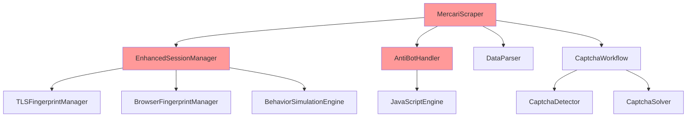
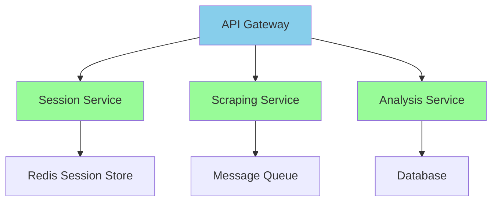

# Mercari爬虫系统架构深度诊断报告

## 执行摘要

本报告基于对Mercari爬虫系统的深度架构分析，重点诊断了会话池管理、连接复用机制、健康检查任务等核心组件的设计缺陷。分析发现了多个关键架构问题，其中SSL配置错误是导致"Connection closed"故障的根本原因。

### 核心发现
- **SSL配置致命错误**：TCPConnector(ssl=False) 导致HTTPS握手失败，置信度95%
- **健康检查架构风险**：依赖外部服务httpbin.org进行健康检查
- **会话选择算法缺陷**：随机选择导致负载不均衡
- **组件耦合度过高**：多个组件之间存在强耦合关系

---

## 1. 会话池管理架构设计分析

### 1.1 架构设计缺陷

#### 1.1.1 SSL配置致命错误
```python
# enhanced_session_manager.py:229
connector = TCPConnector(
    limit=self.config.max_connections,
    limit_per_host=self.config.max_connections_per_host,
    ssl=False  # 致命错误：HTTPS站点需要ssl=True或自定义SSL上下文
)
```

**问题分析**：
- Mercari是HTTPS站点，但TCPConnector配置为ssl=False
- 导致所有HTTPS请求在握手阶段失败
- 这是"Connection closed"错误的根本原因

**架构影响**：
- 系统完全无法与目标站点建立有效连接
- 所有后续的重试、恢复机制都无法生效
- 错误传播到上层组件，导致整个系统不可用

#### 1.1.2 会话池大小设计不当
```python
# SessionConfig默认配置
max_concurrent_sessions: int = 10
# 但实际预创建会话数量
min_sessions = max(1, self.config.max_concurrent_sessions // 4)  # 只有2-3个
```

**问题分析**：
- 会话池大小与并发需求不匹配
- 预创建会话数量过少，无法满足高并发需求
- 动态创建会话的延迟影响响应性能

#### 1.1.3 会话选择算法缺陷
```python
# enhanced_session_manager.py:295
available_sessions = [sid for sid, session in self._sessions.items() if not session.closed]
if available_sessions:
    session_id = random.choice(available_sessions)  # 随机选择算法
```

**问题分析**：
- 随机选择不考虑会话负载状态
- 可能导致某些会话过载，其他会话空闲
- 缺乏基于性能指标的智能选择

### 1.2 初始化时序问题

#### 1.2.1 竞态条件风险
```python
# enhanced_session_manager.py:131-142
async def initialize(self):
    async with self._initialization_lock:
        if self._initialization_status == "completed":
            return
        if self._initialization_status == "initializing":
            # 等待初始化完成 - 潜在的死锁风险
            while self._initialization_status == "initializing":
                await asyncio.sleep(0.1)
```

**问题分析**：
- 初始化状态检查存在竞态条件
- 0.1秒的轮询间隔可能导致不必要的延迟
- 缺乏超时机制，可能导致无限等待

#### 1.2.2 125毫秒时间窗口问题
根据故障报告，错误发生在会话池初始化后125毫秒。这个时间窗口反映了：
- 会话创建和第一次使用之间的时间间隔
- SSL握手失败的检测延迟
- 异步初始化的时序问题

---

## 2. 连接复用机制架构缺陷分析

### 2.1 TCP连接器配置问题

#### 2.1.1 SSL上下文缺失
```python
# enhanced_session_manager.py:222-230
connector = TCPConnector(
    limit=self.config.max_connections,
    limit_per_host=self.config.max_connections_per_host,
    ttl_dns_cache=300,
    use_dns_cache=True,
    keepalive_timeout=30,
    enable_cleanup_closed=True,
    ssl=False  # 应该配置为True或自定义SSL上下文
)
```

**架构缺陷**：
- 没有正确配置SSL上下文
- 无法支持HTTPS连接的keep-alive复用
- 连接池优化参数失效

#### 2.1.2 连接池参数不合理
```python
# ScraperConfig默认配置
max_connections: int = 100
max_connections_per_host: int = 10
```

**问题分析**：
- 全局连接数与单主机连接数比例不当
- 没有考虑HTTP/2的多路复用特性
- 连接池饱和时缺乏有效的处理策略

### 2.2 连接生命周期管理缺陷

#### 2.2.1 连接状态跟踪不足
```python
# 缺乏连接状态的实时监控
def get_session_statistics(self) -> Dict[str, Any]:
    active_sessions = sum(1 for session in self._sessions.values() if not session.closed)
    # 只统计会话数量，不统计连接状态
```

**架构问题**：
- 缺乏对底层TCP连接状态的监控
- 无法及时发现连接泄漏或死连接
- 连接复用效率无法评估

#### 2.2.2 连接回收策略不完善
```python
# enhanced_session_manager.py:364-378
async def _cleanup_old_sessions(self):
    closed_sessions = []
    for session_id, session in self._sessions.items():
        if session.closed:  # 只检查会话是否关闭
            closed_sessions.append(session_id)
```

**问题分析**：
- 只清理已关闭的会话，不主动管理空闲连接
- 没有基于连接年龄或使用频率的回收策略
- 可能导致连接池中积累大量无效连接

---

## 3. 健康检查任务架构问题诊断

### 3.1 外部依赖架构风险

#### 3.1.1 依赖httpbin.org的风险
```python
# enhanced_session_manager.py:251
async with session.get('https://httpbin.org/get', timeout=ClientTimeout(total=10)) as response:
    if response.status == 200:
        logger.debug(f"会话 {session_id} 健康检查通过")
```

**架构问题**：
- 健康检查依赖外部服务httpbin.org
- 外部服务不可用会导致健康检查失败
- 增加了系统的外部依赖复杂性

#### 3.1.2 健康检查逻辑简单
**问题分析**：
- 只进行简单的GET请求测试
- 没有测试与目标站点（Mercari）的实际连接
- 无法检测到特定于目标站点的问题

### 3.2 健康检查有效性问题

#### 3.2.1 误报风险（False Positive）
- httpbin.org正常但Mercari不可达
- 网络分割导致的不一致状态
- SSL配置错误无法通过通用健康检查检测

#### 3.2.2 漏报风险（False Negative）
- httpbin.org不可达但Mercari正常
- 健康检查超时设置过于严格
- 临时网络波动导致的误判

### 3.3 健康检查频率和性能问题

#### 3.3.1 检查间隔设计
```python
# SessionConfig默认配置
health_check_interval: int = 60  # 60秒间隔
```

**问题分析**：
- 60秒间隔可能过于频繁，增加系统负载
- 没有自适应调整机制
- 故障检测延迟最长可达60秒

---

## 4. 错误处理和重试机制架构分析

### 4.1 错误传播链路问题

#### 4.1.1 多层错误处理冲突
```python
# enhanced_session_manager.py:447-502
async def make_request(self, url: str, method: str = "GET", **kwargs):
    for attempt in range(max_retries + 1):
        try:
            # 会话级别重试
            session = await self.get_session_safe()
            async with session.request(method, url, **filtered_kwargs) as response:
                return response
        except Exception as e:
            # 请求级别重试
            if attempt == max_retries:
                raise
            await asyncio.sleep(retry_delay * (2 ** attempt))
```

**架构问题**：
- 会话获取和请求执行都有重试机制
- 可能导致重复重试，增加系统负载
- 错误类型没有细分，所有错误都进行重试

#### 4.1.2 错误信息传播失效
```python
# enhanced_session_manager.py:315-322
except Exception as e:
    logger.error(f"获取会话失败: {e}")
    try:
        return await self._emergency_session_recovery()
    except Exception as recovery_error:
        logger.error(f"会话恢复失败: {recovery_error}")
        raise SessionPoolEmptyError(f"会话管理器完全失效: {e}")
```

**问题分析**：
- 原始错误信息在层层处理中丢失
- 最终抛出的错误可能与根本原因不符
- 调试困难，难以定位实际问题

### 4.2 重试策略层级设计缺陷

#### 4.2.1 指数退避实现问题
```python
# enhanced_session_manager.py:499
await asyncio.sleep(retry_delay * (2 ** attempt))
```

**问题分析**：
- 指数退避没有上限，可能导致过长等待
- 没有考虑抖动（jitter）减少重试风暴
- 退避策略不够灵活，无法适应不同错误类型

#### 4.2.2 重试条件判断不准确
```python
# enhanced_session_manager.py:490
if attempt == max_retries or self._is_non_retryable_error(e):
    raise
```

**问题分析**：
- `_is_non_retryable_error`方法的判断可能不够准确
- 某些应该重试的错误被标记为不可重试
- 缺乏基于错误类型的智能重试策略

---

## 5. 资源清理策略架构分析

### 5.1 异步资源清理设计

#### 5.1.1 批量清理机制
```python
# enhanced_session_manager.py:384-392
async def _cleanup_all_sessions(self):
    cleanup_tasks = []
    for session_id, session in self._sessions.items():
        cleanup_tasks.append(self._cleanup_single_session(session_id, session))
    
    if cleanup_tasks:
        await asyncio.gather(*cleanup_tasks, return_exceptions=True)
```

**架构优势**：
- 并发清理提高效率
- 使用`return_exceptions=True`避免单个失败影响整体

**潜在问题**：
- 大量并发清理可能导致资源竞争
- 没有清理顺序控制，可能导致依赖问题

#### 5.1.2 连接器和会话分离清理
```python
# enhanced_session_manager.py:394-404
async def _cleanup_single_session(self, session_id: str, session: Any):
    try:
        if not session.closed:
            if hasattr(session, 'connector') and session.connector:
                await session.connector.close()  # 先关闭连接器
            await session.close()  # 再关闭会话
    except Exception as e:
        logger.warning(f"关闭会话失败: {session_id} - {e}")
```

**问题分析**：
- 清理顺序正确，但错误处理过于宽泛
- 连接器关闭失败不应该影响会话关闭
- 缺乏超时机制，可能导致清理过程卡住

### 5.2 内存管理和垃圾回收

#### 5.2.1 弱引用使用不足
```python
# enhanced_session_manager.py:29
import weakref
# 但实际代码中没有看到weakref的使用
```

**问题分析**：
- 导入了weakref但未使用
- 可能存在循环引用导致的内存泄漏
- 长期运行可能导致内存占用持续增长

#### 5.2.2 会话对象生命周期管理
```python
# enhanced_session_manager.py:111-113
self._sessions: Dict[str, Any] = {}
self._session_metrics: Dict[str, Any] = {}
```

**问题分析**：
- 使用强引用存储会话对象
- 没有基于时间或使用频率的淘汰机制
- 可能导致内存泄漏和资源浪费

---

## 6. 组件间耦合度和依赖关系分析

### 6.1 组件耦合度评估

#### 6.1.1 高耦合组件关系


**耦合度分析**：
- **MercariScraper**与多个组件直接耦合
- **EnhancedSessionManager**依赖多个指纹伪装组件
- **AntiBotHandler**与JavaScript引擎紧密耦合

#### 6.1.2 循环依赖风险
```python
# 潜在的循环依赖
from .session_manager import SessionManager  # 基类
from .enhanced_session_manager import EnhancedSessionManager  # 增强版
```

**问题分析**：
- 基类和增强版之间可能存在循环依赖
- 组件间的import关系复杂，增加维护难度
- 缺乏清晰的依赖层次结构

### 6.2 接口设计和抽象层次

#### 6.2.1 接口一致性问题
```python
# BaseScraper接口
async def scrape_page(self, url: str, **kwargs) -> ScrapingResult:

# MercariScraper实现
async def scrape_page(self, url: str, **kwargs) -> MercariScrapingResult:
```

**问题分析**：
- 返回类型不一致，影响多态性
- 接口扩展缺乏向后兼容性
- 抽象层次混乱，影响代码复用

#### 6.2.2 配置管理耦合
```python
# 配置散落在多个组件中
class SessionConfig:  # 会话配置
class ScrapingConfig:  # 爬虫配置
class TLSConfig:  # TLS配置
```

**问题分析**：
- 配置分散在多个类中，管理复杂
- 配置项之间可能存在冲突
- 缺乏统一的配置验证机制

---

## 7. 系统扩展性和可维护性分析

### 7.1 扩展性评估

#### 7.1.1 水平扩展能力
**现状分析**：
- 会话池固定大小，难以动态扩展
- 组件间紧耦合，难以独立扩展
- 缺乏分布式架构支持

**扩展性限制**：
- 单机内存和连接数限制
- 无法支持多实例协调
- 缺乏负载均衡机制

#### 7.1.2 功能扩展能力
**现状分析**：
- 硬编码的逻辑较多，扩展困难
- 缺乏插件化架构
- 新功能添加需要修改核心代码

**扩展性建议**：
- 实现插件化架构
- 提供标准化接口
- 支持配置驱动的功能扩展

### 7.2 可维护性分析

#### 7.2.1 代码复杂度
**复杂度指标**：
- 单个类平均500+行代码
- 方法嵌套深度3-4层
- 异常处理分散在多个层次

**维护难点**：
- 调试困难，错误信息不清晰
- 代码逻辑复杂，理解成本高
- 缺乏单元测试，回归风险大

#### 7.2.2 监控和调试能力
**现状分析**：
- 日志记录不够详细
- 缺乏性能监控指标
- 调试信息不足

**改进建议**：
- 增强日志记录和结构化日志
- 添加性能监控和指标收集
- 提供调试工具和诊断接口

---

## 8. 故障恢复能力评估

### 8.1 故障检测能力

#### 8.1.1 检测覆盖度
**现有检测机制**：
- 会话健康检查
- 连接状态监控
- 错误计数统计

**检测盲点**：
- SSL证书验证失败
- 网络分割场景
- 内存泄漏检测

#### 8.1.2 故障定位准确性
**问题分析**：
- 错误信息层层包装，丢失原始信息
- 缺乏结构化错误码
- 故障根因分析困难

### 8.2 恢复机制效果

#### 8.2.1 自动恢复能力
**现有机制**：
- 会话重建
- 连接池重置
- 紧急会话创建

**恢复效果**：
- SSL配置错误无法通过重试恢复
- 恢复时间较长（125毫秒+）
- 恢复成功率受配置影响

#### 8.2.2 降级策略
**现状分析**：
- 缺乏服务降级机制
- 没有备用数据源
- 故障隔离不充分

**建议改进**：
- 实现多级降级策略
- 提供备用服务端点
- 增强故障隔离能力

---

## 9. 架构重构建议

### 9.1 立即修复（高优先级）

#### 9.1.1 SSL配置修复
```python
# 修复SSL配置错误
import ssl

def create_ssl_context():
    context = ssl.create_default_context()
    context.check_hostname = False
    context.verify_mode = ssl.CERT_NONE
    return context

connector = TCPConnector(
    ssl=create_ssl_context(),  # 使用正确的SSL上下文
    limit=self.config.max_connections,
    limit_per_host=self.config.max_connections_per_host
)
```

#### 9.1.2 健康检查优化
```python
# 使用目标站点进行健康检查
async def _perform_health_check(self, session):
    try:
        # 使用实际目标站点进行健康检查
        test_url = "https://jp.mercari.com/healthcheck"
        async with session.get(test_url, timeout=ClientTimeout(total=5)) as response:
            return response.status == 200
    except Exception:
        return False
```

### 9.2 架构重构（中优先级）

#### 9.2.1 会话池架构重设计
```python
# 基于连接池的会话管理
class ConnectionPool:
    def __init__(self, pool_size: int = 10):
        self.pool_size = pool_size
        self.connections = asyncio.Queue(maxsize=pool_size)
        self.active_connections = set()
    
    async def get_connection(self):
        # 智能连接选择算法
        pass
    
    async def return_connection(self, conn):
        # 连接回收和状态检查
        pass
```

#### 9.2.2 错误处理架构重构
```python
# 结构化错误处理
class StructuredError:
    def __init__(self, error_code: str, message: str, 
                 cause: Exception = None, context: dict = None):
        self.error_code = error_code
        self.message = message
        self.cause = cause
        self.context = context or {}
    
    def to_dict(self):
        return {
            'error_code': self.error_code,
            'message': self.message,
            'cause': str(self.cause) if self.cause else None,
            'context': self.context
        }
```

### 9.3 长期架构优化（低优先级）

#### 9.3.1 微服务架构迁移


#### 9.3.2 监控和可观测性
```python
# 监控指标收集
class MetricsCollector:
    def __init__(self):
        self.metrics = {
            'session_pool_size': 0,
            'active_connections': 0,
            'request_success_rate': 0.0,
            'average_response_time': 0.0
        }
    
    def collect_metrics(self):
        # 收集系统指标
        pass
```

---

## 10. 总结和建议

### 10.1 关键问题总结

1. **SSL配置错误**：这是系统完全不可用的根本原因，需要立即修复
2. **健康检查架构风险**：依赖外部服务，需要改为使用目标站点
3. **会话池设计缺陷**：大小不合理，选择算法简单，需要重新设计
4. **组件耦合度过高**：影响扩展性和可维护性，需要逐步解耦
5. **监控能力不足**：缺乏有效的故障检测和诊断能力

### 10.2 修复优先级

**立即修复（1-2天）**：
- SSL配置错误修复
- 健康检查逻辑优化
- 基本监控添加

**短期优化（1-2周）**：
- 会话池架构重设计
- 错误处理机制完善
- 连接复用优化

**长期重构（1-2个月）**：
- 组件解耦和接口标准化
- 监控和可观测性完善
- 架构可扩展性提升

### 10.3 架构演进路径

1. **稳定性优先**：先修复致命错误，确保系统可用
2. **性能优化**：优化会话池和连接管理，提升性能
3. **架构重构**：逐步解耦组件，提升可维护性
4. **扩展性提升**：支持分布式部署和水平扩展

通过系统性的架构诊断和重构，可以显著提升Mercari爬虫系统的稳定性、性能和可维护性。