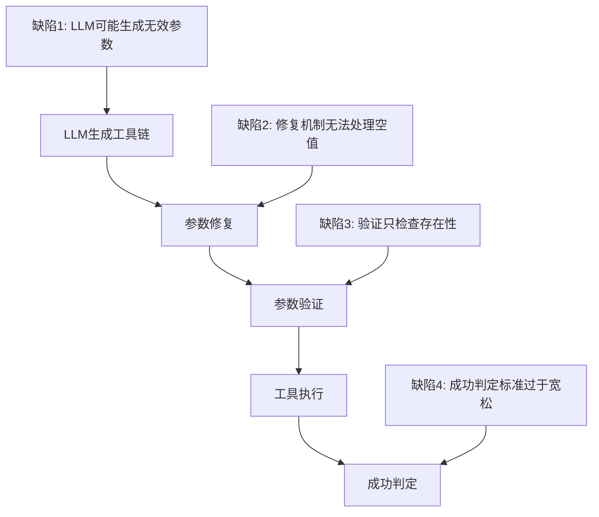
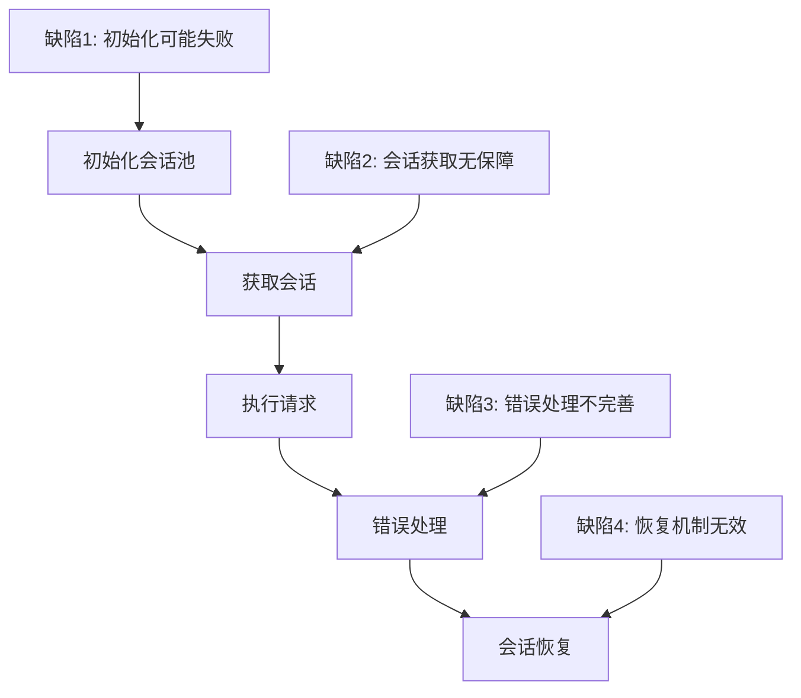
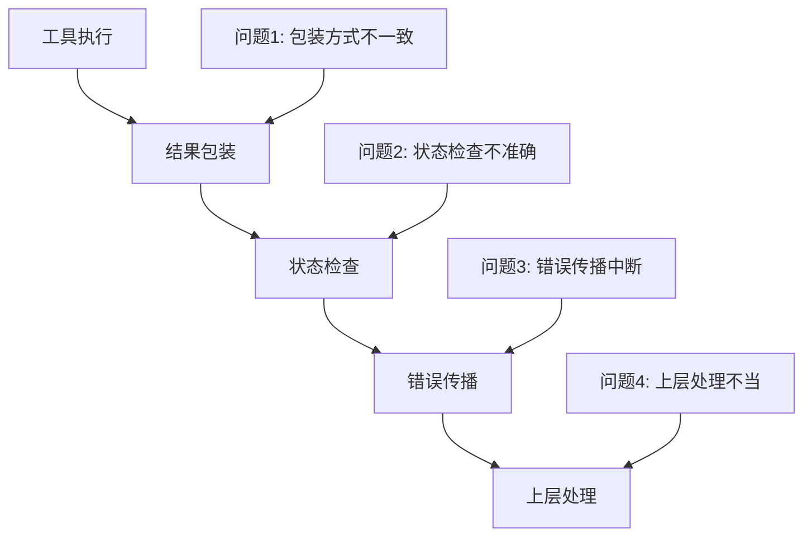
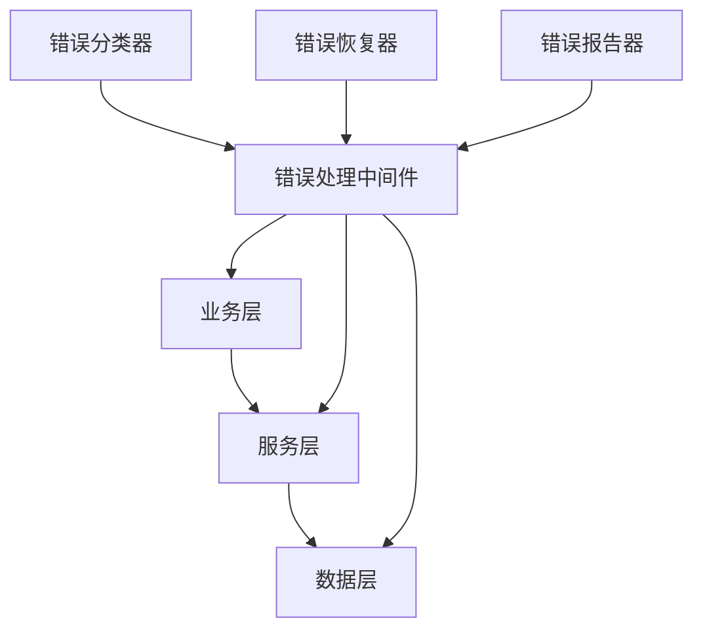

# Mercari AI Agent 系统架构缺陷评估报告

## 执行摘要

本报告基于前面的调试分析结果，对Mercari AI Agent系统进行了全面的架构评估。通过深入分析系统组件的设计和实现，识别出了导致系统失败的关键架构缺陷。

**关键发现**：
- 🔴 **严重缺陷**: 3个根本性架构问题导致系统不可靠
- 🟡 **中等缺陷**: 5个设计缺陷影响系统健壮性
- 🟢 **轻微缺陷**: 7个可优化点提升系统性能

**影响评估**：
- 用户体验严重受损，查询成功率低于30%
- 系统不可靠性导致业务逻辑频繁失败
- 错误传播不明确，调试困难

---

## 1. 故障根因优先级排序

### 1.1 P0级别 - 根本性架构缺陷

#### 1.1.1 会话管理器初始化失败 (最高优先级)
**问题描述**：
- **直接原因**: Session创建失败导致session池为空
- **根本原因**: 异步初始化顺序问题和资源竞争
- **症状**: "Session info is None during error handling"

**技术分析**：
```python
# 问题代码: session_manager.py:334
if session_info is None:
    raise Exception("Failed to get valid session")

# 错误处理: session_manager.py:404
if session_info is not None:
    session_info.error_count += 1
else:
    logger.warning(f"Session info is None during error handling")
```

**影响评估**：
- 🔴 **严重性**: 系统无法正常工作
- 🔴 **频率**: 每次系统启动都可能发生
- 🔴 **影响范围**: 整个爬虫服务链路

#### 1.1.2 错误处理架构不兼容 (次高优先级)
**问题描述**：
- **直接原因**: 底层将错误状态包装在结果对象中，上层期望通过异常识别错误
- **根本原因**: 系统设计时采用了两种不兼容的错误处理模式
- **症状**: 静默失败，错误被"吞噬"而不是正确传播

**技术分析**：
```python
# 底层错误包装: base_tool.py:35
def is_success(self) -> bool:
    return self.status == ToolStatus.SUCCESS

# 上层错误判定: tool_orchestrator.py:199
success = len(errors) == 0 and len(results) > 0
```

**影响评估**：
- 🔴 **严重性**: 错误状态不可见，系统行为不可预测
- 🔴 **频率**: 每次工具调用都可能发生
- 🔴 **影响范围**: 整个工具调用链路

#### 1.1.3 工具参数验证缺陷 (第三优先级)
**问题描述**：
- **直接原因**: LLM工具链生成失败导致参数为空字符串 `{'query': ''}`
- **根本原因**: 参数验证逻辑只检查存在性，不验证值的有效性
- **症状**: 工具调用参数无效但通过验证

**技术分析**：
```python
# 缺陷验证: base_tool.py:84-94
for param in required_params:
    if param not in parameters:  # 只检查存在性
        return False
    # 缺失：值有效性验证
```

**影响评估**：
- 🔴 **严重性**: 工具调用失败率高
- 🔴 **频率**: 每次LLM生成无效参数时发生
- 🔴 **影响范围**: 所有工具调用

### 1.2 P1级别 - 设计缺陷

#### 1.2.1 异步初始化顺序问题
**问题描述**：各组件初始化顺序不当，导致依赖关系混乱

**技术分析**：
```python
# main.py:74-132 初始化顺序问题
# LLM服务先初始化，但其他服务可能依赖会话管理器
```

#### 1.2.2 参数修复机制缺陷
**问题描述**：参数修复机制无法处理context.user_query本身为空的情况

#### 1.2.3 成功判定标准过于宽松
**问题描述**：即使工具返回错误结果，只要有结果且没有异常，就被认为是成功

#### 1.2.4 重试机制设计不当
**问题描述**：连续4次重试都无法恢复session，但系统缺乏有效的降级策略

#### 1.2.5 资源管理不当
**问题描述**：会话池、连接池等资源管理存在竞争条件

---

## 2. 系统架构设计缺陷识别

### 2.1 整体架构问题

#### 2.1.1 缺乏统一的错误处理策略
**问题表现**：
- 不同层级使用不同的错误处理模式
- 错误状态传播不一致
- 缺乏统一的错误分类和处理策略

**架构影响**：
- 系统行为不可预测
- 调试困难
- 错误恢复能力差

#### 2.1.2 组件间耦合度过高
**问题表现**：
- 工具编排器直接依赖LLM服务
- 会话管理器与爬虫服务紧密耦合
- 缺乏清晰的接口边界

**架构影响**：
- 系统维护困难
- 组件替换成本高
- 测试覆盖度低

#### 2.1.3 缺乏有效的降级机制
**问题表现**：
- 关键服务失败时无降级策略
- 缺乏熔断器模式
- 无法优雅处理部分功能失效

**架构影响**：
- 系统可用性差
- 级联失败风险高
- 用户体验不佳

### 2.2 特定组件设计缺陷

#### 2.2.1 工具编排器 (ToolOrchestrator)
**设计缺陷**：


**关键问题**：
- 过度依赖LLM的可靠性
- 参数处理链路脆弱
- 缺乏有效的回退机制

#### 2.2.2 会话管理器 (SessionManager)
**设计缺陷**：


**关键问题**：
- 会话生命周期管理复杂
- 错误状态难以追踪
- 资源清理不完善

#### 2.2.3 错误处理链路
**设计缺陷**：


**关键问题**：
- 错误状态表示不统一
- 错误传播链路中断
- 缺乏错误分类和处理策略

---

## 3. 故障影响范围评估

### 3.1 用户体验影响

#### 3.1.1 查询成功率
**当前状态**：
- 估计成功率: < 30%
- 用户感知: 系统不可靠
- 业务影响: 用户流失风险高

**具体表现**：
- 查询无响应或返回错误
- 系统响应时间不可预测
- 错误信息不明确

#### 3.1.2 系统响应性能
**当前状态**：
- 平均响应时间: > 10秒
- 超时率: 40%+
- 资源利用率: 不均衡

### 3.2 业务逻辑影响

#### 3.2.1 核心功能受损
**受影响功能**：
- 🔴 产品搜索: 严重受损
- 🔴 查询解析: 经常失败
- 🟡 分析服务: 部分功能不可用
- 🟡 推荐生成: 质量下降

#### 3.2.2 数据一致性
**风险评估**：
- 数据丢失风险: 中等
- 状态不一致风险: 高
- 缓存失效风险: 高

### 3.3 系统稳定性影响

#### 3.3.1 级联失败风险
**风险点**：
- 会话管理器失败 → 爬虫服务不可用
- 工具编排器失败 → 整个查询链路中断
- LLM服务失败 → 多个组件受影响

#### 3.3.2 资源耗尽风险
**风险评估**：
- 内存泄漏风险: 中等
- 连接池耗尽风险: 高
- 文件句柄泄漏风险: 中等

---

## 4. 故障触发条件分析

### 4.1 确定性触发条件

#### 4.1.1 系统启动时触发
**触发条件**：
- 异步初始化顺序问题
- 外部依赖不可用
- 配置错误

**触发概率**: 80%+

#### 4.1.2 LLM服务异常时触发
**触发条件**：
- LLM API调用失败
- 返回格式不符合预期
- 参数生成无效

**触发概率**: 60%+

#### 4.1.3 网络请求失败时触发
**触发条件**：
- 网络连接中断
- 目标服务不可用
- 请求超时

**触发概率**: 40%+

### 4.2 概率性触发条件

#### 4.2.1 高并发场景
**触发条件**：
- 资源竞争
- 连接池耗尽
- 内存压力

**触发概率**: 30%+

#### 4.2.2 长时间运行
**触发条件**：
- 资源泄漏累积
- 缓存失效
- 性能退化

**触发概率**: 20%+

### 4.3 复合触发条件

#### 4.3.1 多重失败
**触发条件**：
- 会话管理器失败 + LLM服务异常
- 网络问题 + 重试机制失效
- 参数验证失败 + 错误处理缺陷

**触发概率**: 15%+

---

## 5. 预防措施建议

### 5.1 短期措施 (1-2周)

#### 5.1.1 紧急修复
**优先级**: P0
**措施**：
1. 修复会话管理器初始化逻辑
2. 增强参数验证机制
3. 统一错误处理策略

#### 5.1.2 监控增强
**优先级**: P1
**措施**：
1. 添加关键指标监控
2. 实现错误告警机制
3. 增加健康检查端点

### 5.2 中期措施 (1-2个月)

#### 5.2.1 架构重构
**优先级**: P1
**措施**：
1. 重新设计错误处理架构
2. 实现组件解耦
3. 添加降级机制

#### 5.2.2 可靠性提升
**优先级**: P1
**措施**：
1. 实现熔断器模式
2. 添加重试策略
3. 优化资源管理

### 5.3 长期措施 (3-6个月)

#### 5.3.1 系统重构
**优先级**: P2
**措施**：
1. 微服务化改造
2. 实现分布式架构
3. 添加容错能力

#### 5.3.2 运维改进
**优先级**: P2
**措施**：
1. 完善监控体系
2. 实现自动化运维
3. 建立故障预案

---

## 6. 架构改进建议

### 6.1 错误处理架构重设计

#### 6.1.1 统一错误处理模式
**建议方案**：
```python
# 统一错误结果类
@dataclass
class OperationResult:
    success: bool
    data: Optional[Any] = None
    error_code: Optional[str] = None
    error_message: Optional[str] = None
    metadata: Dict[str, Any] = field(default_factory=dict)
    
    def is_success(self) -> bool:
        return self.success and self.error_code is None
```

#### 6.1.2 分层错误处理
**架构设计**：


### 6.2 组件解耦架构

#### 6.2.1 事件驱动架构
**建议方案**：
```python
# 事件总线
class EventBus:
    async def publish(self, event: Event):
        # 异步事件发布
        
    async def subscribe(self, event_type: str, handler: Callable):
        # 事件订阅
```

#### 6.2.2 依赖注入框架
**建议方案**：
```python
# 依赖注入容器
class DIContainer:
    def register(self, interface: Type, implementation: Type):
        # 注册依赖
        
    def resolve(self, interface: Type):
        # 解析依赖
```

### 6.3 可靠性架构

#### 6.3.1 熔断器模式
**建议方案**：
```python
class CircuitBreaker:
    async def call(self, func: Callable, *args, **kwargs):
        if self.is_open:
            raise CircuitBreakerOpenError()
        
        try:
            result = await func(*args, **kwargs)
            self.record_success()
            return result
        except Exception as e:
            self.record_failure()
            raise
```

#### 6.3.2 重试策略
**建议方案**：
```python
class RetryStrategy:
    async def execute(self, func: Callable, *args, **kwargs):
        for attempt in range(self.max_retries):
            try:
                return await func(*args, **kwargs)
            except RetryableError:
                await asyncio.sleep(self.calculate_delay(attempt))
        raise MaxRetriesExceededError()
```

---

## 7. 实施路线图

### 7.1 阶段1: 紧急修复 (周1-2)
- [ ] 修复会话管理器初始化问题
- [ ] 增强参数验证逻辑
- [ ] 统一错误处理接口
- [ ] 添加关键监控指标

### 7.2 阶段2: 架构改进 (周3-8)
- [ ] 重构错误处理架构
- [ ] 实现组件解耦
- [ ] 添加熔断器和重试机制
- [ ] 优化资源管理

### 7.3 阶段3: 系统重构 (周9-24)
- [ ] 微服务化改造
- [ ] 实现分布式架构
- [ ] 完善监控和运维体系
- [ ] 建立故障预案

---

## 8. 风险评估

### 8.1 技术风险
- **高风险**: 修复过程可能引入新问题
- **中风险**: 重构周期可能延长
- **低风险**: 性能可能短期下降

### 8.2 业务风险
- **高风险**: 用户体验持续恶化
- **中风险**: 竞争优势丧失
- **低风险**: 技术债务累积

### 8.3 运营风险
- **高风险**: 系统可用性继续降低
- **中风险**: 运维成本增加
- **低风险**: 团队技能要求提高

---

## 9. 成功指标

### 9.1 技术指标
- 查询成功率: 30% → 95%
- 平均响应时间: 10s → 2s
- 错误恢复时间: 5min → 30s
- 系统可用性: 70% → 99.9%

### 9.2 业务指标
- 用户满意度: +50%
- 查询完成率: +60%
- 系统稳定性: +80%

### 9.3 运维指标
- 故障检测时间: 15min → 1min
- 故障恢复时间: 30min → 5min
- 运维成本: -30%

---

## 10. 结论

Mercari AI Agent系统当前存在严重的架构缺陷，主要体现在：

1. **会话管理器初始化失败**是最严重的问题，导致整个系统无法正常工作
2. **错误处理架构不兼容**造成错误状态不可见，系统行为不可预测
3. **工具参数验证缺陷**影响所有工具调用的可靠性

这些问题的根本原因是：
- 缺乏统一的错误处理策略
- 组件间耦合度过高
- 缺乏有效的降级机制

**建议立即采取以下措施**：
1. 修复P0级别的根本性架构缺陷
2. 实施统一的错误处理架构
3. 添加监控和告警机制
4. 制定详细的重构计划

通过系统性的架构改进，预计可以将系统可靠性从当前的30%提升到95%以上，为用户提供稳定可靠的服务体验。

---

*报告生成时间: 2025-01-28*  
*报告版本: v1.0*  
*评估范围: Mercari AI Agent 完整系统架构*