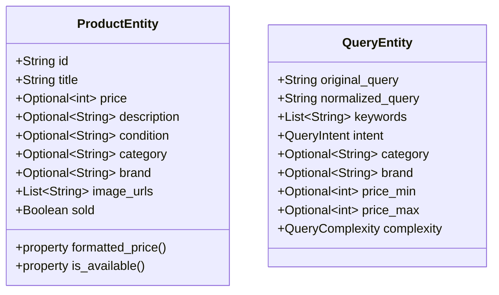
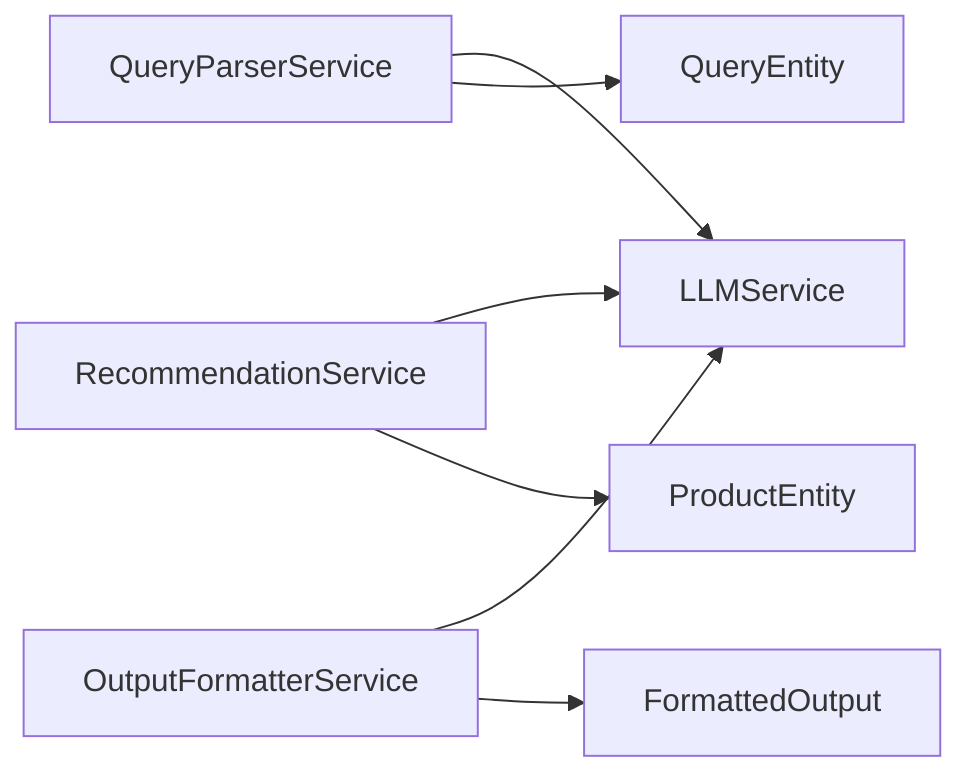
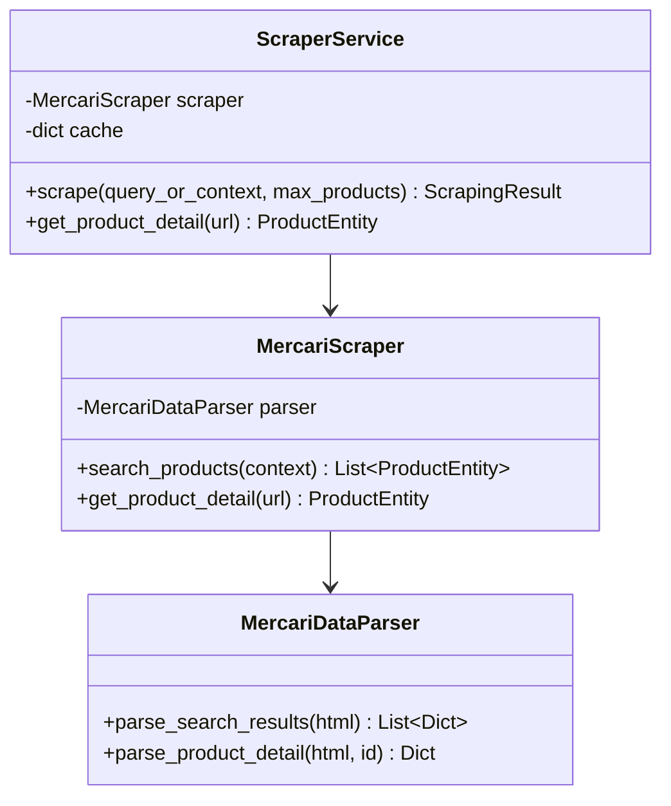
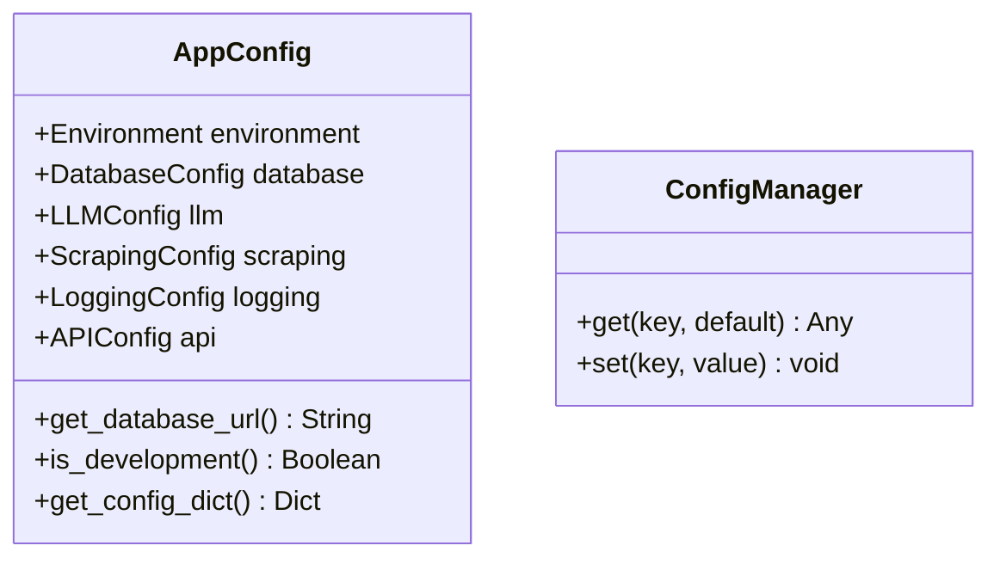
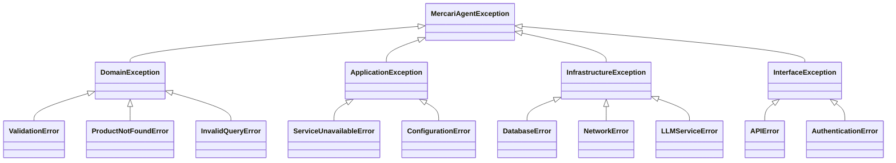
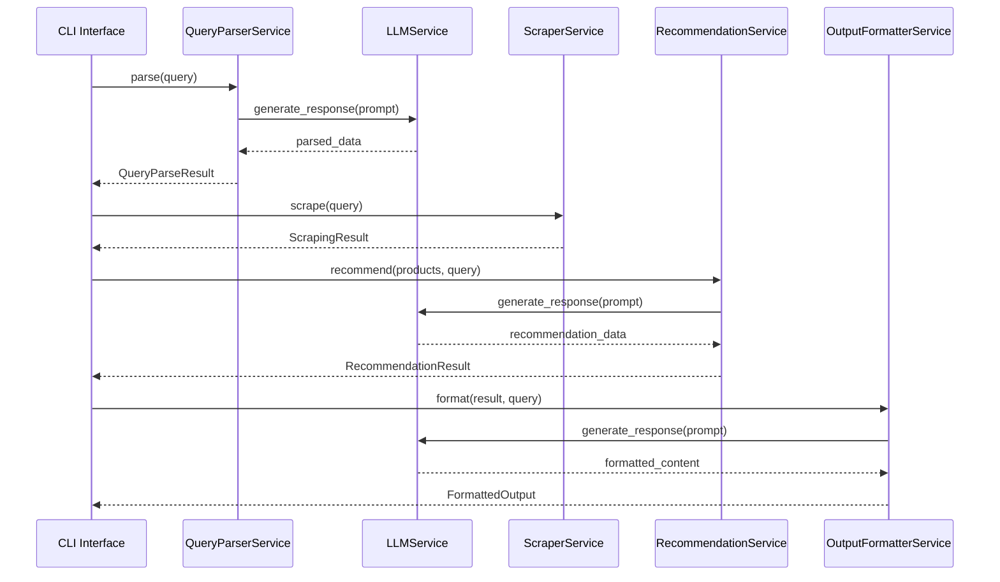
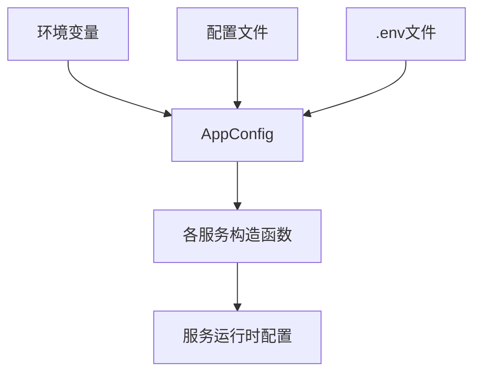

# Mercari AI Agent Refactored 系统架构分析报告

## 目录
1. [系统概述](#系统概述)
2. [架构层次分析](#架构层次分析)
3. [组件交互分析](#组件交互分析)
4. [依赖关系评估](#依赖关系评估)
5. [系统优势](#系统优势)
6. [存在问题](#存在问题)
7. [改进建议](#改进建议)

---

## 系统概述

Mercari AI Agent Refactored 是一个采用六边形架构（Hexagonal Architecture）和领域驱动设计（DDD）原则构建的智能购物助手系统。系统专为日本 Mercari 平台设计，集成了多个 LLM 提供商，实现了查询解析、商品推荐、数据爬取和输出格式化等核心功能。

### 技术栈
- **后端框架**: FastAPI (异步)
- **CLI框架**: Click  
- **HTTP客户端**: HTTPX
- **LLM集成**: OpenAI, Anthropic, Azure
- **架构模式**: 六边形架构 + DDD
- **编程范式**: 异步编程，函数式编程

---

## 架构层次分析

### 1. Domain 层 - 领域核心

#### Entities (实体)


#### Value Objects (值对象)
系统实现了丰富的值对象层次结构：

**价格相关值对象**：
- [`Price`](mercari_ai_agent_refactored/src/mercari_agent/domain/value_objects/price.py:33): 不可变价格对象，包含金额和货币类型
- [`PriceRange`](mercari_ai_agent_refactored/src/mercari_agent/domain/value_objects/price.py:145): 价格范围，支持交集运算
- [`PriceHistory`](mercari_ai_agent_refactored/src/mercari_agent/domain/value_objects/price.py:233): 价格历史跟踪

**商品属性值对象**：
- [`ProductImage`](mercari_ai_agent_refactored/src/mercari_agent/domain/value_objects/product_attributes.py:62): 商品图片信息
- [`ProductImages`](mercari_ai_agent_refactored/src/mercari_agent/domain/value_objects/product_attributes.py:180): 图片集合管理
- [`ProductMetadata`](mercari_ai_agent_refactored/src/mercari_agent/domain/value_objects/product_attributes.py:266): 商品元数据
- [`SellerInfo`](mercari_ai_agent_refactored/src/mercari_agent/domain/value_objects/product_attributes.py:376): 卖家信息

**查询属性值对象**：
- [`SearchFilters`](mercari_ai_agent_refactored/src/mercari_agent/domain/value_objects/query_attributes.py:56): 搜索过滤条件
- [`QueryContext`](mercari_ai_agent_refactored/src/mercari_agent/domain/value_objects/query_attributes.py:218): 查询上下文
- [`SearchCriteria`](mercari_ai_agent_refactored/src/mercari_agent/domain/value_objects/query_attributes.py:373): 搜索条件

### 2. Application 层 - 应用服务



#### 服务协作关系
1. **QueryParserService**: 
   - 依赖 [`LLMService`](mercari_ai_agent_refactored/src/mercari_agent/infrastructure/llm/llm_service.py:33) 进行智能查询解析
   - 回退到基础解析逻辑
   - 输出 [`QueryParseResult`](mercari_ai_agent_refactored/src/mercari_agent/application/services/query_parser_service.py:17)

2. **RecommendationService**:
   - 集成 LLM 进行智能推荐排序
   - 基于价格、关键词、状态等多维度筛选
   - 输出 [`RecommendationResult`](mercari_ai_agent_refactored/src/mercari_agent/application/services/recommendation_service.py:18)

3. **OutputFormatterService**:
   - 使用 LLM 进行智能格式化
   - 支持多种输出格式（markdown_table, detailed_report, simple_list, json_export）
   - 多语言支持

### 3. Infrastructure 层 - 基础设施

#### LLM服务抽象
```python
class LLMService:
    def __init__(self, config): pass
    async def generate_response(self, prompt: str, provider: str = None) -> LLMResponse
    async def get_service_info(self) -> Dict[str, Any]
    async def test_connection(self) -> Dict[str, Dict[str, Any]]
```

#### 爬虫服务架构


### 4. Interfaces 层 - 接口适配

#### CLI接口
- 采用 [`CLIApp`](mercari_ai_agent_refactored/src/mercari_agent/interfaces/cli/main.py:48) 类管理服务生命周期
- 命令：`search`, `parse`, `scrape`, `status`, `config`, `llm_test`
- 依赖注入模式：手动注入各个服务

#### API接口  
- 基于 [`APIServices`](mercari_ai_agent_refactored/src/mercari_agent/interfaces/api/main.py:42) 容器
- FastAPI应用生命周期管理
- 中间件：CORS、限流、错误处理、请求日志

### 5. Shared 层 - 共享组件

#### 配置管理


#### 异常层次结构


---

## 组件交互分析

### 1. 典型请求流程



### 2. 依赖注入模式

系统目前采用**手动依赖注入**模式：

```python
# CLI中的依赖注入
self.llm_service = LLMService(self.config)
self.query_parser = QueryParserService(self.config, self.llm_service)
self.recommendation_service = RecommendationService(self.config, self.llm_service)
self.output_formatter = OutputFormatterService(self.config, self.llm_service)
self.scraper_service = ScraperService(self.config)
```

### 3. 服务间通信

- **同步通信**: 主要通过直接方法调用
- **异步通信**: 使用 `async/await` 进行异步操作
- **错误传播**: 通过异常层次结构进行错误传播

---

## 依赖关系评估

### 1. 外部依赖
- **LLM服务**: OpenAI, Anthropic, Azure (高耦合)
- **HTTP客户端**: HTTPX (中等耦合)
- **Web框架**: FastAPI (低耦合)
- **CLI框架**: Click (低耦合)

### 2. 内部依赖
- **应用层 → 基础设施层**: 正确的依赖方向
- **接口层 → 应用层**: 正确的依赖方向  
- **所有层 → 共享层**: 合理的横向依赖

### 3. 配置传递机制


---

## 系统优势

### 1. 架构设计优势
- ✅ **清晰的分层架构**: 采用六边形架构，职责分离明确
- ✅ **领域驱动设计**: 丰富的领域模型和值对象
- ✅ **异步处理能力**: 全面支持异步操作
- ✅ **多接口支持**: CLI和API双接口

### 2. 扩展性优势  
- ✅ **LLM提供商解耦**: 支持多个LLM提供商
- ✅ **输出格式灵活**: 支持多种输出格式
- ✅ **多语言支持**: 国际化设计
- ✅ **爬虫策略扩展**: 支持多种爬取策略

### 3. 可维护性优势
- ✅ **结构化异常处理**: 完整的异常层次结构
- ✅ **配置管理统一**: 集中的配置管理
- ✅ **日志记录完善**: 全面的日志记录
- ✅ **类型安全**: 使用类型注解

---

## 存在问题

### 1. 依赖注入问题
❌ **手动依赖注入**: 缺乏依赖注入容器
- 服务初始化代码重复
- 依赖关系管理复杂
- 测试时难以mock依赖

### 2. 缓存策略问题
❌ **简单内存缓存**: 
```python
self.cache = {}  # 简单的内存缓存
```
- 无缓存过期策略
- 内存泄漏风险
- 无分布式缓存支持

### 3. 并发控制问题
❌ **基础并发控制**:
- 简单的请求间隔控制
- 缺乏并发请求管理
- 无资源池管理

### 4. 插件系统问题
❌ **插件系统不完整**: 
- 插件目录结构存在但实现不完整
- 缺乏插件加载机制
- 无插件生命周期管理

### 5. 数据一致性问题
❌ **无数据一致性保证**:
- 缓存与数据源不同步
- 无事务管理
- 并发访问无锁机制

---

## 改进建议

### 1. 实现依赖注入容器

```python
# 建议实现DI容器
class DIContainer:
    def __init__(self):
        self._services = {}
        self._singletons = {}
    
    def register_singleton(self, interface, implementation):
        self._services[interface] = ('singleton', implementation)
    
    def register_transient(self, interface, implementation):  
        self._services[interface] = ('transient', implementation)
    
    def resolve(self, interface):
        # 实现依赖解析逻辑
        pass
```

### 2. 增强缓存策略

```python
# 建议使用Redis或内置TTL缓存
class CacheManager:
    def __init__(self, backend='memory', ttl=300):
        self.backend = backend
        self.ttl = ttl
        self.cache = {}
        self.expiry = {}
    
    async def get(self, key):
        if self._is_expired(key):
            await self.delete(key)
            return None
        return self.cache.get(key)
    
    async def set(self, key, value, ttl=None):
        self.cache[key] = value
        self.expiry[key] = time.time() + (ttl or self.ttl)
```

### 3. 实现资源池管理

```python
class ResourcePool:
    def __init__(self, factory, max_size=10):
        self.factory = factory
        self.max_size = max_size
        self.pool = asyncio.Queue(maxsize=max_size)
        self.created = 0
    
    async def acquire(self):
        if not self.pool.empty():
            return await self.pool.get()
        elif self.created < self.max_size:
            resource = await self.factory()
            self.created += 1
            return resource
        else:
            return await self.pool.get()  # Wait for available resource
```

### 4. 完善插件系统

```python
class PluginManager:
    def __init__(self):
        self.plugins = {}
        self.hooks = {}
    
    def load_plugin(self, plugin_path):
        # 动态加载插件
        pass
    
    def register_hook(self, hook_name, callback):
        # 注册钩子函数
        pass
    
    async def execute_hook(self, hook_name, *args, **kwargs):
        # 执行钩子回调
        pass
```

### 5. 添加监控和指标

```python
class MetricsCollector:
    def __init__(self):
        self.counters = {}
        self.timers = {}
        self.gauges = {}
    
    def increment_counter(self, name, value=1, tags=None):
        # 增加计数器
        pass
    
    def record_timer(self, name, duration, tags=None):
        # 记录时间
        pass
    
    def set_gauge(self, name, value, tags=None):
        # 设置指标值
        pass
```

---

## 结论

Mercari AI Agent Refactored 系统展现了良好的架构设计，采用了现代软件架构最佳实践。系统的分层清晰、职责分离明确，具有良好的扩展性和可维护性。

**主要优势**:
- 六边形架构和DDD设计
- 异步处理能力强
- 多LLM提供商支持
- 完整的错误处理机制

**主要问题**:
- 缺乏依赖注入容器
- 缓存策略过于简单
- 插件系统不完整
- 并发控制有限

**总体评分**: **B+**

系统具有坚实的架构基础，但在企业级特性（如依赖注入、高级缓存、监控等）方面还有提升空间。建议按照改进建议逐步完善系统，使其达到生产环境的要求。