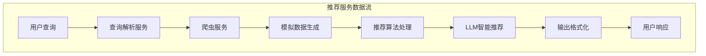
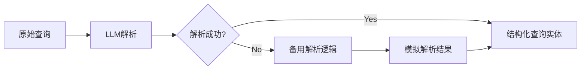
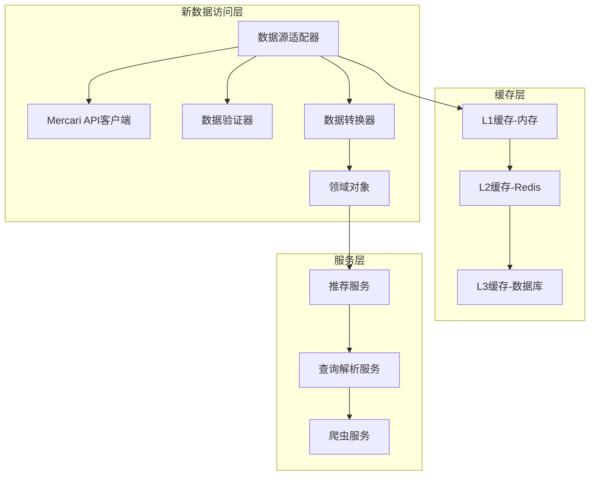

# Mercari AI Agent Refactored 项目模拟数据架构分析报告

## 摘要

本报告对 `mercari_ai_agent_refactored` 项目中的模拟数据实现架构进行了全面分析，识别了现有的数据流、接口设计、集成点和重构影响范围。该分析为后续替换模拟数据为真实数据源提供了详细的技术指导。

## 1. 项目概述

### 1.1 项目架构
- **架构模式**: 洋葱架构 (Onion Architecture)
- **分层结构**: 表现层、应用层、领域层、基础设施层
- **设计原则**: 领域驱动设计 (DDD)、依赖倒置、关注点分离

### 1.2 关键组件
- **应用服务**: 推荐服务、查询解析服务、输出格式化服务
- **基础设施**: 爬虫服务、缓存管理、配置管理
- **领域对象**: 产品实体、查询实体、价格值对象、产品属性值对象

## 2. 数据流架构分析

### 2.1 推荐服务 (RecommendationService) 中的模拟数据实现

#### 2.1.1 架构概述


#### 2.1.2 模拟数据生成点
1. **爬虫服务模拟数据**:
   - 位置: `ScraperService.scraper_service.py`
   - 方法: `MercariDataParser._generate_mock_products()`
   - 特点: 生成随机产品数据，包含ID、标题、价格、条件等

```python
def _generate_mock_products(self) -> List[Dict[str, Any]]:
    """生成模拟产品数据"""
    products = []
    for i in range(10):
        products.append({
            "id": f"m{random.randint(10000000, 99999999)}",
            "title": f"商品示例 {i+1}",
            "price": random.randint(500, 50000),
            "condition": random.choice(["新品・未使用", "未使用に近い", "目立った傷や汚れなし"]),
            "seller_name": f"seller_{i+1}",
            "seller_rating": round(random.uniform(3.5, 5.0), 1),
            # ... 更多字段
        })
    return products
```

2. **推荐服务备用逻辑**:
   - 位置: `RecommendationService._fallback_recommend()`
   - 功能: 基于价格过滤和关键词匹配的简单推荐算法
   - 特点: 作为LLM服务失败时的备用方案

### 2.2 查询解析服务 (QueryParserService) 中的模拟数据处理

#### 2.2.1 模拟数据处理流程


#### 2.2.2 备用解析逻辑特点
- 基于正则表达式的价格提取
- 简单的关键词分词
- 硬编码的类别和品牌推测

### 2.3 输出格式化服务 (OutputFormatterService) 中的模拟数据处理

#### 2.3.1 格式化流程
- 使用LLM进行智能格式化
- 备用格式化逻辑使用硬编码模板
- 支持多种输出格式 (markdown_table, detailed_report, simple_list)

## 3. 接口设计分析

### 3.1 数据接口设计模式

#### 3.1.1 服务接口契约
```python
# 推荐服务接口
class RecommendationService:
    async def recommend(
        self,
        products: List[ProductEntity],
        query: QueryEntity,
        limit: int = 10,
        strategy: str = "balanced"
    ) -> RecommendationResult
```

#### 3.1.2 数据传输对象 (DTOs)
```python
@dataclass
class RecommendationResult:
    recommendations: List[ProductEntity]
    strategy_used: str
    processing_time: float
    total_analyzed: int
```

### 3.2 领域对象设计

#### 3.2.1 产品实体 (ProductEntity)
```python
@dataclass
class ProductEntity:
    id: str
    title: str
    price: Optional[int] = None
    original_price: Optional[int] = None
    description: Optional[str] = None
    condition: Optional[str] = None
    category: Optional[str] = None
    brand: Optional[str] = None
    seller_name: Optional[str] = None
    # ... 更多字段
```

#### 3.2.2 查询实体 (QueryEntity)
```python
@dataclass
class QueryEntity:
    original_query: str
    normalized_query: str = ""
    keywords: List[str] = None
    intent: QueryIntent = QueryIntent.SEARCH
    category: Optional[str] = None
    brand: Optional[str] = None
    price_min: Optional[int] = None
    price_max: Optional[int] = None
    condition: Optional[str] = None
    complexity: QueryComplexity = QueryComplexity.SIMPLE
    language: str = "ja"
```

### 3.3 值对象设计

#### 3.3.1 价格值对象 (Price)
```python
@dataclass(frozen=True)
class Price:
    amount: Decimal
    currency: Currency = Currency.JPY
    
    def format(self) -> str:
        if self.currency == Currency.JPY:
            return f"¥{self.amount:,.0f}"
        # ...
```

#### 3.3.2 产品属性值对象
- `ProductImage`: 产品图片信息
- `ProductMetadata`: 产品元数据
- `SellerInfo`: 卖家信息

## 4. 集成点识别

### 4.1 LLM组件与数据接口的集成点

#### 4.1.1 推荐服务中的LLM集成
```python
# 构建LLM提示词进行智能推荐
llm_prompt = f"""
作为智能购物助手，请基于用户查询分析以下商品并进行推荐排序：

用户查询: {query.original_query}
查询意图: {query.intent.value if query.intent else 'SEARCH'}
价格范围: {query.price_min or 0} - {query.price_max or '无限制'} 日元
推荐策略: {strategy}

商品列表: {product_list}
"""
```

#### 4.1.2 查询解析服务中的LLM集成
```python
llm_prompt = f"""
请分析以下日语购物查询，提取关键信息：
查询: {query_text}

请返回JSON格式，包含以下字段：
- keywords: 产品关键词列表
- category: 产品类别
- brand: 品牌
- price_min: 最低价格
- price_max: 最高价格
- intent: 购买意图
- condition: 商品状态
"""
```

### 4.2 数据访问层集成点

#### 4.2.1 爬虫服务与缓存的集成
```python
# 缓存检查和设置
cache_key = self._generate_cache_key(context)
if context.use_cache and cache_key in self.cache:
    cached_result = self.cache[cache_key]
    if time.time() - cached_result['timestamp'] < self.cache_ttl:
        return cached_result['result']
```

#### 4.2.2 配置管理与服务集成
```python
class AppConfig:
    def __init__(self):
        self.database = DatabaseConfig()
        self.llm = LLMConfig()
        self.scraping = ScrapingConfig()
        self.logging = LoggingConfig()
        self.api = APIConfig()
```

## 5. 模拟数据生成逻辑识别

### 5.1 主要模拟数据生成点

#### 5.1.1 产品数据生成
- **位置**: `MercariDataParser._generate_mock_products()`
- **生成逻辑**: 
  - 随机生成产品ID
  - 固定模板生成产品标题
  - 随机生成价格、条件、卖家信息
  - 模拟图片URL和描述

#### 5.1.2 产品详情生成
- **位置**: `MercariDataParser._generate_mock_product_detail()`
- **生成逻辑**:
  - 基于产品ID生成详细信息
  - 包含多张图片URL
  - 详细描述信息

### 5.2 测试数据生成

#### 5.2.1 推荐服务测试数据
```python
def create_sample_products(self):
    products = [
        ProductEntity(
            id="1",
            title="iPhone 14 Pro 128GB スペースブラック",
            price=98000,
            condition="新品・未使用",
            seller_name="tech_seller",
            # ...
        ),
        # ... 更多测试产品
    ]
```

#### 5.2.2 爬虫服务测试数据
```python
test_query = QueryEntity(
    original_query="iPhone 15 Pro",
    normalized_query="iphone 15 pro",
    keywords=["iPhone", "15", "Pro"],
    intent=QueryIntent.SEARCH,
    category="スマートフォン",
    brand="Apple",
    price_max=100000
)
```

## 6. 重构影响评估

### 6.1 影响范围分析

#### 6.1.1 高影响组件
1. **爬虫服务 (ScraperService)**
   - 需要完全重构数据获取逻辑
   - 替换模拟数据生成为真实Mercari API调用
   - 影响程度: ⭐⭐⭐⭐⭐

2. **推荐服务 (RecommendationService)**
   - 需要适配真实数据结构
   - 可能需要调整推荐算法
   - 影响程度: ⭐⭐⭐⭐

3. **查询解析服务 (QueryParserService)**
   - 备用解析逻辑需要优化
   - 与真实数据字段映射
   - 影响程度: ⭐⭐⭐

#### 6.1.2 中等影响组件
1. **输出格式化服务 (OutputFormatterService)**
   - 需要处理真实数据的边界情况
   - 影响程度: ⭐⭐

2. **缓存管理 (CacheManager)**
   - 需要适配真实数据的缓存策略
   - 影响程度: ⭐⭐

#### 6.1.3 低影响组件
1. **领域对象 (Entities & Value Objects)**
   - 可能需要添加新字段
   - 影响程度: ⭐

2. **配置管理 (AppConfig)**
   - 需要添加API密钥等配置
   - 影响程度: ⭐

### 6.2 向后兼容性要求

#### 6.2.1 接口兼容性
- 保持现有服务接口不变
- 确保返回数据结构一致性
- 维护异常处理机制

#### 6.2.2 配置兼容性
- 支持渐进式迁移
- 保留模拟数据作为备用选项
- 提供开发/生产环境切换

### 6.3 风险评估

#### 6.3.1 技术风险
1. **数据质量风险** (高)
   - 真实数据可能不完整或格式不一致
   - 缓解策略: 实现数据验证和清洗机制

2. **性能风险** (中)
   - 真实API调用可能较慢
   - 缓解策略: 优化缓存策略、异步处理

3. **可用性风险** (中)
   - 外部API可能不稳定
   - 缓解策略: 实现重试机制、降级策略

#### 6.3.2 业务风险
1. **合规风险** (高)
   - 需要遵守Mercari服务条款
   - 缓解策略: 使用官方API，控制请求频率

2. **成本风险** (中)
   - API调用可能产生费用
   - 缓解策略: 实现请求限制、缓存优化

## 7. 真实数据集成架构建议

### 7.1 推荐架构

#### 7.1.1 数据访问层重构


#### 7.1.2 数据源适配器模式
```python
class DataSourceAdapter:
    def __init__(self, config: DataSourceConfig):
        self.real_client = MercariAPIClient(config.api_key)
        self.mock_client = MockDataClient()
        self.use_real_data = config.use_real_data
    
    async def fetch_products(self, query: QueryEntity) -> List[ProductEntity]:
        if self.use_real_data:
            return await self.real_client.search_products(query)
        else:
            return await self.mock_client.generate_products(query)
```

### 7.2 最佳实践建议

#### 7.2.1 渐进式迁移策略
1. **阶段1**: 实现数据源适配器
2. **阶段2**: 添加真实数据验证
3. **阶段3**: 逐步切换服务使用真实数据
4. **阶段4**: 移除模拟数据生成逻辑

#### 7.2.2 错误处理增强
```python
class DataFetchError(BaseServiceException):
    def __init__(self, message: str, fallback_available: bool = False):
        super().__init__(message)
        self.fallback_available = fallback_available

async def fetch_with_fallback(query: QueryEntity) -> List[ProductEntity]:
    try:
        return await real_data_client.fetch(query)
    except DataFetchError as e:
        if e.fallback_available:
            logger.warning(f"使用备用数据源: {e}")
            return await mock_data_client.fetch(query)
        raise
```

#### 7.2.3 监控和度量
```python
class DataSourceMetrics:
    def __init__(self):
        self.api_calls = 0
        self.cache_hits = 0
        self.errors = 0
        self.average_response_time = 0.0
    
    def record_api_call(self, duration: float, success: bool):
        self.api_calls += 1
        if not success:
            self.errors += 1
        self.average_response_time = (
            (self.average_response_time * (self.api_calls - 1) + duration) / self.api_calls
        )
```

## 8. 重构实施计划

### 8.1 实施阶段

#### 8.1.1 准备阶段 (1-2周)
- [ ] 设计数据源适配器接口
- [ ] 实现配置管理增强
- [ ] 设置开发环境和测试数据

#### 8.1.2 核心重构阶段 (3-4周)
- [ ] 实现Mercari API客户端
- [ ] 重构爬虫服务
- [ ] 更新推荐服务逻辑
- [ ] 增强缓存策略

#### 8.1.3 集成测试阶段 (2-3周)
- [ ] 端到端测试
- [ ] 性能测试
- [ ] 错误处理测试
- [ ] 用户验收测试

#### 8.1.4 部署阶段 (1周)
- [ ] 生产环境配置
- [ ] 监控设置
- [ ] 灰度发布
- [ ] 全量部署

### 8.2 风险缓解策略

#### 8.2.1 技术风险缓解
1. **数据质量保证**
   - 实现数据验证管道
   - 设置数据质量监控
   - 建立数据清洗规则

2. **性能优化**
   - 实现多级缓存
   - 使用异步处理
   - 优化数据库查询

3. **可用性保证**
   - 实现熔断机制
   - 设置降级策略
   - 多数据源备份

#### 8.2.2 业务风险缓解
1. **合规保证**
   - 遵守API使用条款
   - 实现请求频率控制
   - 设置使用量监控

2. **成本控制**
   - 实现智能缓存策略
   - 优化API调用频率
   - 设置使用量告警

## 9. 结论

### 9.1 核心发现
1. **模拟数据实现集中在爬虫服务层**，主要通过`MercariDataParser`类的模拟方法生成
2. **服务层设计良好**，具有清晰的接口抽象，便于数据源替换
3. **领域对象设计完善**，支持真实数据的完整映射
4. **缓存和配置管理完善**，为真实数据集成提供良好基础

### 9.2 重构优先级
1. **高优先级**: 爬虫服务重构、数据源适配器实现
2. **中优先级**: 推荐算法优化、缓存策略增强
3. **低优先级**: 监控增强、文档更新

### 9.3 成功关键因素
1. **渐进式迁移**: 避免大爆炸式重构
2. **完善的测试**: 确保重构过程中功能正确性
3. **监控和日志**: 及时发现和解决问题
4. **备用方案**: 确保系统可用性

通过本次分析，我们为mercari_ai_agent_refactored项目的模拟数据重构提供了全面的技术指导，确保能够安全、高效地实现真实数据源的集成。