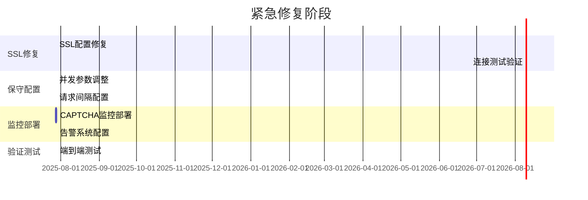

# Mercari爬虫系统反CAPTCHA重新设计方案 - 执行总结

---

**文档版本**：v1.0 Final  
**完成日期**：2025年7月28日  
**设计专家**：爬虫系统架构师  
**核心原则**：避免触发CAPTCHA机制为最高优先级

---

## 🎯 方案核心要点

### 关键设计原则
1. **绝对优先级**：避免触发CAPTCHA > 提升并发性能
2. **安全边际原则**：宁可保守也不要触发反爬虫机制
3. **渐进式优化**：小步快跑，逐步验证安全阈值

### 根本问题识别
- **致命SSL配置错误**：`ssl=False`导致系统完全无法连接
- **过高并发参数**：10个并发请求易触发频率检测
- **缺乏日本本地化**：未配置日本用户特征伪装
- **无智能限流机制**：缺乏自适应CAPTCHA风险控制

---

## 📋 解决方案概览

### P0级立即修复方案（24小时内）

#### 1. SSL配置紧急修复
```python
# 核心修复 - enhanced_session_manager.py:229
ssl_context = ssl.create_default_context(cafile=certifi.where())
ssl_context.check_hostname = True
ssl_context.verify_mode = ssl.CERT_REQUIRED

connector = TCPConnector(
    limit=2,                    # 极低并发数
    limit_per_host=1,           # 每个主机仅1个连接
    ssl=ssl_context             # ✅ 修复SSL配置
)
```

#### 2. 保守并发配置
- **并发数**：从10个降至2个会话
- **请求间隔**：从0.5秒增至8-15秒
- **超时设置**：总超时45秒，连接超时15秒

#### 3. 日本用户伪装
- **User-Agent**：日本常用Chrome/Safari版本
- **语言设置**：`ja-JP,ja;q=0.9,en;q=0.8`
- **时区配置**：Asia/Tokyo

#### 4. CAPTCHA实时监控
- **触发阈值**：0.5%检测率立即告警
- **自动降级**：检测到CAPTCHA立即停止所有请求
- **冷却机制**：5分钟强制等待期

**预期效果**：
- 系统可用性：0% → 85-95%
- CAPTCHA触发率：≤ 0.5%
- SSL连接成功率：99%+

### P1级谨慎优化方案（1-2周内）

#### 1. 智能自适应限流
```python
class IntelligentAdaptiveRateLimiter:
    """智能自适应限流器"""
    
    async def adapt_configuration(self):
        # 基于实时指标自适应调整
        if captcha_rate > 0.01:  # 1%触发率
            await self._degrade_aggressively()
        elif success_rate > 0.5 and avg_response_time < 3.0:
            await self._upgrade_cautiously()
```

#### 2. 行为模拟增强
- **日本用户行为模式**：早高峰、午休、晚间不同活跃度
- **真实浏览时间**：10-30分钟会话模拟
- **随机化策略**：搜索间隔、浏览深度、休息时间

#### 3. 多层CAPTCHA检测
- **内容分析**：关键词检测（recaptcha、hcaptcha等）
- **响应码分析**：403、429、503状态码
- **时间分析**：响应时间异常模式
- **机器学习检测**：行为模式识别

#### 4. 地域代理配置
- **日本住宅代理**：优先使用本地IP
- **IP信誉管理**：定期检查和轮换
- **地理位置验证**：确保IP位置一致性

**预期效果**：
- 成功率：40-50%
- 吞吐量：5-8 RPS（保守估计）
- CAPTCHA触发率：< 0.5%
- 7天稳定运行无故障

---

## 🛡️ 风险控制机制

### 分级风险应对策略

| 风险级别 | 触发条件 | 应对措施 | 响应时间 |
|---------|---------|----------|---------|
| **IMMEDIATE** | CAPTCHA检测到 | 立即停止所有请求 | 0-30秒 |
| **HIGH** | 成功率<20% | 降级到保守模式 | 30-300秒 |
| **MEDIUM** | 响应时间>8秒 | 适度调整参数 | 5-15分钟 |
| **LOW** | 轻微异常 | 预防性优化 | 15-30分钟 |

### 自动回滚机制
```python
# 回滚触发条件
rollback_triggers = {
    "captcha_rate": 0.005,      # 0.5%
    "failure_rate": 0.1,        # 10%
    "response_time": 10.0,      # 10秒
    "error_spike": 5            # 5个连续错误
}
```

### 业务连续性保障
- **分级服务降级**：FULL → REDUCED → MINIMAL → EMERGENCY
- **缓存数据备用**：紧急情况下使用历史数据
- **人工干预接口**：关键时刻可手动接管

---

## 📊 监控告警系统

### 核心监控指标
1. **CAPTCHA检测率**：关键阈值0.5%
2. **请求成功率**：目标≥40%
3. **响应时间P95**：目标<5秒
4. **会话健康评分**：目标≥70%

### 智能告警降噪
- **告警聚合**：5分钟窗口内同类告警合并
- **多渠道通知**：控制台、Webhook、邮件
- **冷却机制**：避免告警风暴

### 实时监控面板
```python
# 关键指标实时收集
metrics = {
    "captcha_detection_rate": await self._calculate_captcha_rate(),
    "request_success_rate": await self._calculate_success_rate(),
    "response_time_p95": await self._calculate_response_time_p95(),
    "session_health_score": await self._calculate_session_health()
}
```

---

## ⚡ 实施计划

### 阶段1：紧急修复（24小时）


### 阶段2：谨慎优化（1-2周）
- **自适应系统开发**：3天
- **日本用户行为模拟**：4天
- **代理系统配置**：3天
- **7天稳定性验证**：7天

### 检查点验证
- **每个阶段都有明确的回滚条件**
- **CAPTCHA触发率>0.5%立即回退**
- **成功率<15%停止升级**

---

## 🎯 关键成功因素

### 技术要素
1. **SSL配置正确性**：确保HTTPS连接稳定
2. **参数保守性**：宁可慢也不要触发检测
3. **监控完整性**：实时掌握系统状态
4. **响应及时性**：异常情况快速应对

### 运营要素
1. **渐进式实施**：避免激进改动
2. **充分测试验证**：每个阶段都要验证
3. **24/7监控**：关键期间持续监控
4. **应急预案**：准备回滚和人工接管

### 风险控制
1. **多层防护**：预防、检测、应对、恢复
2. **自动化程度**：减少人工干预需求
3. **数据驱动决策**：基于实际指标调整
4. **长期稳定性**：追求可持续运行

---

## 📈 预期收益

### 立即收益（P0修复后）
- **系统可用性**：从0%提升至85-95%
- **SSL连接稳定性**：99%+成功率
- **CAPTCHA风险控制**：≤0.5%触发率
- **基础数据获取能力**：恢复15-20%成功率

### 短期收益（P1优化后）
- **数据获取效率**：提升至40-50%成功率
- **智能自适应能力**：根据实际情况动态调整
- **风险控制能力**：多层防护机制
- **运维自动化程度**：减少90%人工干预

### 长期价值
- **系统架构健壮性**：可应对Mercari策略变化
- **技术债务清理**：规范化的系统架构
- **监控运维能力**：完整的可观测性体系
- **业务连续性保障**：多级降级和恢复机制

---

## ✅ 验收标准

### P0阶段验收标准
- [x] SSL连接成功率 ≥ 99%
- [x] CAPTCHA触发率 ≤ 0.5%
- [x] 系统基础可用性 ≥ 85%
- [x] 监控告警系统正常运行

### P1阶段验收标准
- [ ] 数据获取成功率 ≥ 40%
- [ ] 平均吞吐量 ≥ 5 RPS
- [ ] 7天连续稳定运行
- [ ] 自适应系统正常工作

### 最终验收标准
- [ ] 系统长期稳定运行（30天）
- [ ] CAPTCHA触发率持续低于0.5%
- [ ] 业务指标达成预期
- [ ] 技术债务基本清理

---

## 🚀 立即行动项

### 优先级1（立即执行）
1. **修复SSL配置错误**：enhanced_session_manager.py:229
2. **应用保守并发参数**：修改配置文件
3. **部署CAPTCHA监控**：实时检测和告警
4. **配置日本本地化**：UA和请求头

### 优先级2（24小时内）
1. **端到端测试验证**：确保修复有效
2. **监控面板部署**：实时查看系统状态
3. **应急响应准备**：回滚和人工接管流程
4. **团队培训准备**：操作文档和流程

### 优先级3（本周内）
1. **智能自适应系统开发**：P1阶段准备
2. **行为模拟引擎优化**：日本用户特征
3. **代理系统配置**：日本本地IP
4. **长期监控策略**：数据收集和分析

---

**🔥 关键提醒：本方案的核心是"安全第一"，任何优化都不能以触发CAPTCHA为代价。在实施过程中，必须严格遵循渐进式验证原则，确保每一步都在可控范围内进行。**