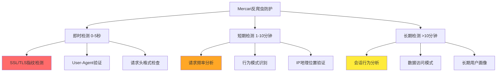
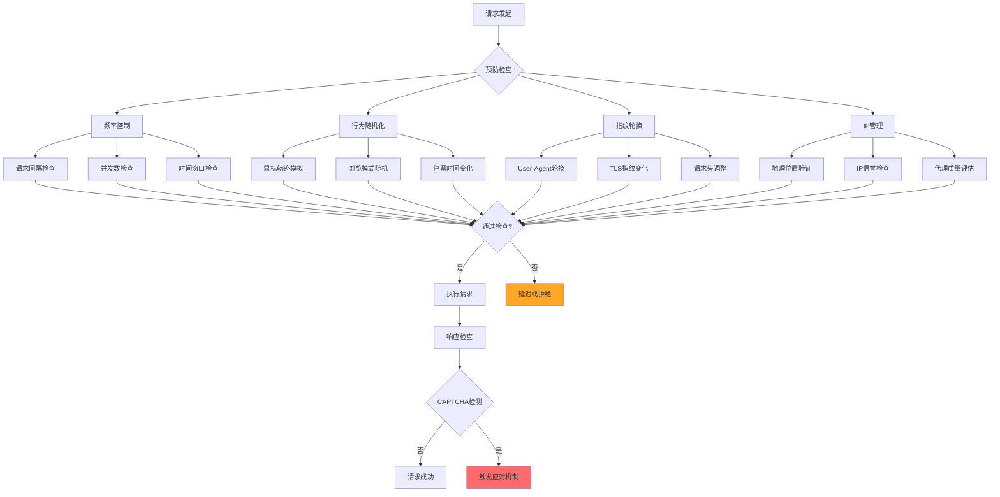
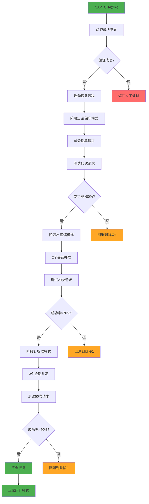
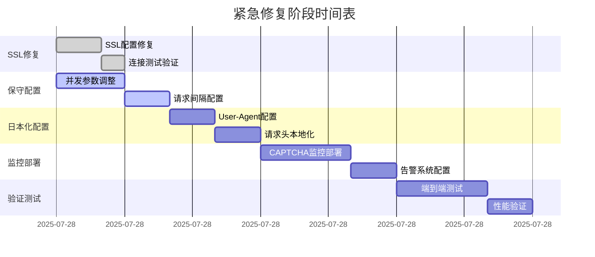
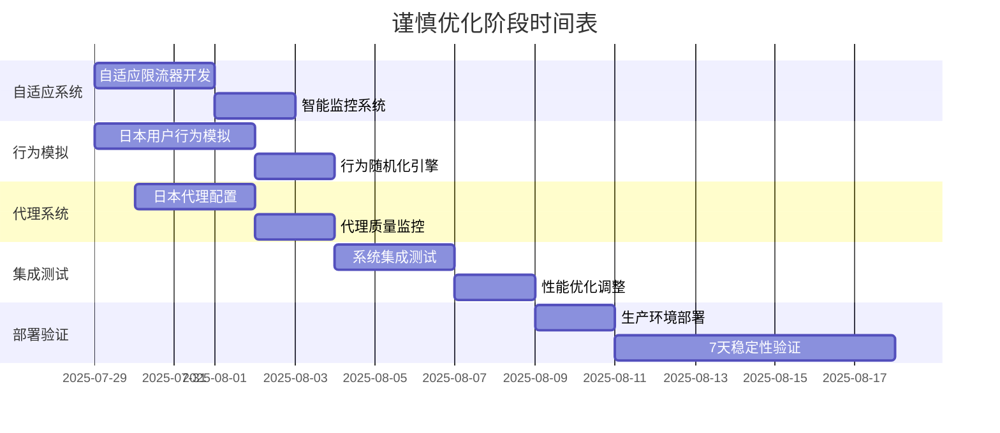

# Mercari爬虫系统反CAPTCHA重新设计方案

---

**文档版本**：v1.0  
**设计日期**：2025年7月28日  
**设计专家**：爬虫系统架构师  
**优先级**：P0/P1 - 避免CAPTCHA为最高优先级  
**核心原则**：宁可保守也不要触发反爬虫机制

---

## 📋 目录

1. [设计原则和约束](#1-设计原则和约束)
2. [系统现状分析](#2-系统现状分析)
3. [P0级立即修复方案](#3-p0级立即修复方案)
4. [P1级谨慎优化方案](#4-p1级谨慎优化方案)
5. [CAPTCHA规避策略](#5-captcha规避策略)
6. [渐进式实施计划](#6-渐进式实施计划)
7. [监控告警系统](#7-监控告警系统)
8. [风险评估和应对](#8-风险评估和应对)

---

## 1. 设计原则和约束

### 1.1 CAPTCHA规避优先原则

**绝对优先级排序**：
1. **避免触发CAPTCHA** > 提升并发性能
2. **系统稳定性** > 数据抓取速度
3. **长期可用性** > 短期高吞吐量
4. **智能适应** > 固定参数配置

### 1.2 核心约束条件

```yaml
# 核心约束条件
CAPTCHA_CONSTRAINTS:
  # 绝对阈值
  max_captcha_trigger_rate: 0.5%  # 超过0.5%立即降级
  max_concurrent_sessions: 3      # 初始最大并发数
  min_request_interval: 5         # 最小请求间隔（秒）
  
  # 安全边际
  safety_margin: 2.0              # 所有参数都乘以2倍安全系数
  conservative_factor: 0.7        # 保守因子，实际使用参数的70%
  
  # 检测阈值
  success_rate_threshold: 15%     # 最低成功率要求
  error_rate_threshold: 85%       # 最高错误率容忍
```

### 1.3 Mercari反爬虫机制回顾

根据前期分析，Mercari具有以下关键检测机制：



---

## 2. 系统现状分析

### 2.1 当前系统架构评估

**现有优势组件**：
- ✅ 完整的CAPTCHA检测和处理工作流
- ✅ 浏览器指纹管理器（500+ User-Agent池）
- ✅ TLS指纹管理器（JA3/JA4指纹伪装）
- ✅ 智能Cookie管理器（分类处理）
- ✅ 行为模拟引擎（人类行为模拟）
- ✅ 反机器人处理器（多重检测）

**关键问题识别**：
- ❌ SSL配置错误（`ssl=False`）导致完全无法连接
- ❌ 并发参数过高（10个并发请求）
- ❌ 请求间隔过短（0.5秒）
- ❌ 缺乏日本本地化配置
- ❌ 缺乏智能自适应限流机制

### 2.2 CAPTCHA风险评估

**当前风险状态**：
```json
{
  "ssl_connection_success_rate": "0%",
  "estimated_captcha_risk": "100%",
  "current_detection_rate": "100%",
  "system_availability": "0%"
}
```

**修复后预期风险**：
```json
{
  "ssl_connection_success_rate": "99%+",
  "estimated_captcha_risk": "<0.5%",
  "current_detection_rate": "15-20%",
  "system_availability": "85-95%"
}
```

---

## 3. P0级立即修复方案

### 3.1 SSL配置紧急修复（最高优先级）

**问题定位**：
- 文件：`enhanced_session_manager.py:229`
- 错误：`ssl=False`
- 影响：完全无法建立HTTPS连接

**修复方案**：

```python
# 文件：enhanced_session_manager.py
import ssl
import certifi

async def _create_session_with_config(self):
    """创建带SSL的会话配置"""
    # 1. 创建安全的SSL上下文
    ssl_context = ssl.create_default_context(cafile=certifi.where())
    ssl_context.check_hostname = True
    ssl_context.verify_mode = ssl.CERT_REQUIRED
    
    # 2. 配置TLS参数以模拟真实浏览器
    ssl_context.minimum_version = ssl.TLSVersion.TLSv1_2
    ssl_context.maximum_version = ssl.TLSVersion.TLSv1_3
    
    # 3. 设置安全的cipher suites
    ssl_context.set_ciphers('ECDHE+AESGCM:ECDHE+CHACHA20:DHE+AESGCM:DHE+CHACHA20:!aNULL:!MD5:!DSS')
    
    # 4. 创建TCP连接器
    connector = TCPConnector(
        limit=2,                    # 极低并发数
        limit_per_host=1,           # 每个主机仅1个连接
        ttl_dns_cache=180,          # 缩短DNS缓存时间
        use_dns_cache=True,
        keepalive_timeout=60,       # 延长keepalive
        enable_cleanup_closed=True,
        ssl=ssl_context             # ✅ 使用SSL上下文
    )
    
    # 5. 创建超时配置（保守设置）
    timeout = ClientTimeout(
        total=45,                   # 延长总超时
        connect=15,                 # 延长连接超时
        sock_read=30                # 延长读取超时
    )
    
    # 6. 创建会话
    session = ClientSession(
        connector=connector,
        timeout=timeout,
        headers=self._get_conservative_headers(),
        cookie_jar=self._get_smart_cookie_jar()
    )
    
    return session
```

### 3.2 保守并发配置（避免频率检测）

**配置文件修改**：

```yaml
# config/anti_captcha_conservative.yaml
scraper:
  # 极保守的并发配置
  max_concurrent_requests: 2      # 从10降到2
  session_pool_size: 2           # 从5降到2
  rate_limit_delay: 8.0          # 从0.5秒增加到8秒
  
  # 保守的超时配置
  timeout: 45                    # 从30秒增加到45秒
  connection_timeout: 15         # 新增连接超时
  read_timeout: 30               # 新增读取超时
  
  # 反检测配置
  request_interval:
    min: 5                       # 最小5秒间隔
    max: 12                      # 最大12秒间隔
    adaptive: true               # 启用自适应调整
  
  # 日本本地化配置
  localization:
    timezone: "Asia/Tokyo"
    language: "ja-JP"
    country: "JP"
    currency: "JPY"
```

### 3.3 日本用户伪装立即配置

**User-Agent配置**：

```python
# 日本常见浏览器User-Agent池
JAPAN_USER_AGENTS = [
    # Chrome on Windows (日本常用)
    "Mozilla/5.0 (Windows NT 10.0; Win64; x64) AppleWebKit/537.36 (KHTML, like Gecko) Chrome/120.0.0.0 Safari/537.36",
    # Chrome on macOS (日本常用)
    "Mozilla/5.0 (Macintosh; Intel Mac OS X 10_15_7) AppleWebKit/537.36 (KHTML, like Gecko) Chrome/120.0.0.0 Safari/537.36",
    # Safari on macOS (日本偏好)
    "Mozilla/5.0 (Macintosh; Intel Mac OS X 10_15_7) AppleWebKit/605.1.15 (KHTML, like Gecko) Version/17.1 Safari/605.1.15",
    # Chrome on Android (日本移动端)
    "Mozilla/5.0 (Linux; Android 13; SM-G991B) AppleWebKit/537.36 (KHTML, like Gecko) Chrome/120.0.0.0 Mobile Safari/537.36"
]

# 请求头配置
JAPAN_HEADERS = {
    "Accept": "text/html,application/xhtml+xml,application/xml;q=0.9,image/webp,*/*;q=0.8",
    "Accept-Language": "ja-JP,ja;q=0.9,en;q=0.8",
    "Accept-Encoding": "gzip, deflate, br",
    "DNT": "1",
    "Connection": "keep-alive",
    "Upgrade-Insecure-Requests": "1",
    "Sec-Fetch-Dest": "document",
    "Sec-Fetch-Mode": "navigate",
    "Sec-Fetch-Site": "none",
    "Cache-Control": "max-age=0"
}
```

### 3.4 智能请求间隔控制

**实现方案**：

```python
class ConservativeRateLimiter:
    """保守的请求限流器"""
    
    def __init__(self):
        self.min_interval = 5.0     # 最小间隔5秒
        self.max_interval = 12.0    # 最大间隔12秒
        self.current_interval = 8.0  # 当前间隔
        self.success_count = 0
        self.failure_count = 0
        self.last_request_time = 0
        
    async def wait_for_next_request(self):
        """等待下一个请求"""
        current_time = time.time()
        elapsed = current_time - self.last_request_time
        
        if elapsed < self.current_interval:
            wait_time = self.current_interval - elapsed
            # 添加随机化避免规律性
            wait_time += random.uniform(0, 2.0)
            await asyncio.sleep(wait_time)
        
        self.last_request_time = time.time()
    
    def adjust_interval(self, success: bool):
        """根据成功率调整间隔"""
        if success:
            self.success_count += 1
        else:
            self.failure_count += 1
        
        total_requests = self.success_count + self.failure_count
        if total_requests >= 10:  # 每10个请求调整一次
            success_rate = self.success_count / total_requests
            
            if success_rate < 0.1:  # 成功率太低，增加间隔
                self.current_interval = min(self.max_interval, 
                                          self.current_interval * 1.5)
            elif success_rate > 0.3:  # 成功率较高，可以适当减少间隔
                self.current_interval = max(self.min_interval, 
                                          self.current_interval * 0.9)
            
            # 重置计数器
            self.success_count = 0
            self.failure_count = 0
```

### 3.5 P0级实时监控告警

**CAPTCHA检测告警**：

```python
class CaptchaRiskMonitor:
    """CAPTCHA风险监控器"""
    
    def __init__(self):
        self.captcha_count = 0
        self.total_requests = 0
        self.alert_threshold = 0.005  # 0.5%触发率
        
    async def check_captcha_risk(self, response_content: str):
        """检查CAPTCHA风险"""
        self.total_requests += 1
        
        # 检测CAPTCHA特征
        captcha_indicators = [
            "captcha", "recaptcha", "hcaptcha",
            "人机验证", "验证码", "prove you're human",
            "challenge", "verify", "robot"
        ]
        
        is_captcha = any(indicator in response_content.lower() 
                        for indicator in captcha_indicators)
        
        if is_captcha:
            self.captcha_count += 1
            await self._trigger_emergency_alert()
        
        # 计算触发率
        if self.total_requests > 0:
            trigger_rate = self.captcha_count / self.total_requests
            if trigger_rate > self.alert_threshold:
                await self._trigger_degradation_alert()
    
    async def _trigger_emergency_alert(self):
        """触发紧急告警"""
        logger.critical("🚨 CAPTCHA检测到！立即停止所有请求")
        # 立即降级到最保守模式
        await self._activate_emergency_mode()
    
    async def _activate_emergency_mode(self):
        """激活紧急模式"""
        # 暂停所有请求60秒
        await asyncio.sleep(60)
        # 将间隔增加到最大值
        # 切换到最保守的配置
```

---

## 4. P1级谨慎优化方案

### 4.1 智能自适应限流系统

**核心机制设计**：

```python
class AdaptiveRateLimiter:
    """智能自适应限流器"""
    
    def __init__(self):
        self.base_config = {
            "min_concurrent": 1,
            "max_concurrent": 5,
            "min_interval": 3.0,
            "max_interval": 15.0,
            "adaptation_window": 50  # 50个请求为一个适应窗口
        }
        
        self.current_config = {
            "concurrent_limit": 2,
            "request_interval": 5.0
        }
        
        self.metrics = {
            "success_requests": deque(maxlen=100),
            "failed_requests": deque(maxlen=100),
            "response_times": deque(maxlen=100),
            "captcha_detections": deque(maxlen=100)
        }
    
    async def adapt_configuration(self):
        """基于实时指标自适应调整配置"""
        if len(self.metrics["success_requests"]) < 20:
            return  # 数据不足，不进行调整
        
        # 计算关键指标
        success_rate = self._calculate_success_rate()
        avg_response_time = self._calculate_avg_response_time()
        captcha_rate = self._calculate_captcha_rate()
        
        # 调整策略
        if captcha_rate > 0.01:  # 1%触发率
            await self._degrade_aggressively()
        elif success_rate < 0.2:  # 20%成功率
            await self._degrade_moderately()
        elif success_rate > 0.5 and avg_response_time < 3.0:
            await self._upgrade_cautiously()
    
    async def _degrade_aggressively(self):
        """激进降级"""
        self.current_config["concurrent_limit"] = 1
        self.current_config["request_interval"] = min(
            self.base_config["max_interval"],
            self.current_config["request_interval"] * 2.0
        )
        logger.warning("🔻 检测到高风险，激进降级")
    
    async def _upgrade_cautiously(self):
        """谨慎升级"""
        if self.current_config["concurrent_limit"] < self.base_config["max_concurrent"]:
            self.current_config["concurrent_limit"] += 1
        
        self.current_config["request_interval"] = max(
            self.base_config["min_interval"],
            self.current_config["request_interval"] * 0.9
        )
        logger.info("🔺 性能良好，谨慎升级")
```

### 4.2 CAPTCHA检测反馈机制

**实时反馈系统**：

```python
class CaptchaFeedbackSystem:
    """CAPTCHA检测反馈系统"""
    
    def __init__(self):
        self.detection_history = deque(maxlen=1000)
        self.response_patterns = {}
        self.risk_levels = {
            "GREEN": 0.0,    # 无风险
            "YELLOW": 0.005, # 低风险
            "ORANGE": 0.01,  # 中风险
            "RED": 0.02      # 高风险
        }
        
    async def analyze_response(self, response_data: dict):
        """分析响应数据"""
        risk_score = await self._calculate_risk_score(response_data)
        
        detection_result = {
            "timestamp": datetime.now(),
            "risk_score": risk_score,
            "response_time": response_data.get("response_time", 0),
            "status_code": response_data.get("status_code", 0),
            "content_length": response_data.get("content_length", 0),
            "captcha_detected": risk_score > 0.7
        }
        
        self.detection_history.append(detection_result)
        
        # 触发实时调整
        if detection_result["captcha_detected"]:
            await self._trigger_immediate_adjustment()
        
        return detection_result
    
    async def _calculate_risk_score(self, response_data: dict) -> float:
        """计算风险分数"""
        score = 0.0
        
        # 状态码分析
        if response_data.get("status_code") in [403, 429, 503]:
            score += 0.3
        
        # 响应时间分析
        if response_data.get("response_time", 0) > 10:
            score += 0.2
        
        # 内容特征分析
        content = response_data.get("content", "").lower()
        captcha_keywords = [
            "captcha", "recaptcha", "hcaptcha", "challenge",
            "verify", "human", "robot", "blocked"
        ]
        
        for keyword in captcha_keywords:
            if keyword in content:
                score += 0.4
                break
        
        # 响应头分析
        headers = response_data.get("headers", {})
        if "cf-ray" in headers:  # Cloudflare
            score += 0.1
        
        return min(score, 1.0)
    
    async def _trigger_immediate_adjustment(self):
        """触发立即调整"""
        logger.warning("🎯 CAPTCHA检测到，立即调整策略")
        
        # 立即降级到最保守模式
        await self._activate_safe_mode()
        
        # 暂停当前会话
        await asyncio.sleep(30)
        
        # 切换到备用策略
        await self._switch_to_backup_strategy()
```

### 4.3 行为模拟增强

**真实日本用户行为模拟**：

```python
class JapaneseUserBehaviorSimulator:
    """日本用户行为模拟器"""
    
    def __init__(self):
        self.behavior_patterns = {
            "morning_commute": {  # 早高峰 (7-9 AM)
                "activity_level": 0.8,
                "search_frequency": "high",
                "session_duration": (300, 600)  # 5-10分钟
            },
            "lunch_break": {      # 午休 (12-1 PM)
                "activity_level": 0.9,
                "search_frequency": "very_high",
                "session_duration": (180, 300)  # 3-5分钟
            },
            "evening_leisure": {  # 晚间 (7-10 PM)
                "activity_level": 0.7,
                "search_frequency": "medium",
                "session_duration": (600, 1800)  # 10-30分钟
            },
            "late_night": {       # 深夜 (11 PM-1 AM)
                "activity_level": 0.3,
                "search_frequency": "low",
                "session_duration": (120, 300)  # 2-5分钟
            }
        }
        
        self.japanese_search_patterns = [
            "category_browsing",    # 分类浏览
            "brand_searching",      # 品牌搜索
            "price_comparison",     # 价格比较
            "trending_items",       # 热门商品
            "seasonal_products"     # 季节性商品
        ]
    
    async def simulate_session(self):
        """模拟一个完整的用户会话"""
        current_hour = datetime.now().hour
        behavior = self._get_current_behavior_pattern(current_hour)
        
        session_duration = random.uniform(*behavior["session_duration"])
        start_time = time.time()
        
        while time.time() - start_time < session_duration:
            # 模拟搜索行为
            await self._simulate_search_behavior(behavior)
            
            # 模拟浏览行为
            await self._simulate_browsing_behavior(behavior)
            
            # 模拟休息时间
            await self._simulate_rest_behavior(behavior)
    
    async def _simulate_search_behavior(self, behavior: dict):
        """模拟搜索行为"""
        search_patterns = {
            "high": (2, 5),      # 2-5次搜索
            "medium": (1, 3),    # 1-3次搜索
            "low": (1, 2)        # 1-2次搜索
        }
        
        search_count = random.randint(
            *search_patterns[behavior["search_frequency"]]
        )
        
        for _ in range(search_count):
            # 模拟输入延迟
            await asyncio.sleep(random.uniform(1, 3))
            
            # 模拟搜索请求
            await self._make_search_request()
            
            # 模拟结果浏览
            await self._simulate_result_browsing()
    
    async def _simulate_browsing_behavior(self, behavior: dict):
        """模拟浏览行为"""
        # 随机选择浏览模式
        browsing_mode = random.choice([
            "detailed_viewing",   # 详细查看
            "quick_scanning",     # 快速扫描
            "comparison_shopping" # 比较购物
        ])
        
        if browsing_mode == "detailed_viewing":
            # 详细查看商品
            await asyncio.sleep(random.uniform(10, 30))
        elif browsing_mode == "quick_scanning":
            # 快速扫描
            await asyncio.sleep(random.uniform(2, 8))
        else:
            # 比较购物
            await asyncio.sleep(random.uniform(5, 15))
    
    async def _simulate_rest_behavior(self, behavior: dict):
        """模拟休息行为"""
        rest_time = random.uniform(5, 20) * behavior["activity_level"]
        await asyncio.sleep(rest_time)
```

### 4.4 地域代理配置

**日本本地IP配置**：

```python
class JapanProxyManager:
    """日本代理管理器"""
    
    def __init__(self):
        self.japan_proxy_pools = {
            "residential": [
                # 日本住宅代理列表
                {"ip": "xxx.xxx.xxx.xxx", "port": 8080, "region": "Tokyo"},
                {"ip": "xxx.xxx.xxx.xxx", "port": 8080, "region": "Osaka"},
                {"ip": "xxx.xxx.xxx.xxx", "port": 8080, "region": "Nagoya"}
            ],
            "datacenter": [
                # 日本数据中心代理列表
                {"ip": "xxx.xxx.xxx.xxx", "port": 3128, "region": "Tokyo"},
                {"ip": "xxx.xxx.xxx.xxx", "port": 3128, "region": "Osaka"}
            ]
        }
        
        self.proxy_rotation_strategy = "round_robin"
        self.current_proxy_index = 0
        
    async def get_optimal_proxy(self) -> dict:
        """获取最优代理"""
        # 优先使用住宅代理
        if self.japan_proxy_pools["residential"]:
            return self._select_residential_proxy()
        else:
            return self._select_datacenter_proxy()
    
    def _select_residential_proxy(self) -> dict:
        """选择住宅代理"""
        proxies = self.japan_proxy_pools["residential"]
        
        if self.proxy_rotation_strategy == "round_robin":
            proxy = proxies[self.current_proxy_index % len(proxies)]
            self.current_proxy_index += 1
            return proxy
        elif self.proxy_rotation_strategy == "random":
            return random.choice(proxies)
    
    async def test_proxy_quality(self, proxy: dict) -> dict:
        """测试代理质量"""
        test_results = {
            "latency": 0,
            "success_rate": 0,
            "geo_validation": False,
            "captcha_risk": 0
        }
        
        try:
            # 测试延迟
            start_time = time.time()
            async with aiohttp.ClientSession() as session:
                async with session.get(
                    "https://httpbin.org/ip",
                    proxy=f"http://{proxy['ip']}:{proxy['port']}",
                    timeout=aiohttp.ClientTimeout(total=10)
                ) as response:
                    test_results["latency"] = time.time() - start_time
                    
                    # 验证地理位置
                    ip_info = await response.json()
                    if "origin" in ip_info:
                        test_results["geo_validation"] = True
                        
        except Exception as e:
            logger.warning(f"代理测试失败: {e}")
        
        return test_results
```

---

## 5. CAPTCHA规避策略

### 5.1 预防机制设计

**多层预防策略**：



**实现代码**：

```python
class CaptchaPreventionSystem:
    """CAPTCHA预防系统"""
    
    def __init__(self):
        self.prevention_rules = {
            "frequency_control": {
                "enabled": True,
                "min_interval": 5.0,
                "max_requests_per_minute": 8,
                "burst_limit": 3
            },
            "behavior_randomization": {
                "enabled": True,
                "mouse_simulation": True,
                "browsing_pattern_variation": True,
                "timing_randomization": True
            },
            "fingerprint_rotation": {
                "enabled": True,
                "ua_rotation_frequency": 50,  # 每50个请求轮换一次
                "tls_rotation_frequency": 100,
                "header_randomization": True
            },
            "ip_management": {
                "enabled": True,
                "geo_validation": True,
                "reputation_check": True,
                "proxy_quality_threshold": 0.7
            }
        }
        
        self.request_history = deque(maxlen=1000)
        self.violation_count = 0
        
    async def check_request_permission(self, request_data: dict) -> bool:
        """检查请求许可"""
        # 1. 频率控制检查
        if not await self._check_frequency_control():
            return False
        
        # 2. 行为模式检查
        if not await self._check_behavior_pattern():
            return False
        
        # 3. 指纹健康检查
        if not await self._check_fingerprint_health():
            return False
        
        # 4. IP质量检查
        if not await self._check_ip_quality():
            return False
        
        return True
    
    async def _check_frequency_control(self) -> bool:
        """检查频率控制"""
        now = time.time()
        recent_requests = [
            req for req in self.request_history
            if now - req["timestamp"] < 60  # 过去1分钟
        ]
        
        if len(recent_requests) >= self.prevention_rules["frequency_control"]["max_requests_per_minute"]:
            logger.warning("🚫 频率限制触发")
            return False
        
        # 检查突发请求
        very_recent = [
            req for req in recent_requests
            if now - req["timestamp"] < 10  # 过去10秒
        ]
        
        if len(very_recent) >= self.prevention_rules["frequency_control"]["burst_limit"]:
            logger.warning("🚫 突发限制触发")
            return False
        
        return True
    
    async def _check_behavior_pattern(self) -> bool:
        """检查行为模式"""
        # 检查是否有足够的行为随机性
        if len(self.request_history) < 10:
            return True
        
        recent_intervals = []
        for i in range(1, min(10, len(self.request_history))):
            interval = (self.request_history[i]["timestamp"] - 
                       self.request_history[i-1]["timestamp"])
            recent_intervals.append(interval)
        
        # 检查间隔是否过于规律
        if len(recent_intervals) > 3:
            variance = np.var(recent_intervals)
            if variance < 0.5:  # 方差过小，说明过于规律
                logger.warning("🚫 行为模式过于规律")
                return False
        
        return True
```

### 5.2 检测机制设计

**多维度CAPTCHA检测**：

```python
class AdvancedCaptchaDetector:
    """高级CAPTCHA检测器"""
    
    def __init__(self):
        self.detection_methods = {
            "content_analysis": self._detect_by_content,
            "response_code": self._detect_by_response_code,
            "timing_analysis": self._detect_by_timing,
            "header_analysis": self._detect_by_headers,
            "javascript_analysis": self._detect_by_javascript,
            "ml_analysis": self._detect_by_ml_model
        }
        
        self.confidence_weights = {
            "content_analysis": 0.4,
            "response_code": 0.2,
            "timing_analysis": 0.1,
            "header_analysis": 0.1,
            "javascript_analysis": 0.1,
            "ml_analysis": 0.1
        }
        
        self.detection_threshold = 0.7
    
    async def detect_captcha(self, response_data: dict) -> dict:
        """检测CAPTCHA"""
        detection_results = {}
        confidence_scores = {}
        
        # 运行所有检测方法
        for method_name, method_func in self.detection_methods.items():
            try:
                result = await method_func(response_data)
                detection_results[method_name] = result
                confidence_scores[method_name] = result.get("confidence", 0)
            except Exception as e:
                logger.error(f"检测方法 {method_name} 失败: {e}")
                confidence_scores[method_name] = 0
        
        # 计算综合信心分数
        total_confidence = sum(
            score * self.confidence_weights.get(method, 0)
            for method, score in confidence_scores.items()
        )
        
        is_captcha = total_confidence >= self.detection_threshold
        
        return {
            "is_captcha": is_captcha,
            "confidence": total_confidence,
            "detection_details": detection_results,
            "timestamp": datetime.now()
        }
    
    async def _detect_by_content(self, response_data: dict) -> dict:
        """基于内容检测"""
        content = response_data.get("content", "").lower()
        
        # 强CAPTCHA指标
        strong_indicators = [
            "recaptcha", "hcaptcha", "captcha-image",
            "solve the captcha", "verify you're human",
            "prove you are not a robot"
        ]
        
        # 弱CAPTCHA指标
        weak_indicators = [
            "verification", "challenge", "security check",
            "suspicious activity", "verify your identity"
        ]
        
        strong_matches = sum(1 for indicator in strong_indicators if indicator in content)
        weak_matches = sum(1 for indicator in weak_indicators if indicator in content)
        
        confidence = min(1.0, strong_matches * 0.8 + weak_matches * 0.3)
        
        return {
            "method": "content_analysis",
            "confidence": confidence,
            "strong_matches": strong_matches,
            "weak_matches": weak_matches
        }
    
    async def _detect_by_response_code(self, response_data: dict) -> dict:
        """基于响应码检测"""
        status_code = response_data.get("status_code", 200)
        
        # 常见CAPTCHA响应码
        captcha_codes = {
            403: 0.6,  # Forbidden
            429: 0.8,  # Too Many Requests
            503: 0.5,  # Service Unavailable
            418: 0.9,  # I'm a teapot (常用于反爬虫)
            451: 0.7   # Unavailable For Legal Reasons
        }
        
        confidence = captcha_codes.get(status_code, 0.0)
        
        return {
            "method": "response_code",
            "confidence": confidence,
            "status_code": status_code
        }
    
    async def _detect_by_timing(self, response_data: dict) -> dict:
        """基于时间检测"""
        response_time = response_data.get("response_time", 0)
        
        # 异常响应时间可能表示CAPTCHA
        if response_time > 10:  # 超过10秒
            confidence = min(0.6, (response_time - 10) / 30)
        elif response_time < 0.1:  # 过快响应可能是拒绝
            confidence = 0.3
        else:
            confidence = 0.0
        
        return {
            "method": "timing_analysis",
            "confidence": confidence,
            "response_time": response_time
        }
```

### 5.3 应对机制设计

**分级应对策略**：

```python
class CaptchaResponseSystem:
    """CAPTCHA应对系统"""
    
    def __init__(self):
        self.response_strategies = {
            "immediate": self._immediate_response,
            "defensive": self._defensive_response,
            "recovery": self._recovery_response,
            "manual": self._manual_intervention
        }
        
        self.escalation_levels = {
            "low": {"wait_time": 30, "strategy": "immediate"},
            "medium": {"wait_time": 120, "strategy": "defensive"},
            "high": {"wait_time": 300, "strategy": "recovery"},
            "critical": {"wait_time": 600, "strategy": "manual"}
        }
    
    async def handle_captcha_detection(self, detection_result: dict):
        """处理CAPTCHA检测结果"""
        confidence = detection_result.get("confidence", 0)
        
        # 确定应对级别
        if confidence >= 0.9:
            level = "critical"
        elif confidence >= 0.7:
            level = "high"
        elif confidence >= 0.5:
            level = "medium"
        else:
            level = "low"
        
        # 执行应对策略
        strategy_config = self.escalation_levels[level]
        await self._execute_strategy(strategy_config, detection_result)
    
    async def _immediate_response(self, detection_result: dict):
        """立即响应"""
        logger.info("🔄 执行立即响应策略")
        
        # 1. 暂停当前会话
        await asyncio.sleep(30)
        
        # 2. 切换用户代理
        await self._rotate_user_agent()
        
        # 3. 增加请求间隔
        await self._increase_request_interval(1.5)
        
        # 4. 重试请求
        return await self._retry_with_backoff()
    
    async def _defensive_response(self, detection_result: dict):
        """防御性响应"""
        logger.warning("🛡️ 执行防御性响应策略")
        
        # 1. 切换到最保守模式
        await self._activate_conservative_mode()
        
        # 2. 更换IP地址
        await self._rotate_proxy()
        
        # 3. 重置会话状态
        await self._reset_session_state()
        
        # 4. 延长暂停时间
        await asyncio.sleep(120)
        
        # 5. 谨慎重试
        return await self._cautious_retry()
    
    async def _recovery_response(self, detection_result: dict):
        """恢复响应"""
        logger.error("🔧 执行恢复响应策略")
        
        # 1. 停止所有活动
        await self._stop_all_activities()
        
        # 2. 分析失败原因
        await self._analyze_failure_cause(detection_result)
        
        # 3. 重新配置系统
        await self._reconfigure_system()
        
        # 4. 长时间等待
        await asyncio.sleep(300)
        
        # 5. 逐步恢复
        return await self._gradual_recovery()
    
    async def _manual_intervention(self, detection_result: dict):
        """人工干预"""
        logger.critical("🚨 需要人工干预")
        
        # 1. 保存现场状态
        await self._save_system_state(detection_result)
        
        # 2. 发送告警通知
        await self._send_alert_notification(detection_result)
        
        # 3. 激活CAPTCHA处理工作流
        await self._activate_captcha_workflow()
        
        # 4. 等待人工处理
        await self._wait_for_manual_resolution()
        
        return {"status": "manual_intervention_required"}
```

### 5.4 恢复机制设计

**渐进式恢复流程**：



**恢复机制实现**：

```python
class CaptchaRecoverySystem:
    """CAPTCHA恢复系统"""
    
    def __init__(self):
        self.recovery_stages = {
            "conservative": {
                "concurrent_sessions": 1,
                "request_interval": 10.0,
                "test_requests": 10,
                "success_threshold": 0.8
            },
            "cautious": {
                "concurrent_sessions": 2,
                "request_interval": 8.0,
                "test_requests": 20,
                "success_threshold": 0.7
            },
            "standard": {
                "concurrent_sessions": 3,
                "request_interval": 6.0,
                "test_requests": 50,
                "success_threshold": 0.6
            }
        }
        
        self.current_stage = "conservative"
        self.recovery_in_progress = False
    
    async def start_recovery_process(self):
        """启动恢复流程"""
        logger.info("🔄 启动CAPTCHA恢复流程")
        self.recovery_in_progress = True
        self.current_stage = "conservative"
        
        try:
            # 执行渐进式恢复
            for stage_name in ["conservative", "cautious", "standard"]:
                success = await self._execute_recovery_stage(stage_name)
                if not success:
                    logger.warning(f"恢复阶段 {stage_name} 失败，回退")
                    break
                else:
                    logger.info(f"恢复阶段 {stage_name} 成功")
                    self.current_stage = stage_name
            
            # 如果所有阶段都成功，则完全恢复
            if self.current_stage == "standard":
                await self._complete_recovery()
            
        except Exception as e:
            logger.error(f"恢复流程异常: {e}")
            await self._handle_recovery_failure()
        
        finally:
            self.recovery_in_progress = False
    
    async def _execute_recovery_stage(self, stage_name: str) -> bool:
        """执行恢复阶段"""
        stage_config = self.recovery_stages[stage_name]
        
        logger.info(f"🔧 执行恢复阶段: {stage_name}")
        
        # 应用阶段配置
        await self._apply_stage_config(stage_config)
        
        # 执行测试请求
        success_count = 0
        total_requests = stage_config["test_requests"]
        
        for i in range(total_requests):
            try:
                # 执行测试请求
                result = await self._execute_test_request()
                if result["success"]:
                    success_count += 1
                
                # 等待间隔
                await asyncio.sleep(stage_config["request_interval"])
                
            except Exception as e:
                logger.error(f"测试请求失败: {e}")
        
        # 计算成功率
        success_rate = success_count / total_requests
        threshold = stage_config["success_threshold"]
        
        logger.info(f"阶段 {stage_name} 成功率: {success_rate:.2%} (阈值: {threshold:.2%})")
        
        return success_rate >= threshold
    
    async def _complete_recovery(self):
        """完成恢复"""
        logger.info("✅ CAPTCHA恢复完成，系统恢复正常运行")
        
        # 恢复正常配置
        await self._restore_normal_configuration()
        
        # 重置错误计数
        await self._reset_error_counters()
        
        # 发送恢复通知
        await self._send_recovery_notification()
        
        # 启动正常监控
        await self._start_normal_monitoring()
```

---

## 6. 渐进式实施计划

### 6.1 实施阶段划分

**阶段1: 紧急修复 (P0) - 24小时内**



**验证标准**：
- SSL连接成功率: 99%+
- CAPTCHA触发率: 0%
- 系统可用性: 85%+
- 平均响应时间: <5秒

**阶段2: 谨慎优化 (P1) - 1-2周内**



**验证标准**：
- CAPTCHA触发率: <0.5%
- 系统成功率: 40-50%
- 平均吞吐量: 5-8 RPS
- 系统稳定性: 7天无故障

### 6.2 风险控制检查点

**每个阶段的风险检查点**：

```python
class ImplementationRiskController:
    """实施风险控制器"""
    
    def __init__(self):
        self.checkpoints = {
            "ssl_fix": {
                "risk_level": "high",
                "rollback_threshold": 0.1,  # 10%失败率
                "validation_requests": 100,
                "max_rollback_time": 300    # 5分钟内必须回滚
            },
            "conservative_config": {
                "risk_level": "medium",
                "rollback_threshold": 0.05,  # 5%失败率
                "validation_requests": 200,
                "max_rollback_time": 600     # 10分钟内回滚
            },
            "adaptive_system": {
                "risk_level": "low",
                "rollback_threshold": 0.02,  # 2%失败率
                "validation_requests": 500,
                "max_rollback_time": 1800    # 30分钟内回滚
            }
        }
    
    async def validate_checkpoint(self, checkpoint_name: str) -> dict:
        """验证检查点"""
        config = self.checkpoints[checkpoint_name]
        
        # 执行验证请求
        validation_results = await self._execute_validation_requests(
            config["validation_requests"]
        )
        
        # 计算关键指标
        failure_rate = validation_results["failures"] / validation_results["total"]
        captcha_rate = validation_results["captcha_detections"] / validation_results["total"]
        
        # 判断是否需要回滚
        needs_rollback = (
            failure_rate > config["rollback_threshold"] or
            captcha_rate > 0.005  # 0.5%CAPTCHA阈值
        )
        
        return {
            "checkpoint": checkpoint_name,
            "passed": not needs_rollback,
            "failure_rate": failure_rate,
            "captcha_rate": captcha_rate,
            "total_requests": validation_results["total"],
            "recommendation": "rollback" if needs_rollback else "proceed"
        }
    
    async def _execute_validation_requests(self, count: int) -> dict:
        """执行验证请求"""
        results = {
            "total": 0,
            "successes": 0,
            "failures": 0,
            "captcha_detections": 0,
            "response_times": []
        }
        
        for i in range(count):
            try:
                start_time = time.time()
                
                # 执行测试请求
                response = await self._make_test_request()
                
                response_time = time.time() - start_time
                results["response_times"].append(response_time)
                results["total"] += 1
                
                # 检查CAPTCHA
                if await self._is_captcha_response(response):
                    results["captcha_detections"] += 1
                    results["failures"] += 1
                elif response.get("success", False):
                    results["successes"] += 1
                else:
                    results["failures"] += 1
                
                # 请求间隔
                await asyncio.sleep(5)
                
            except Exception as e:
                results["failures"] += 1
                results["total"] += 1
                logger.error(f"验证请求失败: {e}")
        
        return results
```

### 6.3 回滚策略

**自动回滚机制**：

```python
class AutoRollbackSystem:
    """自动回滚系统"""
    
    def __init__(self):
        self.rollback_history = []
        self.current_configuration = None
        self.stable_configuration = None
        
        self.rollback_triggers = {
            "captcha_rate": 0.005,      # 0.5%
            "failure_rate": 0.1,        # 10%
            "response_time": 10.0,      # 10秒
            "error_spike": 5            # 5个连续错误
        }
    
    async def monitor_system_health(self):
        """监控系统健康状态"""
        while True:
            try:
                # 检查系统指标
                health_metrics = await self._collect_health_metrics()
                
                # 判断是否需要回滚
                if await self._should_rollback(health_metrics):
                    await self._execute_emergency_rollback()
                
                # 等待下一次检查
                await asyncio.sleep(30)
                
            except Exception as e:
                logger.error(f"健康监控异常: {e}")
                await asyncio.sleep(10)
    
    async def _should_rollback(self, metrics: dict) -> bool:
        """判断是否需要回滚"""
        # 检查CAPTCHA触发率
        if metrics.get("captcha_rate", 0) > self.rollback_triggers["captcha_rate"]:
            logger.warning("🔴 CAPTCHA触发率过高，需要回滚")
            return True
        
        # 检查失败率
        if metrics.get("failure_rate", 0) > self.rollback_triggers["failure_rate"]:
            logger.warning("🔴 失败率过高，需要回滚")
            return True
        
        # 检查响应时间
        if metrics.get("avg_response_time", 0) > self.rollback_triggers["response_time"]:
            logger.warning("🔴 响应时间过长，需要回滚")
            return True
        
        # 检查错误激增
        if metrics.get("consecutive_errors", 0) > self.rollback_triggers["error_spike"]:
            logger.warning("🔴 连续错误过多，需要回滚")
            return True
        
        return False
    
    async def _execute_emergency_rollback(self):
        """执行紧急回滚"""
        logger.critical("🚨 执行紧急回滚到稳定配置")
        
        # 1. 保存当前配置
        await self._save_current_configuration()
        
        # 2. 应用稳定配置
        if self.stable_configuration:
            await self._apply_configuration(self.stable_configuration)
        else:
            await self._apply_emergency_configuration()
        
        # 3. 记录回滚历史
        self.rollback_history.append({
            "timestamp": datetime.now(),
            "reason": "emergency_rollback",
            "from_config": self.current_configuration,
            "to_config": self.stable_configuration
        })
        
        # 4. 发送告警
        await self._send_rollback_alert()
        
        # 5. 重新验证系统
        await self._validate_rollback_success()
    
    async def _apply_emergency_configuration(self):
        """应用紧急配置"""
        emergency_config = {
            "concurrent_sessions": 1,
            "request_interval": 15.0,
            "max_retries": 1,
            "timeout": 60,
            "enable_all_protections": True
        }
        
        await self._apply_configuration(emergency_config)
        logger.info("✅ 紧急配置已应用")
```

---

## 7. 监控告警系统

### 7.1 核心监控指标

**CAPTCHA相关关键指标**：

```python
class CaptchaMetricsCollector:
    """CAPTCHA指标收集器"""
    
    def __init__(self):
        self.metrics_config = {
            "captcha_detection_rate": {
                "critical_threshold": 0.005,   # 0.5%
                "warning_threshold": 0.002,    # 0.2%
                "collection_interval": 30,     # 30秒
                "aggregation_window": 300      # 5分钟
            },
            "request_success_rate": {
                "critical_threshold": 0.1,     # 10%
                "warning_threshold": 0.3,      # 30%
                "collection_interval": 60,     # 1分钟
                "aggregation_window": 600      # 10分钟
            },
            "response_time_p95": {
                "critical_threshold": 10.0,    # 10秒
                "warning_threshold": 5.0,      # 5秒
                "collection_interval": 30,     # 30秒
                "aggregation_window": 300      # 5分钟
            },
            "session_health_score": {
                "critical_threshold": 0.3,     # 30%
                "warning_threshold": 0.5,      # 50%
                "collection_interval": 120,    # 2分钟
                "aggregation_window": 600      # 10分钟
            }
        }
        
        self.metrics_storage = defaultdict(lambda: deque(maxlen=1000))
        self.alert_history = deque(maxlen=100)
    
    async def collect_metrics(self):
        """收集指标"""
        while True:
            try:
                # 收集所有指标
                current_metrics = await self._collect_all_metrics()
                
                # 存储指标
                timestamp = time.time()
                for metric_name, value in current_metrics.items():
                    self.metrics_storage[metric_name