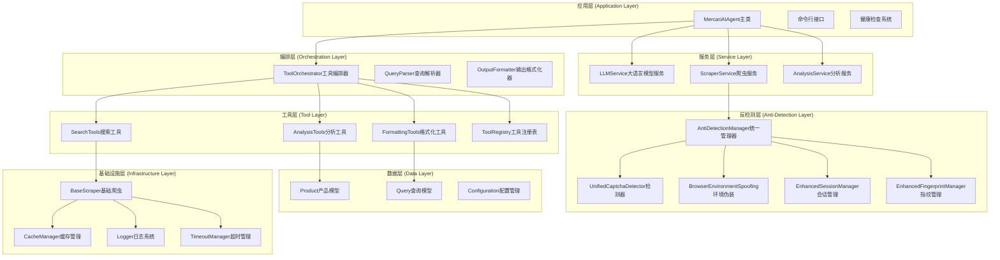
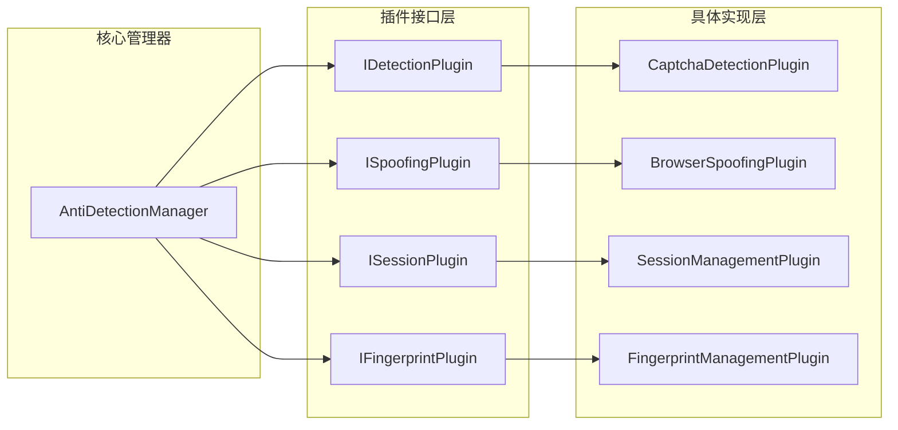
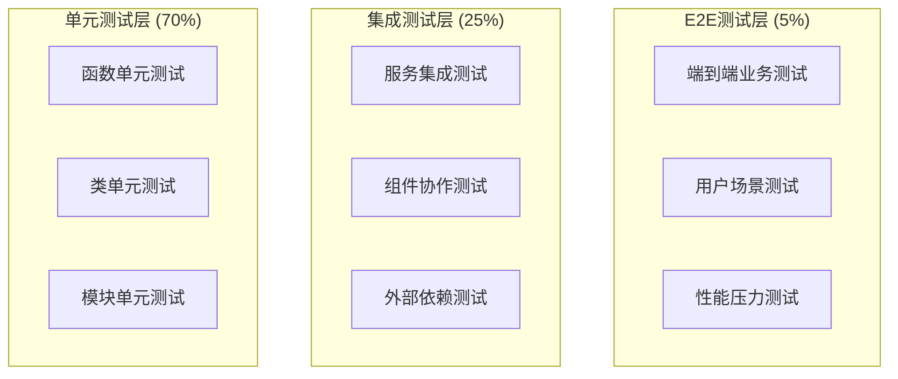
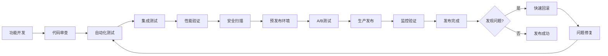

# 反检测功能完整系统集成方案

## 📋 方案概述

本方案基于对Mercari AI Agent现有系统的深入分析，设计了一个全面、可扩展、高性能的反检测功能集成架构。方案涵盖8个核心维度，确保无缝集成、最大化代码复用、最小化系统复杂度，同时保证高性能和高可用性。

### 🎯 核心目标
- **无缝集成**：反检测功能与现有系统完全兼容，无冲突风险
- **最大化代码复用**：充分利用现有组件，避免重复开发
- **最小化系统复杂度**：保持架构清晰，降低维护成本
- **高性能**：反检测功能不影响系统整体性能
- **高可用**：具备完善的错误处理和恢复机制
- **可扩展**：支持功能扩展和技术演进

---

## 1. 详细技术架构分析

### 1.1 现有系统架构层次分析



### 1.2 反检测功能最佳插入点识别

基于现有架构分析，确定以下关键集成点：

#### 🎯 一级集成点（核心集成）
1. **ScraperService层**：主要反检测逻辑集成点
   - 位置：`src/mercari_agent/services/scraper_service.py`
   - 作用：统一管理所有爬虫的反检测功能
   - 集成组件：AntiDetectionManager作为核心服务

2. **BaseScraper层**：底层爬虫反检测能力增强
   - 位置：`src/mercari_agent/scrapers/base_scraper.py`
   - 作用：为所有爬虫实现提供统一的反检测基础能力
   - 集成组件：会话管理、指纹管理、环境伪装

#### 🎯 二级集成点（功能增强）
3. **ToolOrchestrator层**：工具编排级别的反检测策略
   - 位置：`src/mercari_agent/core/tool_orchestrator.py`
   - 作用：在工具调用层面应用反检测策略
   - 集成方式：工具执行前预处理，执行后结果验证

4. **MercariScraper层**：专用爬虫增强
   - 位置：`src/mercari_agent/scrapers/mercari_scraper.py`
   - 作用：Mercari特定反检测优化
   - 集成组件：CAPTCHA工作流、行为模拟

### 1.3 分层架构设计原则

#### 📐 职责分离原则
- **管理层**：AntiDetectionManager统一协调所有反检测组件
- **检测层**：UnifiedCaptchaDetector专注于检测逻辑
- **伪装层**：BrowserEnvironmentSpoofing专注于环境伪装
- **会话层**：EnhancedSessionManager专注于会话管理
- **指纹层**：EnhancedFingerprintManager专注于指纹管理

#### 🔗 模块解耦设计
- **接口抽象**：每个组件都有清晰的接口定义
- **依赖注入**：通过工厂模式实现组件间松耦合
- **事件驱动**：基于事件机制实现异步通信
- **配置驱动**：所有功能通过配置文件控制开关

---

## 2. 现有系统兼容性评估

### 2.1 现有组件可复用性分析

#### ✅ 高度可复用组件
1. **配置管理系统**
   - 组件：`src/mercari_agent/config/settings.py`
   - 复用度：95%
   - 增强：添加反检测专用配置类
   - 兼容性：完全兼容，向后兼容

2. **日志系统**
   - 组件：`src/mercari_agent/utils/logger.py`
   - 复用度：100%
   - 增强：添加反检测专用日志分类
   - 兼容性：完全兼容

3. **缓存管理**
   - 组件：`src/mercari_agent/utils/cache_manager.py`
   - 复用度：90%
   - 增强：添加指纹和会话缓存支持
   - 兼容性：完全兼容

#### 🔄 需要适配的组件
1. **ScraperService**
   - 当前状态：已有基础反检测支持
   - 适配需求：集成AntiDetectionManager
   - 风险等级：低
   - 适配工作量：中等

2. **BaseScraper**
   - 当前状态：基础会话管理
   - 适配需求：增强会话和指纹管理
   - 风险等级：中等
   - 适配工作量：中等

#### ⚠️ 潜在冲突点识别
1. **会话管理冲突**
   - 问题：现有SessionManager与EnhancedSessionManager功能重叠
   - 解决方案：渐进式迁移，保持向后兼容接口
   - 风险控制：双模式运行，逐步切换

2. **超时管理冲突**
   - 问题：TimeoutManager与反检测延迟策略可能冲突
   - 解决方案：统一超时管理，反检测延迟纳入超时计算
   - 风险控制：分层超时策略，互不干扰

### 2.2 渐进式迁移策略

#### 🚀 阶段一：基础集成（1-2周）
- 集成AntiDetectionManager到ScraperService
- 保持现有功能100%向后兼容
- 添加反检测功能开关，默认关闭
- 完整的单元测试覆盖

#### 🚀 阶段二：功能增强（2-3周）
- 逐步启用反检测功能
- A/B测试验证性能影响
- 收集用户反馈，优化配置
- 添加监控和告警机制

#### 🚀 阶段三：全面部署（1-2周）
- 默认启用反检测功能
- 移除旧代码和冗余功能
- 性能优化和稳定性增强
- 文档更新和培训

---

## 3. 模块化集成策略

### 3.1 插件化架构设计

#### 🔧 核心架构模式



#### 📝 插件接口定义

```python
# 反检测插件基础接口
class IAntiDetectionPlugin(ABC):
    @abstractmethod
    async def initialize(self, config: Dict[str, Any]) -> bool:
        """初始化插件"""
        pass
    
    @abstractmethod
    async def process(self, context: DetectionContext) -> DetectionResult:
        """处理反检测逻辑"""
        pass
    
    @abstractmethod
    async def cleanup(self) -> None:
        """清理资源"""
        pass
    
    @property
    @abstractmethod
    def plugin_info(self) -> PluginInfo:
        """插件信息"""
        pass
```

### 3.2 工厂模式和依赖注入

#### 🏭 组件工厂设计

```python
class AntiDetectionFactory:
    """反检测组件工厂"""
    
    def __init__(self):
        self._creators = {}
        self._instances = {}
    
    def register_creator(self, component_type: str, creator: Callable):
        """注册组件创建器"""
        self._creators[component_type] = creator
    
    async def create_component(self, component_type: str, config: Dict) -> Any:
        """创建组件实例"""
        if component_type not in self._creators:
            raise ComponentNotFoundError(f"Unknown component: {component_type}")
        
        creator = self._creators[component_type]
        instance = await creator(config)
        self._instances[component_type] = instance
        return instance
    
    def get_component(self, component_type: str) -> Any:
        """获取组件实例"""
        return self._instances.get(component_type)
```

#### 💉 依赖注入容器

```python
class DIContainer:
    """依赖注入容器"""
    
    def __init__(self):
        self._services = {}
        self._singletons = {}
    
    def register_singleton(self, interface: type, implementation: type):
        """注册单例服务"""
        self._services[interface] = (implementation, True)
    
    def register_transient(self, interface: type, implementation: type):
        """注册瞬时服务"""
        self._services[interface] = (implementation, False)
    
    async def resolve(self, interface: type) -> Any:
        """解析服务"""
        if interface not in self._services:
            raise ServiceNotFoundError(f"Service {interface} not registered")
        
        implementation, is_singleton = self._services[interface]
        
        if is_singleton:
            if interface not in self._singletons:
                self._singletons[interface] = await self._create_instance(implementation)
            return self._singletons[interface]
        else:
            return await self._create_instance(implementation)
```

### 3.3 配置驱动的功能开关

#### ⚙️ 功能开关设计

```yaml
# 反检测功能开关配置
anti_detection:
  global:
    enabled: true
    mode: "balanced"  # minimal/balanced/aggressive
  
  plugins:
    captcha_detection:
      enabled: true
      priority: 1
    
    browser_spoofing:
      enabled: true
      priority: 2
    
    session_management:
      enabled: true
      priority: 3
    
    fingerprint_management:
      enabled: true
      priority: 4
  
  feature_flags:
    enable_advanced_detection: true
    enable_ml_analysis: false
    enable_behavioral_simulation: true
    enable_proxy_rotation: false
```

#### 🎛️ 动态配置管理

```python
class ConfigManager:
    """配置管理器"""
    
    def __init__(self):
        self._config = {}
        self._watchers = []
        self._lock = asyncio.Lock()
    
    async def load_config(self, config_path: str):
        """加载配置"""
        async with self._lock:
            with open(config_path, 'r') as f:
                self._config = yaml.safe_load(f)
            await self._notify_watchers()
    
    def get_config(self, path: str, default=None):
        """获取配置值"""
        keys = path.split('.')
        value = self._config
        
        for key in keys:
            if isinstance(value, dict) and key in value:
                value = value[key]
            else:
                return default
        
        return value
    
    def watch_config(self, callback: Callable):
        """监听配置变化"""
        self._watchers.append(callback)
```

---

## 4. 冗余代码识别与清理方案

### 4.1 冗余代码分析

#### 📊 代码重复度分析

| 组件类别 | 重复功能 | 冗余度 | 清理优先级 | 预估工作量 |
|---------|---------|--------|-----------|-----------|
| 会话管理 | SessionManager vs EnhancedSessionManager | 60% | 高 | 3-5天 |
| 指纹管理 | BrowserFingerprintManager重复逻辑 | 40% | 中 | 2-3天 |
| 检测逻辑 | CaptchaDetector vs UnifiedCaptchaDetector | 70% | 高 | 4-6天 |
| 配置管理 | 多个配置类重复字段 | 30% | 低 | 1-2天 |
| 工具方法 | 爬虫工具类重复函数 | 50% | 中 | 2-3天 |

#### 🧹 清理策略

1. **会话管理统一**
   ```python
   # 目标：统一会话管理接口
   class UnifiedSessionManager:
       def __init__(self, config: SessionConfig):
           # 集成现有SessionManager和EnhancedSessionManager功能
           self.basic_manager = SessionManager(config.basic)
           self.enhanced_manager = EnhancedSessionManager(config.enhanced)
           self.mode = config.mode  # basic/enhanced/hybrid
       
       async def get_session(self, url: str) -> ClientSession:
           if self.mode == 'enhanced':
               return await self.enhanced_manager.get_session(url)
           elif self.mode == 'hybrid':
               # 智能选择策略
               return await self._smart_session_selection(url)
           else:
               return await self.basic_manager.get_session()
   ```

2. **检测逻辑合并**
   ```python
   # 目标：统一检测接口，移除冗余检测器
   class UnifiedDetectionEngine:
       def __init__(self):
           self.detectors = [
               UnifiedCaptchaDetector(),
               # 移除旧的CaptchaDetector
           ]
       
       async def detect(self, content: str, response: Any) -> DetectionResult:
           # 统一检测逻辑，避免重复实现
           pass
   ```

### 4.2 重构优先级和风险评估

#### 🚦 重构优先级矩阵

| 重构项目 | 影响范围 | 技术复杂度 | 业务风险 | 优先级 | 建议时间窗口 |
|---------|---------|-----------|---------|-------|-------------|
| 会话管理统一 | 高 | 中 | 中 | P1 | 第一阶段 |
| 检测逻辑合并 | 高 | 高 | 低 | P1 | 第一阶段 |
| 配置类整合 | 中 | 低 | 低 | P2 | 第二阶段 |
| 工具类清理 | 低 | 低 | 低 | P3 | 第三阶段 |

#### ⚠️ 风险控制措施

1. **渐进式重构**
   - 保持旧接口兼容性
   - 新旧实现并存一段时间
   - 充分测试后再移除旧代码

2. **回滚准备**
   - 代码版本管理和标记
   - 快速回滚脚本准备
   - 监控指标设置

3. **测试保障**
   - 完整的回归测试套件
   - 性能基准测试
   - A/B测试验证

---

## 5. 性能优化建议

### 5.1 异步处理和并发优化

#### 🚀 异步架构优化

```python
class OptimizedAntiDetectionManager:
    """性能优化的反检测管理器"""
    
    def __init__(self, config: Dict[str, Any]):
        self.config = config
        self.detector_pool = AsyncDetectorPool(max_workers=5)
        self.session_pool = AsyncSessionPool(max_sessions=10)
        self.semaphore = asyncio.Semaphore(config.get('max_concurrent_detections', 3))
    
    async def detect_with_optimization(self, content: str, response: Any) -> DetectionResult:
        """优化的检测逻辑"""
        async with self.semaphore:
            # 并行执行多种检测
            detection_tasks = [
                self._fast_keyword_detection(content),
                self._dom_structure_analysis(content),
                self._context_analysis(content, response)
            ]
            
            # 使用超时和取消机制
            try:
                results = await asyncio.wait_for(
                    asyncio.gather(*detection_tasks, return_exceptions=True),
                    timeout=self.config.get('detection_timeout', 10.0)
                )
                return self._combine_results(results)
            except asyncio.TimeoutError:
                # 优雅降级到快速检测
                return await self._fallback_detection(content)
```

#### ⚡ 并发控制策略

```python
class ConcurrencyController:
    """并发控制器"""
    
    def __init__(self, config: ConcurrencyConfig):
        self.max_concurrent_sessions = config.max_concurrent_sessions
        self.max_requests_per_session = config.max_requests_per_session
        self.session_semaphore = asyncio.Semaphore(self.max_concurrent_sessions)
        self.request_limiters = {}
    
    async def acquire_session_slot(self, session_id: str) -> AsyncContextManager:
        """获取会话槽位"""
        return self.session_semaphore
    
    async def acquire_request_slot(self, session_id: str) -> AsyncContextManager:
        """获取请求槽位"""
        if session_id not in self.request_limiters:
            self.request_limiters[session_id] = asyncio.Semaphore(
                self.max_requests_per_session
            )
        return self.request_limiters[session_id]
```

### 5.2 缓存机制和资源池管理

#### 💾 多层缓存架构

```python
class MultiLevelCache:
    """多级缓存系统"""
    
    def __init__(self, config: CacheConfig):
        # L1: 内存缓存 (最快)
        self.memory_cache = TTLCache(
            maxsize=config.memory_cache_size,
            ttl=config.memory_cache_ttl
        )
        
        # L2: Redis缓存 (中等速度，持久化)
        self.redis_cache = RedisCache(
            host=config.redis_host,
            port=config.redis_port,
            ttl=config.redis_cache_ttl
        )
        
        # L3: 磁盘缓存 (慢，大容量)
        self.disk_cache = DiskCache(
            cache_dir=config.disk_cache_dir,
            max_size=config.disk_cache_size
        )
    
    async def get(self, key: str) -> Optional[Any]:
        """多级获取"""
        # L1 查找
        if key in self.memory_cache:
            return self.memory_cache[key]
        
        # L2 查找
        value = await self.redis_cache.get(key)
        if value is not None:
            # 回填到L1
            self.memory_cache[key] = value
            return value
        
        # L3 查找
        value = await self.disk_cache.get(key)
        if value is not None:
            # 回填到L2和L1
            await self.redis_cache.set(key, value)
            self.memory_cache[key] = value
            return value
        
        return None
```

#### 🏊 资源池管理

```python
class ResourcePoolManager:
    """资源池管理器"""
    
    def __init__(self, config: PoolConfig):
        self.session_pool = AsyncPool(
            create_func=self._create_session,
            max_size=config.max_sessions,
            min_size=config.min_sessions
        )
        
        self.fingerprint_pool = AsyncPool(
            create_func=self._create_fingerprint,
            max_size=config.max_fingerprints,
            min_size=config.min_fingerprints
        )
        
        self.detector_pool = AsyncPool(
            create_func=self._create_detector,
            max_size=config.max_detectors,
            min_size=config.min_detectors
        )
    
    async def get_optimized_session(self, url: str) -> EnhancedSession:
        """获取优化的会话"""
        session = await self.session_pool.acquire()
        fingerprint = await self.fingerprint_pool.acquire()
        
        # 应用指纹到会话
        await session.apply_fingerprint(fingerprint)
        
        return OptimizedSessionWrapper(session, fingerprint, self.session_pool)
```

### 5.3 内存使用和垃圾回收策略

#### 🗑️ 智能内存管理

```python
class MemoryManager:
    """内存管理器"""
    
    def __init__(self, config: MemoryConfig):
        self.max_memory_mb = config.max_memory_mb
        self.gc_threshold = config.gc_threshold
        self.monitor_interval = config.monitor_interval
        self.cleanup_tasks = []
        
    async def start_monitoring(self):
        """启动内存监控"""
        self.cleanup_tasks.append(
            asyncio.create_task(self._memory_monitor_loop())
        )
    
    async def _memory_monitor_loop(self):
        """内存监控循环"""
        while True:
            try:
                memory_usage = self._get_memory_usage()
                
                if memory_usage > self.gc_threshold:
                    await self._trigger_cleanup()
                
                await asyncio.sleep(self.monitor_interval)
                
            except Exception as e:
                logger.error(f"Memory monitoring error: {e}")
    
    async def _trigger_cleanup(self):
        """触发清理"""
        # 强制垃圾回收
        gc.collect()
        
        # 清理缓存
        await self._cleanup_caches()
        
        # 回收资源池
        await self._shrink_pools()
```

---

## 6. 安全风险评估

### 6.1 反检测功能引入的安全风险

#### 🔒 安全威胁分析

| 威胁类型 | 风险等级 | 影响范围 | 可能后果 | 缓解措施 |
|---------|---------|---------|---------|---------|
| 指纹泄露 | 高 | 用户隐私 | 身份关联 | 指纹轮换、加密存储 |
| 会话劫持 | 中 | 数据安全 | 数据泄露 | 会话加密、超时控制 |
| 配置暴露 | 中 | 系统安全 | 策略泄露 | 配置加密、访问控制 |
| 内存泄露 | 低 | 系统稳定 | 服务中断 | 内存监控、自动清理 |

#### 🛡️ 安全边界设计

```python
class SecurityBoundary:
    """安全边界控制器"""
    
    def __init__(self, config: SecurityConfig):
        self.encryption_key = config.encryption_key
        self.access_control = AccessController(config.access_rules)
        self.audit_logger = AuditLogger(config.audit_config)
    
    async def secure_store(self, key: str, data: Any, sensitivity: str) -> str:
        """安全存储"""
        # 根据敏感性级别选择加密强度
        if sensitivity == 'high':
            encrypted_data = await self._strong_encrypt(data)
        elif sensitivity == 'medium':
            encrypted_data = await self._medium_encrypt(data)
        else:
            encrypted_data = await self._basic_encrypt(data)
        
        # 记录访问日志
        await self.audit_logger.log_access('store', key, sensitivity)
        
        return await self._secure_persistence(key, encrypted_data)
    
    async def secure_retrieve(self, key: str, user_context: UserContext) -> Any:
        """安全检索"""
        # 访问控制检查
        if not await self.access_control.check_permission(user_context, key):
            raise UnauthorizedAccessError(f"Access denied for key: {key}")
        
        # 检索和解密
        encrypted_data = await self._secure_retrieval(key)
        decrypted_data = await self._decrypt(encrypted_data)
        
        # 记录访问日志
        await self.audit_logger.log_access('retrieve', key, user_context.user_id)
        
        return decrypted_data
```

### 6.2 权限控制机制

#### 👤 基于角色的访问控制（RBAC）

```python
class RoleBasedAccessControl:
    """基于角色的访问控制"""
    
    def __init__(self):
        self.roles = {
            'admin': ['read', 'write', 'config', 'monitor'],
            'operator': ['read', 'write', 'monitor'],
            'viewer': ['read', 'monitor'],
            'system': ['read', 'write', 'config', 'monitor', 'internal']
        }
        
        self.resource_permissions = {
            'anti_detection.config': ['admin'],
            'anti_detection.fingerprints': ['admin', 'operator'],
            'anti_detection.sessions': ['admin', 'operator'],
            'anti_detection.stats': ['admin', 'operator', 'viewer'],
            'anti_detection.internal': ['system']
        }
    
    async def check_permission(self, user_role: str, resource: str, action: str) -> bool:
        """检查权限"""
        if user_role not in self.roles:
            return False
        
        user_permissions = self.roles[user_role]
        if action not in user_permissions:
            return False
        
        allowed_roles = self.resource_permissions.get(resource, [])
        return user_role in allowed_roles
```

### 6.3 敏感信息安全存储

#### 🔐 分级加密策略

```python
class TieredEncryption:
    """分级加密系统"""
    
    def __init__(self, config: EncryptionConfig):
        # 高级加密（AES-256-GCM）
        self.high_cipher = AESCipher(
            key=config.high_security_key,
            mode='GCM',
            key_length=256
        )
        
        # 中级加密（AES-128-CBC）
        self.medium_cipher = AESCipher(
            key=config.medium_security_key,
            mode='CBC',
            key_length=128
        )
        
        # 基础加密（简单XOR）
        self.basic_cipher = XORCipher(config.basic_security_key)
    
    async def encrypt_fingerprint(self, fingerprint: BrowserFingerprint) -> str:
        """加密指纹数据"""
        # 指纹数据属于高敏感信息
        fingerprint_json = fingerprint.to_json()
        return await self.high_cipher.encrypt(fingerprint_json)
    
    async def encrypt_session(self, session_data: Dict[str, Any]) -> str:
        """加密会话数据"""
        # 会话数据属于中等敏感信息
        session_json = json.dumps(session_data)
        return await self.medium_cipher.encrypt(session_json)
    
    async def encrypt_config(self, config_data: Dict[str, Any]) -> str:
        """加密配置数据"""
        # 配置数据属于基础敏感信息
        config_json = json.dumps(config_data)
        return await self.basic_cipher.encrypt(config_json)
```

---

## 7. 测试验证流程

### 7.1 测试金字塔设计

#### 🔺 测试层次架构



#### 🧪 单元测试设计

```python
class TestAntiDetectionManager:
    """反检测管理器单元测试"""
    
    @pytest.fixture
    async def manager(self):
        """测试夹具"""
        config = {
            'global': {'mode': 'testing'},
            'detector': {'confidence_threshold': 0.5}
        }
        manager = AntiDetectionManager(config)
        await manager.initialize()
        yield manager
        await manager.stop()
    
    async def test_captcha_detection(self, manager):
        """测试CAPTCHA检测功能"""
        # 准备测试数据
        captcha_html = self._load_test_html('captcha_page.html')
        
        # 执行检测
        result = await manager.detect_captcha(captcha_html)
        
        # 断言验证
        assert result.is_detected is True
        assert result.confidence > 0.5
        assert result.detection_type == CaptchaType.RECAPTCHA
    
    async def test_fingerprint_rotation(self, manager):
        """测试指纹轮换功能"""
        # 获取初始指纹
        initial_fingerprint = await manager.fingerprint_manager.get_fingerprint()
        
        # 触发轮换
        await manager.fingerprint_manager.rotate_fingerprint()
        
        # 获取新指纹
        new_fingerprint = await manager.fingerprint_manager.get_fingerprint()
        
        # 验证指纹已更换
        assert initial_fingerprint.fingerprint_id != new_fingerprint.fingerprint_id
    
    @pytest.mark.performance
    async def test_detection_performance(self, manager):
        """测试检测性能"""
        html_content = self._load_test_html('normal_page.html')
        
        start_time = time.time()
        result = await manager.detect_captcha(html_content)
        end_time = time.time()
        
        # 性能要求：检测时间小于1秒
        detection_time = end_time - start_time
        assert detection_time < 1.0
        
        # 记录性能数据
        self._record_performance_metric('detection_time', detection_time)
```

### 7.2 集成测试策略

#### 🔗 服务集成测试

```python
class TestServiceIntegration:
    """服务集成测试"""
    
    @pytest.fixture(scope="session")
    async def integrated_services(self):
        """集成服务夹具"""
        # 创建真实服务实例
        llm_service = LLMService(test_config.llm)
        scraper_service = ScraperService(test_config.scraper)
        analysis_service = AnalysisService(test_config.analysis)
        
        # 初始化服务
        await scraper_service.initialize()
        await analysis_service.initialize()
        
        yield {
            'llm': llm_service,
            'scraper': scraper_service,
            'analysis': analysis_service
        }
        
        # 清理服务
        await scraper_service.cleanup()
        await analysis_service.cleanup()
    
    async def test_scraper_anti_detection_integration(self, integrated_services):
        """测试爬虫与反检测集成"""
        scraper_service = integrated_services['scraper']
        
        # 执行带反检测的爬虫任务
        query = ParsedQuery(
            original_query="iPhone 14",
            refined_query="iPhone 14 Pro",
            intent=SearchIntent.PRODUCT_SEARCH
        )
        
        context = ScrapingContext(query=query, max_pages=1)
        result = await scraper_service.scrape_with_anti_detection(context)
        
        # 验证结果
        assert result.success is True
        assert len(result.products) > 0
        assert result.anti_detection_used is True
    
    async def test_tool_orchestrator_integration(self, integrated_services):
        """测试工具编排器集成"""
        orchestrator = ToolOrchestrator(
            llm_service=integrated_services['llm'],
            scraper_service=integrated_services['scraper'],
            analysis_service=integrated_services['analysis'],
            output_formatter=OutputFormatter()
        )
        
        context = ToolExecutionContext(
            user_query="寻找性价比高的MacBook",
            preferences={'budget': '100000-150000'}
        )
        
        result = await orchestrator.execute_query(context)
        
        assert result.success is True
        assert len(result.tools_used) > 0
        assert 'search_products' in result.tools_used
```

### 7.3 端到端测试和性能测试

#### 🎯 端到端测试场景

```python
class TestE2EScenarios:
    """端到端测试场景"""
    
    @pytest.mark.e2e
    async def test_complete_shopping_workflow(self):
        """完整购物流程测试"""
        # 创建完整系统
        agent = MercariAIAgent()
        await agent.initialize()
        
        try:
            # 执行完整查询流程
            query = "寻找二手Nintendo Switch，预算30000日元以内"
            result = await agent.process_query(query)
            
            # 验证结果完整性
            assert result['success'] is True
            assert 'data' in result
            assert len(result['data']['products']) > 0
            assert result['execution_time'] < 30.0  # 30秒内完成
            
            # 验证反检测功能正常工作
            assert result['data'].get('anti_detection_stats') is not None
            
        finally:
            await agent.cleanup()
    
    @pytest.mark.performance
    async def test_concurrent_queries(self):
        """并发查询性能测试"""
        agent = MercariAIAgent()
        await agent.initialize()
        
        queries = [
            "iPhone 13 Pro",
            "MacBook Air M2",
            "Nintendo Switch",
            "ソニー WH-1000XM4",
            "キヤノン EOS R6"
        ]
        
        try:
            # 并发执行查询
            start_time = time.time()
            tasks = [agent.process_query(query) for query in queries]
            results = await asyncio.gather(*tasks, return_exceptions=True)
            end_time = time.time()
            
            # 性能验证
            total_time = end_time - start_time
            assert total_time < 60.0  # 1分钟内完成所有查询
            
            # 结果验证
            successful_results = [r for r in results if isinstance(r, dict) and r.get('success')]
            assert len(successful_results) >= len(queries) * 0.8  # 80%成功率
            
        finally:
            await agent.cleanup()
```

### 7.4 自动化测试流水线

#### 🚀 CI/CD测试流水线

```yaml
# .github/workflows/anti-detection-tests.yml
name: Anti-Detection System Tests

on:
  push:
    branches: [ main, develop ]
    paths: 
      - 'src/mercari_agent/captcha/**'
      - 'src/mercari_agent/scrapers/**'
  pull_request:
    branches: [ main ]

jobs:
  unit-tests:
    runs-on: ubuntu-latest
    strategy:
      matrix:
        python-version: [3.9, 3.10, 3.11]
    
    steps:
    - uses: actions/checkout@v3
    
    - name: Set up Python
      uses: actions/setup-python@v4
      with:
        python-version: ${{ matrix.python-version }}
    
    - name: Install dependencies
      run: |
        pip install -r requirements-test.txt
        pip install -e .
    
    - name: Run unit tests
      run: |
        pytest tests/unit/ -v --cov=src/mercari_agent/captcha --cov=src/mercari_agent/scrapers
    
    - name: Upload coverage
      uses: codecov/codecov-action@v3

  integration-tests:
    runs-on: ubuntu-latest
    needs: unit-tests
    
    services:
      redis:
        image: redis:7
        options: >-
          --health-cmd "redis-cli ping"
          --health-interval 10s
          --health-timeout 5s
          --health-retries 5
    
    steps:
    - uses: actions/checkout@v3
    
    - name: Set up Python
      uses: actions/setup-python@v4
      with:
        python-version: '3.10'
    
    - name: Install dependencies
      run: |
        pip install -r requirements-test.txt
        pip install -e .
    
    - name: Run integration tests
      run: |
        pytest tests/integration/ -v --maxfail=3
      env:
        REDIS_HOST: localhost
        REDIS_PORT: 6379

  e2e-tests:
    runs-on: ubuntu-latest
    needs: integration-tests
    
    steps:
    - uses: actions/checkout@v3
    
    - name: Set up Python
      uses: actions/setup-python@v4
      with:
        python-version: '3.10'
    
    - name: Install dependencies
      run: |
        pip install -r requirements-test.txt
        pip install -e .
    
    - name: Run E2E tests
      run: |
        pytest tests/e2e/ -v --maxfail=1 -m "not slow"
      env:
        E2E_TEST_MODE: true
        OPENAI_API_KEY: ${{ secrets.OPENAI_API_KEY }}

  performance-tests:
    runs-on: ubuntu-latest
    needs: integration-tests
    
    steps:
    - uses: actions/checkout@v3
    
    - name: Set up Python
      uses: actions/setup-python@v4
      with:
        python-version: '3.10'
    
    - name: Install dependencies
      run: |
        pip install -r requirements-test.txt
        pip install -e .
    
    - name: Run performance tests
      run: |
        pytest tests/performance/ -v --benchmark-only
    
    - name: Upload performance results
      uses: actions/upload-artifact@v3
      with:
        name: performance-results
        path: benchmark-results.json
```

---

## 8. 维护更新机制

### 8.1 版本管理和发布策略

#### 📦 语义化版本控制

```python
class VersionManager:
    """版本管理器"""
    
    def __init__(self):
        self.current_version = "1.0.0"
        self.version_history = []
        self.compatibility_matrix = {}
    
    def plan_release(self, changes: List[str]) -> ReleaseInfo:
        """规划发布版本"""
        change_types = self._analyze_changes(changes)
        
        if change_types['breaking']:
            # 主版本号递增
            new_version = self._increment_major()
        elif change_types['feature']:
            # 次版本号递增
            new_version = self._increment_minor()
        else:
            # 补丁版本号递增
            new_version = self._increment_patch()
        
        return ReleaseInfo(
            version=new_version,
            changes=changes,
            compatibility=self._check_compatibility(new_version),
            rollback_plan=self._create_rollback_plan(),
            migration_guide=self._generate_migration_guide(changes)
        )
```

#### 🔄 发布流程设计



### 8.2 配置管理和环境管理

#### ⚙️ 配置版本化管理

```python
class ConfigurationManager:
    """配置管理器"""
    
    def __init__(self, config_repo: str):
        self.config_repo = config_repo
        self.config_cache = {}
        self.config_watchers = {}
    
    async def load_config(self, environment: str, version: str = "latest") -> Dict[str, Any]:
        """加载配置"""
        config_key = f"{environment}:{version}"
        
        if config_key not in self.config_cache:
            config_data = await self._fetch_config(environment, version)
            self.config_cache[config_key] = config_data
        
        return self.config_cache[config_key]
    
    async def validate_config(self, config: Dict[str, Any]) -> ValidationResult:
        """验证配置"""
        validator = ConfigValidator()
        
        # 基础格式验证
        format_result = await validator.validate_format(config)
        if not format_result.valid:
            return format_result
        
        # 业务逻辑验证
        business_result = await validator.validate_business_rules(config)
        if not business_result.valid:
            return business_result
        
        # 兼容性验证
        compatibility_result = await validator.validate_compatibility(config)
        
        return ValidationResult(
            valid=compatibility_result.valid,
            errors=format_result.errors + business_result.errors + compatibility_result.errors,
            warnings=format_result.warnings + business_result.warnings + compatibility_result.warnings
        )
    
    async def rollout_config(self, config: Dict[str, Any], rollout_strategy: str = "gradual"):
        """配置发布"""
        if rollout_strategy == "gradual":
            await self._gradual_rollout(config)
        elif rollout_strategy == "canary":
            await self._canary_rollout(config)
        elif rollout_strategy == "blue_green":
            await self._blue_green_rollout(config)
        else:
            await self._immediate_rollout(config)
```

### 8.3 热更新和零停机部署

#### 🔥 热更新机制

```python
class HotUpdateManager:
    """热更新管理器"""
    
    def __init__(self, system_manager: SystemManager):
        self.system_manager = system_manager
        self.update_queue = asyncio.Queue()
        self.update_lock = asyncio.Lock()
        self.rollback_snapshots = {}
    
    async def prepare_update(self, update_package: UpdatePackage) -> bool:
        """准备更新"""
        # 创建系统快照
        snapshot_id = await self._create_system_snapshot()
        self.rollback_snapshots[update_package.version] = snapshot_id
        
        # 验证更新包
        validation_result = await self._validate_update_package(update_package)
        if not validation_result.valid:
            logger.error(f"Update validation failed: {validation_result.errors}")
            return False
        
        # 检查资源可用性
        resource_check = await self._check_resource_availability(update_package)
        if not resource_check.sufficient:
            logger.error(f"Insufficient resources: {resource_check.message}")
            return False
        
        return True
    
    async def apply_hot_update(self, update_package: UpdatePackage) -> UpdateResult:
        """应用热更新"""
        async with self.update_lock:
            try:
                # 1. 加载新代码模块
                new_modules = await self._load_new_modules(update_package)
                
                # 2. 验证新模块兼容性
                compatibility_check = await self._check_module_compatibility(new_modules)
                if not compatibility_check.compatible:
                    raise UpdateError(f"Module compatibility check failed: {compatibility_check.issues}")
                
                # 3. 逐步替换模块
                old_modules = await self._gradual_module_replacement(new_modules)
                
                # 4. 验证系统功能
                health_check = await self.system_manager.health_check()
                if not health_check['overall_healthy']:
                    # 回滚到旧模块
                    await self._rollback_modules(old_modules)
                    raise UpdateError("System health check failed after update")
                
                # 5. 清理旧模块
                await self._cleanup_old_modules(old_modules)
                
                return UpdateResult(
                    success=True,
                    version=update_package.version,
                    applied_changes=update_package.changes,
                    rollback_available=True
                )
                
            except Exception as e:
                # 自动回滚
                await self._emergency_rollback(update_package.version)
                return UpdateResult(
                    success=False,
                    error=str(e),
                    rollback_applied=True
                )
```

#### 🚀 零停机部署策略

```python
class ZeroDowntimeDeployer:
    """零停机部署器"""
    
    def __init__(self, load_balancer: LoadBalancer):
        self.load_balancer = load_balancer
        self.deployment_strategies = {
            'blue_green': self._blue_green_deployment,
            'rolling': self._rolling_deployment,
            'canary': self._canary_deployment
        }
    
    async def deploy(self, 
                    deployment_package: DeploymentPackage, 
                    strategy: str = 'rolling') -> DeploymentResult:
        """执行零停机部署"""
        
        if strategy not in self.deployment_strategies:
            raise ValueError(f"Unknown deployment strategy: {strategy}")
        
        deployment_func = self.deployment_strategies[strategy]
        return await deployment_func(deployment_package)
    
    async def _rolling_deployment(self, package: DeploymentPackage) -> DeploymentResult:
        """滚动部署"""
        instances = await self.load_balancer.get_active_instances()
        deployment_results = []
        
        # 逐个实例更新
        for i, instance in enumerate(instances):
            try:
                # 1. 将实例从负载均衡器移除
                await self.load_balancer.remove_instance(instance)
                
                # 2. 等待现有请求完成
                await self._wait_for_requests_completion(instance)
                
                # 3. 部署新版本
                deploy_result = await self._deploy_to_instance(instance, package)
                if not deploy_result.success:
                    raise DeploymentError(f"Failed to deploy to {instance}: {deploy_result.error}")
                
                # 4. 健康检查
                health_check = await self._instance_health_check(instance)
                if not health_check.healthy:
                    raise DeploymentError(f"Health check failed for {instance}")
                
                # 5. 将实例重新加入负载均衡器
                await self.load_balancer.add_instance(instance)
                
                deployment_results.append(DeploymentResult(
                    instance=instance,
                    success=True,
                    version=package.version
                ))
                
                # 6. 短暂延迟，确保稳定
                await asyncio.sleep(30)
                
            except Exception as e:
                # 回滚当前实例
                await self._rollback_instance(instance)
                await self.load_balancer.add_instance(instance)
                
                deployment_results.append(DeploymentResult(
                    instance=instance,
                    success=False,
                    error=str(e)
                ))
                
                # 如果是关键错误，停止部署
                if self._is_critical_error(e):
                    break
        
        return AggregatedDeploymentResult(
            overall_success=all(r.success for r in deployment_results),
            instance_results=deployment_results,
            rollback_available=True
        )
```

### 8.4 监控告警和故障自愈

#### 📊 监控体系设计

```python
class AntiDetectionMonitor:
    """反检测系统监控"""
    
    def __init__(self, config: MonitoringConfig):
        self.config = config
        self.metrics_collector = MetricsCollector()
        self.alert_manager = AlertManager(config.alert_config)
        self.self_healing = SelfHealingSystem()
        
        # 监控指标定义
        self.metrics = {
            'detection_rate': Gauge('captcha_detection_rate'),
            'false_positive_rate': Gauge('false_positive_rate'),
            'system_latency': Histogram('system_response_latency'),
            'resource_usage': Gauge('resource_usage_percent'),
            'error_rate': Counter('system_error_count')
        }
    
    async def start_monitoring(self):
        """启动监控"""
        monitoring_tasks = [
            self._metrics_collection_loop(),
            self._health_check_loop(),
            self._performance_monitoring_loop(),
            self._anomaly_detection_loop()
        ]
        
        await asyncio.gather(*monitoring_tasks, return_exceptions=True)
    
    async def _metrics_collection_loop(self):
        """指标收集循环"""
        while True:
            try:
                # 收集系统指标
                system_stats = await self._collect_system_stats()
                
                # 更新Prometheus指标
                self.metrics['detection_rate'].set(system_stats.detection_rate)
                self.metrics['false_positive_rate'].set(system_stats.false_positive_rate)
                self.metrics['resource_usage'].set(system_stats.cpu_usage)
                
                # 检查阈值告警
                await self._check_metric_thresholds(system_stats)
                
                await asyncio.sleep(self.config.metrics_interval)
                
            except Exception as e:
                logger.error(f"Metrics collection error: {e}")
    
    async def _anomaly_detection_loop(self):
        """异常检测循环"""
        anomaly_detector = AnomalyDetector()
        
        while True:
            try:
                # 获取最近的指标数据
                recent_metrics = await self.metrics_collector.get_recent_metrics(
                    time_window=timedelta(minutes=10)
                )
                
                # 异常检测
                anomalies = await anomaly_detector.detect_anomalies(recent_metrics)
                
                # 处理检测到的异常
                for anomaly in anomalies:
                    await self._handle_anomaly(anomaly)
                
                await asyncio.sleep(60)  # 每分钟检测一次
                
            except Exception as e:
                logger.error(f"Anomaly detection error: {e}")
    
    async def _handle_anomaly(self, anomaly: Anomaly):
        """处理异常"""
        # 发送告警
        await self.alert_manager.send_alert(
            severity=anomaly.severity,
            title=f"Anomaly Detected: {anomaly.type}",
            description=anomaly.description,
            metrics=anomaly.metrics
        )
        
        # 尝试自愈
        if anomaly.severity >= Severity.HIGH:
            healing_actions = await self.self_healing.get_healing_actions(anomaly)
            for action in healing_actions:
                try:
                    await action.execute()
                    logger.info(f"Self-healing action completed: {action.name}")
                except Exception as e:
                    logger.error(f"Self-healing action failed: {action.name}, error: {e}")
```

#### 🔧 故障自愈系统

```python
class SelfHealingSystem:
    """故障自愈系统"""
    
    def __init__(self):
        self.healing_rules = []
        self.healing_history = []
        self.recovery_strategies = {
            'memory_leak': self._handle_memory_leak,
            'high_cpu': self._handle_high_cpu,
            'detection_failure': self._handle_detection_failure,
            'session_timeout': self._handle_session_timeout,
            'fingerprint_blocked': self._handle_fingerprint_blocked
        }
    
    async def register_healing_rule(self, rule: HealingRule):
        """注册自愈规则"""
        self.healing_rules.append(rule)
    
    async def get_healing_actions(self, anomaly: Anomaly) -> List[HealingAction]:
        """获取自愈动作"""
        applicable_rules = []
        
        for rule in self.healing_rules:
            if await rule.is_applicable(anomaly):
                applicable_rules.append(rule)
        
        # 按优先级排序
        applicable_rules.sort(key=lambda r: r.priority, reverse=True)
        
        # 生成自愈动作
        actions = []
        for rule in applicable_rules:
            rule_actions = await rule.generate_actions(anomaly)
            actions.extend(rule_actions)
        
        return actions
    
    async def _handle_memory_leak(self, anomaly: Anomaly) -> List[HealingAction]:
        """处理内存泄露"""
        actions = []
        
        # 1. 强制垃圾回收
        actions.append(GarbageCollectionAction())
        
        # 2. 清理缓存
        actions.append(CacheClearAction(cache_types=['memory', 'session']))
        
        # 3. 重启资源池
        actions.append(ResourcePoolRestartAction())
        
        # 4. 如果严重，重启服务
        if anomaly.severity >= Severity.CRITICAL:
            actions.append(ServiceRestartAction(graceful=True))
        
        return actions
    
    async def _handle_detection_failure(self, anomaly: Anomaly) -> List[HealingAction]:
        """处理检测失败"""
        actions = []
        
        # 1. 重新初始化检测器
        actions.append(DetectorReinitializationAction())
        
        # 2. 切换到备用检测策略
        actions.append(FallbackDetectionAction())
        
        # 3. 更新检测规则
        actions.append(DetectionRuleUpdateAction())
        
        return actions
    
    async def _handle_fingerprint_blocked(self, anomaly: Anomaly) -> List[HealingAction]:
        """处理指纹被封锁"""
        actions = []
        
        # 1. 立即轮换指纹
        actions.append(FingerprintRotationAction(immediate=True))
        
        # 2. 标记问题指纹
        actions.append(FingerprintBlacklistAction(
            fingerprint_id=anomaly.context.get('fingerprint_id')
        ))
        
        # 3. 生成新的指纹池
        actions.append(FingerprintPoolRegenerationAction())
        
        return actions
```

---

## 9. 详细实施路线图

### 9.1 分阶段执行计划

#### 🚀 第一阶段：基础集成（2-3周）

**目标**：建立基础的反检测系统框架，确保与现有系统兼容

**主要任务**：
1. **AntiDetectionManager集成** (5天)
   - 在ScraperService中集成AntiDetectionManager
   - 创建配置管理接口
   - 实现基础的初始化和清理逻辑
   - 添加功能开关，默认禁用

2. **统一检测器部署** (3天)
   - 部署UnifiedCaptchaDetector
   - 替换现有的多个检测器
   - 保持向后兼容的API接口
   - 添加检测结果缓存

3. **基础测试框架** (4天)
   - 建立单元测试套件
   - 创建集成测试基础设施
   - 设置CI/CD流水线
   - 添加代码覆盖率检查

4. **文档和培训** (3天)
   - 编写技术文档
   - 创建开发者指南
   - 团队培训和知识传递

**交付成果**：
- 可运行的反检测系统基础版本
- 完整的测试套件（覆盖率>80%）
- 技术文档和使用指南
- CI/CD流水线配置

**风险控制**：
- 保持现有功能100%兼容
- 新功能默