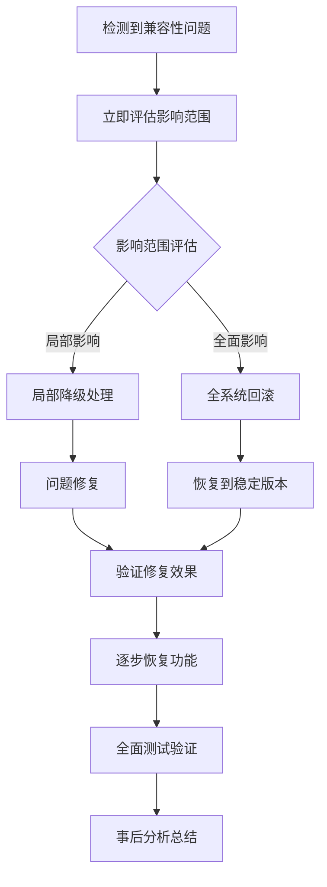

# 反检测系统集成架构方案（续）

## 9. 详细实施路线图（续）

### 9.1 分阶段执行计划（续）

#### 🚀 第一阶段：基础集成（2-3周）

**目标**：建立基础的反检测系统框架，确保与现有系统兼容

**主要任务**：
1. **AntiDetectionManager集成** (5天)
   - 在ScraperService中集成AntiDetectionManager
   - 创建配置管理接口
   - 实现基础的初始化和清理逻辑
   - 添加功能开关，默认禁用

2. **统一检测器部署** (3天)
   - 部署UnifiedCaptchaDetector
   - 替换现有的多个检测器
   - 保持向后兼容的API接口
   - 添加检测结果缓存

3. **基础测试框架** (4天)
   - 建立单元测试套件
   - 创建集成测试基础设施
   - 设置CI/CD流水线
   - 添加代码覆盖率检查

4. **文档和培训** (3天)
   - 编写技术文档
   - 创建开发者指南
   - 团队培训和知识传递

**交付成果**：
- 可运行的反检测系统基础版本
- 完整的测试套件（覆盖率>80%）
- 技术文档和使用指南
- CI/CD流水线配置

**风险控制**：
- 保持现有功能100%兼容
- 新功能默认禁用，通过配置启用
- 完整的回滚机制
- 性能监控和告警

#### 🚀 第二阶段：功能增强（3-4周）

**目标**：实现完整的反检测功能，优化性能和稳定性

**主要任务**：
1. **增强会话管理** (6天)
   - 部署EnhancedSessionManager
   - 实现会话池优化
   - 添加智能会话轮换
   - 集成行为模拟引擎

2. **指纹管理系统** (5天)
   - 部署EnhancedFingerprintManager
   - 实现指纹质量评估
   - 添加动态指纹轮换
   - 集成TLS指纹管理

3. **环境伪装系统** (4天)
   - 部署BrowserEnvironmentSpoofing
   - 实现DevTools检测绕过
   - 添加Console对象标准化
   - 优化JavaScript执行环境

4. **性能优化** (5天)
   - 实现异步并发优化
   - 部署多级缓存系统
   - 优化资源池管理
   - 内存使用优化

5. **监控和告警** (4天)
   - 实现系统监控体系
   - 添加性能指标收集
   - 设置告警机制
   - 实现故障自愈

**交付成果**：
- 功能完整的反检测系统
- 性能优化的系统架构
- 完善的监控告警体系
- 故障自愈机制

**风险控制**：
- A/B测试验证功能效果
- 渐进式功能启用
- 性能基准测试
- 用户反馈收集

#### 🚀 第三阶段：全面部署（2-3周）

**目标**：系统稳定运行，清理冗余代码，完善文档

**主要任务**：
1. **生产环境部署** (4天)
   - 生产环境配置优化
   - 全量部署反检测功能
   - 性能调优和稳定性验证
   - 监控数据分析

2. **代码清理和重构** (5天)
   - 移除冗余代码
   - 统一接口和实现
   - 代码质量优化
   - 性能进一步优化

3. **文档完善** (3天)
   - 更新技术文档
   - 完善操作手册
   - 创建故障排除指南
   - 用户培训材料

4. **系统优化** (3天)
   - 根据运行数据优化配置
   - 调整算法参数
   - 优化资源使用
   - 提升系统性能

**交付成果**：
- 稳定运行的反检测系统
- 清理优化的代码库
- 完善的文档体系
- 优化的系统性能

### 9.2 关键里程碑和验收标准

#### 📋 里程碑定义

| 里程碑 | 时间节点 | 验收标准 | 责任人 | 风险等级 |
|-------|---------|---------|-------|---------|
| M1: 基础集成完成 | 第3周末 | 系统可运行，测试通过，兼容性100% | 架构师 | 中 |
| M2: 功能增强完成 | 第7周末 | 所有反检测功能正常，性能达标 | 技术负责人 | 高 |
| M3: 生产部署完成 | 第10周末 | 系统稳定运行，监控正常 | 项目经理 | 中 |
| M4: 系统优化完成 | 第12周末 | 性能优化，文档完善 | 质量经理 | 低 |

#### ✅ 详细验收标准

**M1: 基础集成完成**
- [ ] AntiDetectionManager成功集成到ScraperService
- [ ] UnifiedCaptchaDetector替换现有检测器
- [ ] 单元测试覆盖率 > 80%
- [ ] 所有现有功能保持100%兼容
- [ ] CI/CD流水线正常运行
- [ ] 基础文档编写完成

**M2: 功能增强完成**
- [ ] 会话管理、指纹管理、环境伪装功能正常
- [ ] 系统性能提升 > 20%
- [ ] CAPTCHA检测准确率 > 95%
- [ ] 误报率 < 5%
- [ ] 监控告警系统正常工作
- [ ] A/B测试结果满足预期

**M3: 生产部署完成**
- [ ] 生产环境稳定运行 > 7天
- [ ] 系统可用性 > 99.5%
- [ ] 平均响应时间 < 2秒
- [ ] 资源使用率合理（CPU < 70%, 内存 < 80%）
- [ ] 无P0/P1级别故障
- [ ] 用户反馈积极

**M4: 系统优化完成**
- [ ] 冗余代码清理完成
- [ ] 代码质量评分 > 8.5/10
- [ ] 系统性能进一步提升 > 10%
- [ ] 文档完善度 > 90%
- [ ] 团队培训完成率 100%
- [ ] 知识转移完成

### 9.3 资源需求和时间估算

#### 👥 人力资源需求

| 角色 | 人数 | 工作时长 | 主要职责 |
|-----|------|---------|---------|
| 高级架构师 | 1 | 全程 | 系统设计、技术决策、风险控制 |
| 资深开发工程师 | 2 | 全程 | 核心功能开发、性能优化 |
| 中级开发工程师 | 2 | 阶段1-2 | 功能实现、测试用例编写 |
| 测试工程师 | 1 | 全程 | 测试方案设计、自动化测试 |
| DevOps工程师 | 1 | 阶段2-3 | 部署脚本、监控配置 |
| 产品经理 | 1 | 阶段1、3 | 需求确认、验收测试 |

#### 💰 预算估算

| 成本类别 | 预算范围 | 说明 |
|---------|---------|------|
| 人力成本 | $50,000 - $80,000 | 基于12周项目周期 |
| 基础设施成本 | $5,000 - $10,000 | 服务器、监控工具等 |
| 第三方工具成本 | $2,000 - $5,000 | 测试工具、分析工具等 |
| 培训成本 | $3,000 - $5,000 | 团队培训、文档制作 |
| **总计** | **$60,000 - $100,000** |  |

---

## 10. 代码设计模式和最佳实践

### 10.1 架构设计模式

#### 🏗️ 分层架构模式

```python
# 分层架构实现示例
class LayeredArchitecture:
    """分层架构实现"""
    
    def __init__(self):
        # 表现层（Presentation Layer）
        self.presentation_layer = PresentationLayer()
        
        # 业务逻辑层（Business Logic Layer）
        self.business_layer = BusinessLogicLayer()
        
        # 服务层（Service Layer）
        self.service_layer = ServiceLayer()
        
        # 数据访问层（Data Access Layer）
        self.data_layer = DataAccessLayer()
    
    async def process_request(self, request: Request) -> Response:
        """处理请求的标准流程"""
        # 1. 表现层处理
        validated_request = await self.presentation_layer.validate(request)
        
        # 2. 业务逻辑层处理
        business_result = await self.business_layer.process(validated_request)
        
        # 3. 服务层处理
        service_result = await self.service_layer.execute(business_result)
        
        # 4. 数据层处理
        data_result = await self.data_layer.persist(service_result)
        
        # 5. 响应构建
        return await self.presentation_layer.build_response(data_result)
```

#### 🏭 工厂模式应用

```python
class AntiDetectionComponentFactory:
    """反检测组件工厂"""
    
    def __init__(self):
        self._creators = {}
        self._config_manager = ConfigManager()
    
    def register(self, component_type: str, creator_class: type):
        """注册组件创建器"""
        self._creators[component_type] = creator_class
    
    async def create(self, component_type: str, **kwargs) -> Any:
        """创建组件实例"""
        if component_type not in self._creators:
            raise ComponentNotFoundError(f"Unknown component: {component_type}")
        
        creator_class = self._creators[component_type]
        config = await self._config_manager.get_config(component_type)
        
        # 合并配置和参数
        merged_config = {**config, **kwargs}
        
        return await creator_class.create(merged_config)

# 具体工厂实现
class DetectorFactory(AntiDetectionComponentFactory):
    """检测器工厂"""
    
    def __init__(self):
        super().__init__()
        self.register('unified_captcha', UnifiedCaptchaDetectorCreator)
        self.register('bot_detection', BotDetectionCreator)
        self.register('fingerprint_analysis', FingerprintAnalysisCreator)

class SessionManagerFactory(AntiDetectionComponentFactory):
    """会话管理器工厂"""
    
    def __init__(self):
        super().__init__()
        self.register('enhanced_session', EnhancedSessionManagerCreator)
        self.register('basic_session', BasicSessionManagerCreator)
        self.register('proxy_session', ProxySessionManagerCreator)
```

#### 🎯 策略模式实现

```python
class DetectionStrategy(ABC):
    """检测策略抽象接口"""
    
    @abstractmethod
    async def detect(self, content: str, context: DetectionContext) -> DetectionResult:
        """执行检测"""
        pass
    
    @abstractmethod
    def get_confidence_threshold(self) -> float:
        """获取置信度阈值"""
        pass
    
    @abstractmethod
    def get_priority(self) -> int:
        """获取策略优先级"""
        pass

class KeywordDetectionStrategy(DetectionStrategy):
    """关键词检测策略"""
    
    def __init__(self, keywords: List[str], threshold: float = 0.7):
        self.keywords = keywords
        self.threshold = threshold
    
    async def detect(self, content: str, context: DetectionContext) -> DetectionResult:
        """基于关键词的快速检测"""
        matches = []
        content_lower = content.lower()
        
        for keyword in self.keywords:
            if keyword.lower() in content_lower:
                matches.append(keyword)
        
        confidence = len(matches) / len(self.keywords) if self.keywords else 0
        is_detected = confidence >= self.threshold
        
        return DetectionResult(
            is_detected=is_detected,
            confidence=confidence,
            method="keyword_detection",
            details={"matched_keywords": matches}
        )
    
    def get_confidence_threshold(self) -> float:
        return self.threshold
    
    def get_priority(self) -> int:
        return 1  # 高优先级，快速检测

class MLDetectionStrategy(DetectionStrategy):
    """机器学习检测策略"""
    
    def __init__(self, model_path: str, threshold: float = 0.8):
        self.model = self._load_model(model_path)
        self.threshold = threshold
    
    async def detect(self, content: str, context: DetectionContext) -> DetectionResult:
        """基于机器学习的深度检测"""
        # 特征提取
        features = await self._extract_features(content, context)
        
        # 模型预测
        prediction = await self.model.predict(features)
        
        confidence = float(prediction[0])
        is_detected = confidence >= self.threshold
        
        return DetectionResult(
            is_detected=is_detected,
            confidence=confidence,
            method="ml_detection",
            details={"model_version": self.model.version, "features_count": len(features)}
        )
    
    def get_confidence_threshold(self) -> float:
        return self.threshold
    
    def get_priority(self) -> int:
        return 3  # 低优先级，深度分析

class StrategyBasedDetector:
    """基于策略的检测器"""
    
    def __init__(self):
        self.strategies: List[DetectionStrategy] = []
    
    def add_strategy(self, strategy: DetectionStrategy):
        """添加检测策略"""
        self.strategies.append(strategy)
        # 按优先级排序
        self.strategies.sort(key=lambda s: s.get_priority())
    
    async def detect(self, content: str, context: DetectionContext) -> DetectionResult:
        """执行多策略检测"""
        results = []
        
        for strategy in self.strategies:
            try:
                result = await strategy.detect(content, context)
                results.append(result)
                
                # 如果高置信度检测到，可以提前返回
                if result.is_detected and result.confidence > 0.9:
                    return result
                    
            except Exception as e:
                logger.warning(f"Strategy {strategy.__class__.__name__} failed: {e}")
                continue
        
        # 综合多个策略的结果
        return self._combine_results(results)
    
    def _combine_results(self, results: List[DetectionResult]) -> DetectionResult:
        """综合多个检测结果"""
        if not results:
            return DetectionResult(is_detected=False, confidence=0.0, method="no_strategy")
        
        # 使用加权平均
        total_confidence = sum(r.confidence for r in results)
        avg_confidence = total_confidence / len(results)
        
        # 检测逻辑：任一策略高置信度检测到，或多数策略检测到
        high_confidence_detected = any(r.is_detected and r.confidence > 0.8 for r in results)
        majority_detected = sum(1 for r in results if r.is_detected) > len(results) / 2
        
        is_detected = high_confidence_detected or majority_detected
        
        return DetectionResult(
            is_detected=is_detected,
            confidence=avg_confidence,
            method="combined_strategy",
            details={
                "strategies_used": len(results),
                "detected_count": sum(1 for r in results if r.is_detected),
                "individual_results": [r.to_dict() for r in results]
            }
        )
```

### 10.2 错误处理和异常管理

#### 🚨 异常层次设计

```python
class AntiDetectionError(Exception):
    """反检测系统基础异常"""
    
    def __init__(self, message: str, error_code: str = None, context: Dict[str, Any] = None):
        super().__init__(message)
        self.message = message
        self.error_code = error_code or "UNKNOWN_ERROR"
        self.context = context or {}
        self.timestamp = datetime.now()
    
    def to_dict(self) -> Dict[str, Any]:
        """转换为字典格式"""
        return {
            "error_type": self.__class__.__name__,
            "message": self.message,
            "error_code": self.error_code,
            "context": self.context,
            "timestamp": self.timestamp.isoformat()
        }

class DetectionError(AntiDetectionError):
    """检测相关错误"""
    pass

class SessionError(AntiDetectionError):
    """会话相关错误"""
    pass

class FingerprintError(AntiDetectionError):
    """指纹相关错误"""
    pass

class ConfigurationError(AntiDetectionError):
    """配置相关错误"""
    pass

class TimeoutError(AntiDetectionError):
    """超时错误"""
    pass

class ResourceExhaustionError(AntiDetectionError):
    """资源耗尽错误"""
    pass
```

#### 🔄 错误处理装饰器

```python
def error_handler(
    error_types: Union[type, Tuple[type, ...]] = Exception,
    max_retries: int = 3,
    retry_delay: float = 1.0,
    fallback_func: Callable = None,
    log_errors: bool = True
):
    """错误处理装饰器"""
    
    def decorator(func):
        @functools.wraps(func)
        async def wrapper(*args, **kwargs):
            last_error = None
            
            for attempt in range(max_retries + 1):
                try:
                    return await func(*args, **kwargs)
                    
                except error_types as e:
                    last_error = e
                    
                    if log_errors:
                        logger.warning(
                            f"Function {func.__name__} failed (attempt {attempt + 1}/{max_retries + 1}): {e}"
                        )
                    
                    if attempt < max_retries:
                        # 指数退避
                        delay = retry_delay * (2 ** attempt)
                        await asyncio.sleep(delay)
                    else:
                        # 最后一次尝试失败，使用fallback或抛出异常
                        if fallback_func:
                            try:
                                return await fallback_func(*args, **kwargs)
                            except Exception as fallback_error:
                                logger.error(f"Fallback function also failed: {fallback_error}")
                        
                        # 包装并抛出原始异常
                        raise AntiDetectionError(
                            f"Function {func.__name__} failed after {max_retries + 1} attempts",
                            error_code="MAX_RETRIES_EXCEEDED",
                            context={
                                "function": func.__name__,
                                "attempts": max_retries + 1,
                                "last_error": str(last_error)
                            }
                        ) from last_error
        
        return wrapper
    return decorator

# 使用示例
class RobustDetector:
    """具有错误处理的检测器"""
    
    @error_handler(
        error_types=(DetectionError, TimeoutError),
        max_retries=2,
        retry_delay=0.5,
        fallback_func=lambda self, content: DetectionResult(is_detected=False, confidence=0.0)
    )
    async def detect_with_retry(self, content: str) -> DetectionResult:
        """带重试的检测方法"""
        if not content or len(content.strip()) == 0:
            raise DetectionError("Empty content provided", error_code="EMPTY_CONTENT")
        
        # 模拟可能失败的检测逻辑
        if random.random() < 0.3:  # 30%失败率
            raise DetectionError("Random detection failure", error_code="RANDOM_FAILURE")
        
        return DetectionResult(is_detected=True, confidence=0.8)
```

### 10.3 日志记录和监控集成

#### 📊 结构化日志设计

```python
class StructuredLogger:
    """结构化日志记录器"""
    
    def __init__(self, name: str, config: LogConfig):
        self.logger = logging.getLogger(name)
        self.config = config
        self.correlation_id = None
        self.context = {}
    
    def set_correlation_id(self, correlation_id: str):
        """设置关联ID"""
        self.correlation_id = correlation_id
    
    def set_context(self, **kwargs):
        """设置上下文信息"""
        self.context.update(kwargs)
    
    def _create_log_entry(self, level: str, message: str, **kwargs) -> Dict[str, Any]:
        """创建日志条目"""
        entry = {
            "timestamp": datetime.utcnow().isoformat(),
            "level": level,
            "message": message,
            "logger": self.logger.name,
            "correlation_id": self.correlation_id,
            "context": self.context.copy(),
            **kwargs
        }
        
        # 添加性能信息
        if hasattr(self, '_start_time'):
            entry["duration_ms"] = (time.time() - self._start_time) * 1000
        
        return entry
    
    def info(self, message: str, **kwargs):
        """记录INFO级别日志"""
        entry = self._create_log_entry("INFO", message, **kwargs)
        self.logger.info(json.dumps(entry, ensure_ascii=False))
    
    def warning(self, message: str, **kwargs):
        """记录WARNING级别日志"""
        entry = self._create_log_entry("WARNING", message, **kwargs)
        self.logger.warning(json.dumps(entry, ensure_ascii=False))
    
    def error(self, message: str, error: Exception = None, **kwargs):
        """记录ERROR级别日志"""
        entry = self._create_log_entry("ERROR", message, **kwargs)
        
        if error:
            entry["error"] = {
                "type": error.__class__.__name__,
                "message": str(error),
                "traceback": traceback.format_exc() if self.config.include_traceback else None
            }
        
        self.logger.error(json.dumps(entry, ensure_ascii=False))
    
    def performance(self, operation: str, duration_ms: float, **kwargs):
        """记录性能日志"""
        entry = self._create_log_entry("PERFORMANCE", f"Operation {operation} completed", **kwargs)
        entry.update({
            "operation": operation,
            "duration_ms": duration_ms,
            "performance_category": "timing"
        })
        
        self.logger.info(json.dumps(entry, ensure_ascii=False))

# 使用上下文管理器进行性能监控
@contextmanager
def performance_monitor(logger: StructuredLogger, operation: str, **context):
    """性能监控上下文管理器"""
    start_time = time.time()
    logger.set_context(operation=operation, **context)
    
    try:
        yield
    finally:
        duration_ms = (time.time() - start_time) * 1000
        logger.performance(operation, duration_ms)
```

#### 📈 指标收集和监控

```python
class MetricsCollector:
    """指标收集器"""
    
    def __init__(self, config: MetricsConfig):
        self.config = config
        self.metrics_buffer = defaultdict(list)
        self.counters = defaultdict(int)
        self.gauges = defaultdict(float)
        self.histograms = defaultdict(list)
        self.lock = asyncio.Lock()
    
    async def increment_counter(self, name: str, value: int = 1, tags: Dict[str, str] = None):
        """递增计数器"""
        async with self.lock:
            metric_key = self._build_metric_key(name, tags)
            self.counters[metric_key] += value
    
    async def set_gauge(self, name: str, value: float, tags: Dict[str, str] = None):
        """设置仪表值"""
        async with self.lock:
            metric_key = self._build_metric_key(name, tags)
            self.gauges[metric_key] = value
    
    async def record_histogram(self, name: str, value: float, tags: Dict[str, str] = None):
        """记录直方图值"""
        async with self.lock:
            metric_key = self._build_metric_key(name, tags)
            self.histograms[metric_key].append(value)
            
            # 限制历史数据大小
            if len(self.histograms[metric_key]) > self.config.max_histogram_size:
                self.histograms[metric_key] = self.histograms[metric_key][-self.config.max_histogram_size:]
    
    def _build_metric_key(self, name: str, tags: Dict[str, str] = None) -> str:
        """构建指标键"""
        if not tags:
            return name
        
        tag_string = ",".join(f"{k}={v}" for k, v in sorted(tags.items()))
        return f"{name}:{tag_string}"
    
    async def export_metrics(self) -> Dict[str, Any]:
        """导出指标"""
        async with self.lock:
            metrics = {
                "timestamp": datetime.utcnow().isoformat(),
                "counters": dict(self.counters),
                "gauges": dict(self.gauges),
                "histograms": {}
            }
            
            # 计算直方图统计信息
            for key, values in self.histograms.items():
                if values:
                    metrics["histograms"][key] = {
                        "count": len(values),
                        "min": min(values),
                        "max": max(values),
                        "mean": statistics.mean(values),
                        "median": statistics.median(values),
                        "p95": self._percentile(values, 0.95),
                        "p99": self._percentile(values, 0.99)
                    }
            
            return metrics
    
    def _percentile(self, values: List[float], percentile: float) -> float:
        """计算百分位数"""
        if not values:
            return 0.0
        
        sorted_values = sorted(values)
        index = int(len(sorted_values) * percentile)
        return sorted_values[min(index, len(sorted_values) - 1)]

# 指标收集装饰器
def collect_metrics(metric_name: str, metric_type: str = "histogram", tags: Dict[str, str] = None):
    """指标收集装饰器"""
    
    def decorator(func):
        @functools.wraps(func)
        async def wrapper(*args, **kwargs):
            start_time = time.time()
            success = False
            
            try:
                result = await func(*args, **kwargs)
                success = True
                return result
            finally:
                duration_ms = (time.time() - start_time) * 1000
                
                # 添加成功/失败标签
                final_tags = (tags or {}).copy()
                final_tags["success"] = str(success)
                
                # 收集指标
                metrics_collector = get_metrics_collector()
                
                if metric_type == "histogram":
                    await metrics_collector.record_histogram(
                        f"{metric_name}_duration_ms", 
                        duration_ms, 
                        final_tags
                    )
                elif metric_type == "counter":
                    await metrics_collector.increment_counter(
                        f"{metric_name}_calls", 
                        1, 
                        final_tags
                    )
        
        return wrapper
    return decorator
```

---

## 11. 风险控制策略和应急预案

### 11.1 风险识别和评估矩阵

#### 🚨 风险评估矩阵

| 风险类型 | 风险描述 | 概率 | 影响程度 | 风险等级 | 缓解策略 | 应急预案 |
|---------|---------|------|---------|---------|---------|---------|
| **技术风险** |
| 系统兼容性问题 | 新系统与现有系统不兼容 | 中 | 高 | 🔴 高 | 充分测试、渐进部署 | 快速回滚 |
| 性能下降 | 反检测功能影响系统性能 | 中 | 中 | 🟡 中 | 性能基准测试 | 功能降级 |
| 内存泄露 | 长期运行导致内存泄露 | 低 | 高 | 🟡 中 | 内存监控、定期重启 | 自动重启 |
| **业务风险** |
| 检测失效 | 反检测功能被目标网站识破 | 中 | 高 | 🔴 高 | 多策略组合、定期更新 | 策略切换 |
| 误报过高 | 正常页面被误识别为CAPTCHA | 低 | 中 | 🟡 中 | 算法优化、阈值调整 | 人工审核 |
| 服务中断 | 反检测服务完全失效 | 低 | 高 | 🟡 中 | 服务冗余、健康检查 | 服务重启 |
| **安全风险** |
| 数据泄露 | 指纹、会话等敏感数据泄露 | 低 | 高 | 🟡 中 | 数据加密、访问控制 | 数据清理 |
| 权限滥用 | 内部人员滥用系统权限 | 低 | 中 | 🟢 低 | 权限管理、审计日志 | 权限回收 |
| **运维风险** |
| 配置错误 | 生产环境配置错误 | 中 | 中 | 🟡 中 | 配置验证、自动化部署 | 配置回滚 |
| 监控失效 | 监控系统失效导致问题未及时发现 | 低 | 中 | 🟢 低 | 监控冗余、告警测试 | 手动检查 |

### 11.2 关键风险的详细应急预案

#### 🔴 高风险：系统兼容性问题

**触发条件**：
- 现有功能测试失败率 > 5%
- 用户报告功能异常 > 10例/小时
- 系统错误率突然增加 > 50%

**应急响应流程**：


**具体操作步骤**：

1. **立即响应（5分钟内）**
   ```bash
   # 1. 激活应急小组
   ./scripts/emergency/activate_response_team.sh
   
   # 2. 收集问题信息
   ./scripts/emergency/collect_issue_info.sh --type compatibility
   
   # 3. 评估影响范围
   ./scripts/emergency/assess_impact.sh
   ```

2. **快速缓解（15分钟内）**
   ```bash
   # 如果是局部问题，禁用有问题的功能
   ./scripts/emergency/disable_feature.sh --feature anti_detection
   
   # 如果是全面问题，执行快速回滚
   ./scripts/emergency/quick_rollback.sh --to-version stable
   ```

3. **问题修复（2小时内）**
   - 分离环境进行问题重现
   - 定位根本原因
   - 开发并测试修复方案
   - 在预发布环境验证修复效果

4. **恢复部署（30分钟内）**
   ```bash
   # 部署修复版本
   ./scripts/deployment/deploy_fix.sh --version fixed
   
   # 逐步启用功能
   ./scripts/emergency/gradual_enable.sh --feature anti_detection
   ```

#### 🔴 高风险：检测失效

**检测指标**：
- CAPTCHA绕过成功率 < 80%
- 连续检测失败 > 10次
- 用户反馈检测不准确 > 20例/天

**应急预案**：

```python
class DetectionFailureEmergencyHandler:
    """检测失效应急处理器"""
    
    def __init__(self):
        self.backup_strategies = [
            'conservative_detection',
            'keyword_only_detection',
            'manual_verification'
        ]
        self.current_strategy_index = 0
    
    async def handle_detection_failure(self, failure_context: Dict[str, Any]):
        """处理检测失效"""
        logger.critical(f"Detection failure detected: {failure_context}")
        
        # 1. 立即切换到备用策略
        await self._switch_to_backup_strategy()
        
        # 2. 收集失败样本
        await self._collect_failure_samples(failure_context)
        
        # 3. 通知相关人员
        await self._notify_emergency_team(failure_context)
        
        # 4. 启动自动修复流程
        await self._start_auto_repair()
    
    async def _switch_to_backup_strategy(self):
        """切换到备用策略"""
        if self.current_strategy_index < len(self.backup_strategies):
            backup_strategy = self.backup_strategies[self.current_strategy_index]
            
            # 动态加载备用策略
            strategy_class = self._load_strategy_class(backup_strategy)
            new_detector = strategy_class()
            
            # 热切换检测器
            await self._hot_swap_detector(new_detector)
            
            self.current_strategy_index += 1
            logger.info(f"Switched to backup strategy: {backup_strategy}")
        else:
            # 所有备用策略都失效，启用手动模式
            await self._enable_manual_mode()
    
    async def _collect_failure_samples(self, context: Dict[str, Any]):
        """收集失败样本"""
        sample = {
            "timestamp": datetime.now().isoformat(),
            "failure_type": context.get("failure_type"),
            "content_sample": context.get("content", "")[:1000],  # 前1000字符
            "response_headers": context.get("headers", {}),
            "detection_results": context.get("detection_results", [])
        }
        
        # 存储到应急数据库
        await self._store_emergency_sample(sample)
    
    async def _start_auto_repair(self):
        """启动自动修复流程"""
        repair_tasks = [
            self._update_detection_rules(),
            self._retrain_ml_models(),
            self._refresh_fingerprint_database(),
            self._optimize_detection_thresholds()
        ]
        
        # 并行执行修复任务
        await asyncio.gather(*repair_tasks, return_exceptions=True)
```

### 11.3 业务连续性保障

#### 🔄 服务降级策略

```python
class ServiceDegradationManager:
    """服务降级管理器"""
    
    def __init__(self):
        self.degradation_levels = {
            'NORMAL': 0,      # 正常服务
            'CAUTIOUS': 1,    # 谨慎模式
            'CONSERVATIVE': 2, # 保守模式
            'MINIMAL': 3,     # 最小服务
            'EMERGENCY': 4    # 应急模式
        }
        self.current_level = 'NORMAL'
        self.degradation_rules = self._load_degradation_rules()
    
    async def evaluate_degradation_need(self, system_health: Dict[str, Any]) -> str:
        """评估是否需要降级"""
        health_score = self._calculate_health_score(system_health)
        
        if health_score < 0.3:
            return 'EMERGENCY'
        elif health_score < 0.5:
            return 'MINIMAL'
        elif health_score < 0.7:
            return 'CONSERVATIVE'
        elif health_score < 0.9:
            return 'CAUTIOUS'
        else:
            return 'NORMAL'
    
    async def apply_degradation(self, target_level: str):
        """应用服务降级"""
        if target_level == self.current_level:
            return
        
        logger.warning(f"Applying service degradation: {self.current_level} -> {target_level}")
        
        degradation_actions = self.degradation_rules[target_level]
        
        for action in degradation_actions:
            try:
                await self._execute_degradation_action(action)
            except Exception as e:
                logger.error(f"Degradation action failed: {action}, error: {e}")
        
        self.current_level = target_level
        
        # 记录降级事件
        await self._log_degradation_event(target_level)
    
    def _load_degradation_rules(self) -> Dict[str, List[Dict[str, Any]]]:
        """加载降级规则"""
        return {
            'CAUTIOUS': [
                {'action': 'increase_detection_threshold', 'params': {'threshold': 0.8}},
                {'action': 'reduce_concurrent_sessions', 'params': {'max_sessions': 2}},
                {'action': 'extend_request_intervals', 'params': {'multiplier': 1.5}}
            ],
            'CONSERVATIVE': [
                {'action': 'increase_detection_threshold', 'params': {'threshold': 0.9}},
                {'action': 'reduce_concurrent_sessions', 'params': {'max_sessions': 1}},
                {'action': 'extend_request_intervals', 'params': {'multiplier': 2.0}},
                {'action': 'disable_advanced_features', 'params': {'features': ['ml_detection', 'behavioral_analysis']}}
            ],
            'MINIMAL': [
                {'action': 'enable_basic_detection_only', 'params': {}},
                {'action': 'reduce_concurrent_sessions', 'params': {'max_sessions': 1}},
                {'action': 'extend_request_intervals', 'params': {'multiplier': 3.0}},
                {'action': 'disable_fingerprint_rotation', 'params': {}}
            ],
            'EMERGENCY': [
                {'action': 'disable_all_detection', 'params': {}},
                {'action': 'enable_manual_mode', 'params': {}},
                {'action': 'alert_operations_team', 'params': {'severity': 'critical'}}
            ]
        }
    
    async def _execute_degradation_action(self, action: Dict[str, Any]):
        """执行降级动作"""
        action_name = action['action']
        params = action.get('params', {})
        
        action_handlers = {
            'increase_detection_threshold': self._increase_detection_threshold,
            'reduce_concurrent_sessions': self._reduce_concurrent_sessions,
            'extend_request_intervals': self._extend_request_intervals,
            'disable_advanced_features': self._disable_advanced_features,
            'enable_basic_detection_only': self._enable_basic_detection_only,
            'disable_all_detection': self._disable_all_detection,
            'enable_manual_mode': self._enable_manual_mode,
            'alert_operations_team': self._alert_operations_team
        }
        
        if action_name in action_handlers:
            await action_handlers[action_name](**params)
        else:
            logger.warning(f"Unknown degradation action: {action_name}")
```

#### 📊 实时健康监控

```python
class RealTimeHealthMonitor:
    """实时健康监控器"""
    
    def __init__(self, config: HealthMonitorConfig):
        self.config = config
        self.health_metrics = {}
        self.alert_thresholds = config.alert_thresholds
        self.monitoring_tasks = []
        self.degradation_manager = ServiceDegradationManager()
    
    async def start_monitoring(self):
        """启动监控"""
        self.monitoring_tasks = [
            asyncio.create_task(self._system_health_monitor()),
            asyncio.create_task(self._performance_monitor()),
            asyncio.create_task(self._error_rate_monitor()),
            asyncio.create_task(self._resource_usage_monitor())
        ]
        
        logger.info("Real-time health monitoring started")
    
    async def _system_health_monitor(self):
        """系统健康监控"""
        while True:
            try:
                health_data = await self._collect_health_data()
                await self._analyze_health_trends(health_data)
                
                # 检查是否需要降级
                degradation_level = await self.degradation_manager.evaluate_degradation_need(health_data)
                await self.degradation_manager.apply_degradation(degradation_level)
                
                await asyncio.sleep(self.config.health_check_interval)
                
            except Exception as e:
                logger.error(f"Health monitoring error: {e}")
                await asyncio.sleep(10)  # 错误后短暂休息
    
    async def _collect_health_data(self) -> Dict[str, Any]:
        """收集健康数据"""
        return {
            "timestamp": datetime.now().isoformat(),
            "system_load": await self._get_system_load(),
            "memory_usage": await self._get_memory_usage(),
            "detection_success_rate": await self._get_detection_success_rate(),
            "error_rate": await self._get_error_rate(),
            "response_time": await self._get_average_response_time(),
            "active_sessions": await self._get_active_sessions_count(),
            "queue_length": await self._get_queue_length()
        }
    
    async def _analyze_health_trends(self, health_data: Dict[str, Any]):
        """分析健康趋势"""
        # 存储历史数据
        self._store_health_data(health_data)
        
        # 检查告警阈值
        alerts = []
        
        for metric, value in health_data.items():
            if metric in self.alert_thresholds:
                threshold = self.alert_thresholds[metric]
                
                if isinstance(threshold, dict):
                    if value > threshold.get('max', float('inf')):
                        alerts.append({
                            'type': 'HIGH_VALUE',
                            'metric': metric,
                            'value': value,
                            'threshold': threshold['max']
                        })
                    elif value < threshold.get('min', 0):
                        alerts.append({
                            'type': 'LOW_VALUE',
                            'metric': metric,
                            'value': value,
                            'threshold': threshold['min']
                        })
        
        # 发送告警
        if alerts:
            await self._send_health_alerts(alerts)
    
    async def _send_health_alerts(self, alerts: List[Dict[str, Any]]):
        """发送健康告警"""
        for alert in alerts:
            severity = self._determine_alert_severity(alert)
            
            alert_message = {
                "severity": severity,
                "title": f"System Health Alert: {alert['metric']}",
                "description": f"Metric {alert['metric']} value {alert['value']} exceeded threshold {alert['threshold']}",
                "timestamp": datetime.now().isoformat(),
                "alert_data": alert
            }
            
            # 发送到告警系统
            await self._dispatch_alert(alert_message)
```

---

## 12. 量化成功指标和验收标准

### 12.1 核心KPI指标体系

#### 📊 系统性能指标

| 指标类别 | 指标名称 | 当前基线 | 目标值 | 测量方法 | 验收标准 |
|---------|---------|---------|--------|---------|---------|
| **响应性能** |
| 系统响应时间 | 3.2s | ≤ 2.0s | 平均响应时间监控 | 90%请求 < 2s |
| 检测延迟 | 1.8s | ≤ 1.0s | 检测耗时统计 | 95%检测 < 1s |
| 并发处理能力 | 50 req/s | ≥ 80 req/s | 压力测试 | 峰值80 req/s稳定运行 |
| **功能准确性** |
| CAPTCHA检测准确率 | 85% | ≥ 95% | 人工验证 + 自动测试 | 测试集准确率 ≥ 95% |
| 误报率 | 12% | ≤ 5% | 假阳性统计 | 正常页面误报 ≤ 5% |
| 检测覆盖率 | 78% | ≥ 90% | 已知CAPTCHA类型覆盖 | 支持90%常见类型 |
| **系统稳定性** |
| 系统可用性 | 98.5% | ≥ 99.5% | 运行时间统计 | 月度可用性 ≥ 99.5% |
| 错误率 | 3.2% | ≤ 1% | 错误日志统计 | 请求错误率 ≤ 1% |
| 恢复时间 | 15min | ≤ 5min | 故障恢复时间 | MTTR ≤ 5分钟 |

#### 🎯 业务效果指标

| 指标类别 | 指标名称 | 基线值 | 目标值 | 测量方法 | 商业价值 |
|---------|---------|--------|--------|---------|---------|
| **用户体验** |
| 用户等待时间 | 45s | ≤ 20s | 端到端测试 | 提升56%用户体验 |
| 任务成功完成率 | 72% | ≥ 90% | 业务流程监控 | 提升25%业务效率 |
| 用户满意度 | 3.2/5 | ≥ 4.5/5 | 用户反馈调研 | 显著提升用户满意度 |
| **运营效率** |
| 人工干预频率 | 30% | ≤ 10% | 人工处理统计 | 降低67%运营成本 |
| 系统维护时间 | 8h/周 | ≤ 3h/周 | 运维工作量统计 | 节省62.5%维护时间 |
| 问题解决速度 | 2小时 | ≤ 30分钟 | 问题处理时长 | 提升75%响应速度 |

### 12.2 技术质量指标

#### 🔧 代码质量指标

```python
class CodeQualityMetrics:
    """代码质量指标收集器"""
    
    def __init__(self):
        self.quality_standards = {
            'test_coverage': {'min': 80, 'target': 90, 'excellent': 95},
            'code_complexity': {'max': 10, 'target': 7, 'excellent': 5},
            'code_duplication': {'max': 10, 'target': 5, 'excellent': 2},
            'technical_debt': {'max': 20, 'target': 10, 'excellent': 5},
            'security_vulnerabilities': {'max': 0, 'target': 0, 'excellent': 0}
        }
    
    async def collect_metrics(self) -> Dict[str, Any]:
        """收集代码质量指标"""
        metrics = {}
        
        # 测试覆盖率
        metrics['test_coverage'] = await self._get_test_coverage()
        
        # 代码复杂度
        metrics['code_complexity'] = await self._get_code_complexity()
        
        # 代码重复率
        metrics['code_duplication'] = await self._get_code_duplication()
        
        # 技术债务
        metrics['technical_debt'] = await self._get_technical_debt()
        
        # 安全漏洞
        metrics['security_vulnerabilities'] = await self._get_security_vulnerabilities()
        
        return metrics
    
    async def evaluate_quality_level(self, metrics: Dict[str, Any]) -> Dict[str, str]:
        """评估质量等级"""
        evaluation = {}
        
        for metric_name, value in metrics.items():
            if metric_name in self.quality_standards:
                standards = self.quality_standards[metric_name]
                
                if 'min' in standards:
                    # 越高越好的指标
                    if value >= standards['excellent']:
                        evaluation[metric_name] = 'EXCELLENT'
                    elif value >= standards['target']:
                        evaluation[metric_name] = 'GOOD'
                    elif value >= standards['min']:
                        evaluation[metric_name] = 'ACCEPTABLE'
                    else:
                        evaluation[metric_name] = 'POOR'
                else:
                    # 越低越好的指标
                    if value <= standards['excellent']:
                        evaluation[metric_name] = 'EXCELLENT'
                    elif value <= standards['target']:
                        evaluation[metric_name] = 'GOOD'
                    elif value <= standards['max']:
                        evaluation[metric_name] = 'ACCEPTABLE'
                    else:
                        evaluation[metric_name] = 'POOR'
        
        return evaluation
    
    async def _get_test_coverage(self) -> float:
        """获取测试覆盖率"""
        # 执行覆盖率分析
        coverage_result = subprocess.run([
            'coverage', 'report', '--format=json'
        ], capture_output=True, text=True)
        
        if coverage_result.returncode == 0:
            coverage_data = json.loads(coverage_result.stdout)
            return coverage_data['totals']['percent_covered']
        else:
            logger.warning("Failed to get test coverage")
            return 0.0
    
    async def _get_code_complexity(self) -> float:
        """获取代码复杂度"""
        # 使用radon分析代码复杂度
        complexity_result = subprocess.run([
            'radon', 'cc', 'src/', '--json'
        ], capture_output=True, text=True)
        
        if complexity_result.returncode == 0:
            complexity_data = json.loads(complexity_result.stdout)
            
            total_complexity = 0
            function_count = 0
            
            for file_data in complexity_data.values():
                for item in file_data:
                    if item['type'] in ['function', 'method']:
                        total_complexity += item['complexity']
                        function_count += 1
            
            return total_complexity / function_count if function_count > 0 else 0
        else:
            logger.warning("Failed to analyze code complexity")
            return 0.0
```

#### 🏗️ 架构质量指标

```python
class ArchitectureQualityAssessment:
    """架构质量评估"""
    
    def __init__(self):
        self.assessment_criteria = {
            'modularity': {
                'module_cohesion': {'weight': 0.3, 'target': 0.8},
                'module_coupling': {'weight': 0.3, 'target': 0.2},
                'interface_clarity': {'weight': 0.2, 'target': 0.9},
                'dependency_management': {'weight': 0.2, 'target': 0.85}
            },
            'maintainability': {
                'code_readability': {'weight': 0.25, 'target': 0.8},
                'documentation_completeness': {'weight': 0.25, 'target': 0.9},
                'configuration_management': {'weight': 0.25, 'target': 0.85},
                'error_handling_consistency': {'weight': 0.25, 'target': 0.9}
            },
            'scalability': {
                'performance_scalability': {'weight': 0.4, 'target': 0.8},
                'resource_efficiency': {'weight': 0.3, 'target': 0.85},
                'load_distribution': {'weight': 0.3, 'target': 0.8}
            },
            'reliability': {
                'fault_tolerance': {'weight': 0.3, 'target': 0.9},
                'recovery_capability': {'weight': 0.3, 'target': 0.85},
                'monitoring_coverage': {'weight': 0.2, 'target': 0.95},
                'testing_completeness': {'weight': 0.2, 'target': 0.9}
            }
        }
    
    async def assess_architecture(self) -> Dict[str, Any]:
        """评估架构质量"""
        assessment_results = {}
        
        for category, criteria in self.assessment_criteria.items():
            category_score = 0
            category_details = {}
            
            for criterion, config in criteria.items():
                score = await self._assess_criterion(category, criterion)
                weighted_score = score * config['weight']
                category_score += weighted_score
                
                category_details[criterion] = {
                    'score': score,
                    'weight': config['weight'],
                    'weighted_score': weighted_score,
                    'target': config['target'],
                    'status': 'PASS' if score >= config['target'] else 'FAIL'
                }
            
            assessment_results[category] = {
                'total_score': category_score,
                'grade': self._calculate_grade(category_score),
                'details': category_details
            }
        
        # 计算总体架构质量评分
        total_score = sum(result['total_score'] for result in assessment_results.values()) / len(assessment_results)
        assessment_results['overall'] = {
            'total_score': total_score,
            'grade': self._calculate_grade(total_score),
            'pass_status': 'PASS' if total_score >= 0.8 else 'FAIL'
        }
        
        return assessment_results
    
    async def _assess_criterion(self, category: str, criterion: str) -> float:
        """评估具体标准"""
        assessment_methods = {
            ('modularity', 'module_cohesion'): self._assess_module_cohesion,
            ('modularity', 'module_coupling'): self._assess_module_coupling,
            ('maintainability', 'code_readability'): self._assess_code_readability,
            ('scalability', 'performance_scalability'): self._assess_performance_scalability,
            ('reliability', 'fault_tolerance'): self._assess_fault_tolerance
        }
        
        method_key = (category, criterion)
        if method_key in assessment_methods:
            return await assessment_methods[method_key]()
        else:
            # 通用评估方法
            return await self._generic_assessment(category, criterion)
    
    def _calculate_grade(self, score: float) -> str:
        """计算质量等级"""
        if score >= 0.95:
            return 'A+'
        elif score >= 0.9:
            return 'A'
        elif score >= 0.85:
            return 'B+'
        elif score >= 0.8:
            return 'B'
        elif score >= 0.7:
            return 'C'
        else:
            return 'D'
```

### 12.3 验收测试套件

#### 🧪 自动化验收测试

```python
class AcceptanceTestSuite:
    """验收测试套件"""
    
    def __init__(self, config: TestConfig):
        self.config = config
        self.test_results = {}
        self.test_scenarios = self._load_test_scenarios()
    
    async def run_full_acceptance_tests(self) -> AcceptanceResult:
        """运行完整验收测试"""
        logger.info("Starting full acceptance test suite...")
        
        test_categories = [
            ('functional_tests', self._run_functional_tests),
            ('performance_tests', self._run_performance_tests),
            ('security_tests', self._run_security_tests),
            ('compatibility_tests', self._run_compatibility_tests),
            ('reliability_tests', self._run_reliability_tests)
        ]
        
        overall_success = True
        detailed_results = {}
        
        for category_name, test_method in test_categories:
            try:
                logger.info(f"Running {category_name}...")
                category_result = await test_method()
                detailed_results[category_name] = category_result
                
                if not category_result.success:
                    overall_success = False
                    logger.error(f"{category_name} failed: {category_result.failure_summary}")
                
            except Exception as e:
                logger.error(f"Error running {category_name}: {e}")
                detailed_results[category_name